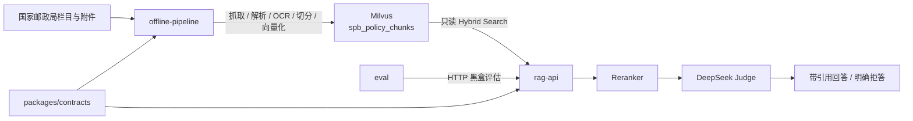

# 国家邮政局政策知识库

面向国家邮政局“政策法规标准”栏目的数据治理与检索增强问答项目。仓库包含
相互隔离的离线数据流水线、在线 RAG API、黑盒评估工具和共享数据契约，可
完成公开政策资料的抓取、解析、OCR、切分、向量化、Milvus 同步、混合检索、
相关性拒答、引用式问答和量化评估。

当前项目定位为 Demo、测试和技术方向验证，不包含原始业务数据、私有评估集、
运行报告或任何真实凭证。

## 核心能力

| 能力 | 实现 |
|---|---|
| 数据发现 | 按栏目接口分页获取完整目录，保留外链与失败状态 |
| 多格式解析 | HTML、PDF、DOCX、旧版 Word、XLSX、图片与扫描 PDF |
| OCR | macOS Vision 中文 OCR，按附件和页码保存可续跑 sidecar |
| 结构化切分 | 识别法规章、节、条、段落和表格行，保留章节路径 |
| 向量化 | `moka-ai/m3e-base`，768 维、L2 归一化 |
| 混合检索 | Milvus HNSW/COSINE Dense + BM25 Sparse + RRF |
| 语义重排 | `BAAI/bge-reranker-base` Cross-Encoder |
| 可信问答 | 本地相关性门槛 + DeepSeek 证据充分性门槛 |
| 可追溯输出 | 回答包含编号引用、文档元数据和原文链接 |
| 服务接口 | JSON 检索、JSON 问答、SSE 流式问答、健康检查和指标 |
| 黑盒评估 | Recall/MRR、误拒/误放、引用、事实覆盖、延迟和 Token |

## 架构



离线流水线拥有目标 collection 的创建和写入能力；在线服务只读访问 Milvus，
不包含爬虫、OCR 或数据库写入代码；评估工具只通过 HTTP 观察在线服务，不
导入在线实现，也不直连数据库。

## 仓库结构

```text
apps/
  offline-pipeline/   抓取、解析、OCR、切分、向量化和 Milvus 同步
  rag-api/            在线检索、双重相关性门槛和 DeepSeek 问答
packages/
  contracts/          collection schema、embedding 与元数据共享契约
eval/                 独立 HTTP 黑盒评估工具
deploy/               Docker Compose 与 Prometheus 配置
docs/                 API、架构和部署文档
```

依赖方向固定为：

```text
spb-policy-pipeline ─┐
                     ├──> spb-contracts
spb-rag-api ─────────┘
```

在线和离线应用禁止相互导入。架构测试会检查该约束。

## 共享数据契约

| 项目 | 当前值 |
|---|---|
| Milvus database | `aisv` |
| Collection | `spb_policy_chunks` |
| Schema version | `1` |
| Embedding | `moka-ai/m3e-base` |
| Dimension | `768` |
| Dense metric | `COSINE` |
| Dense field | `text_dense` |
| Sparse field | `text_sparse` |

离线建表和在线启动都会校验该契约。不兼容的 schema 变更应升级 schema version
或创建新 collection，不能让在线服务静默兼容。

## 环境要求

- Python 3.11；
- [uv](https://docs.astral.sh/uv/)；
- Milvus 2.6.x；
- Docker 与 Docker Compose（容器部署时）；
- DeepSeek API Key（使用问答接口时）；
- Poppler `pdftoppm`（处理扫描 PDF 时）；
- macOS Vision（使用当前 OCR 实现时）。

安装整个 workspace：

```bash
uv sync --python 3.11 --all-packages --all-extras --group dev
```

`--all-extras` 会安装 embedding 和 Milvus 依赖，首次安装需要下载 PyTorch 与
模型相关运行库。

## 离线数据流水线

### 配置

```bash
cp apps/offline-pipeline/.env.example apps/offline-pipeline/.env

set -a
source apps/offline-pipeline/.env
set +a
```

离线 CLI 直接读取进程环境变量，因此运行命令前需要导入该文件，或在任务调度器
中配置等价环境变量。`.env`、原始文件、处理产物和向量文件均不会进入版本
控制。

### 完整处理流程

```bash
# 1. 获取栏目目录并抓取详情页
uv run --package spb-policy-pipeline spb-pipeline inventory
uv run --package spb-policy-pipeline spb-pipeline crawl-details

# 2. 解析页面、发现并下载附件
uv run --package spb-policy-pipeline spb-pipeline parse
uv run --package spb-policy-pipeline spb-pipeline crawl-attachments
uv run --package spb-policy-pipeline spb-pipeline parse

# 3. 对扫描附件执行 OCR，然后重新解析
uv run --package spb-policy-pipeline spb-pipeline ocr
uv run --package spb-policy-pipeline spb-pipeline parse

# 4. 按模型输入约束切分、检查质量并生成向量
uv run --package spb-policy-pipeline spb-pipeline \
  chunk --max-chars 360 --overlap-chars 50
uv run --package spb-policy-pipeline spb-pipeline report
uv run --package spb-policy-pipeline spb-pipeline \
  embed --model moka-ai/m3e-base
```

抓取状态保存在 `data/state/crawl.db`。命令可以重复执行；已成功下载且本地文件
仍存在的资源默认不会重复请求。

### Milvus 初始化与同步

首次创建独立 collection 并写入：

```bash
uv run --package spb-policy-pipeline spb-pipeline milvus-create
uv run --package spb-policy-pipeline spb-pipeline milvus-ingest
```

后续只插入数据库中缺失的 chunk：

```bash
uv run --package spb-policy-pipeline spb-pipeline milvus-sync
```

只读检查 schema、记录数、加载状态和索引状态：

```bash
uv run --package spb-policy-pipeline spb-pipeline milvus-check
```

连接参数默认从 `apps/offline-pipeline/.env` 或环境变量读取，也可以显式传入
`--uri`、`--database`、`--collection` 和 `--token`。创建逻辑不会覆盖已存在
的同名 collection；首次导入要求目标 collection 为空。

### 本地产物

```text
data/raw/inventory/              栏目接口原始响应
data/raw/html/                   详情页原始 HTML
data/raw/attachments/            原始附件
data/state/crawl.db              抓取状态与错误记录
data/processed/inventory.jsonl   规范化目录
data/processed/attachments.jsonl 附件清单与父文档关系
data/processed/documents.jsonl   结构化文档
data/processed/chunks.jsonl      检索与 embedding 片段
data/processed/ocr/              OCR sidecar
data/processed/embeddings-*.npz  Dense 向量与稳定 chunk ID
data/reports/quality-report.json 数据质量报告
```

## 在线 RAG API

在线服务提供：

| 方法 | 路径 | 用途 |
|---|---|---|
| `POST` | `/v1/retrieve` | 混合检索与重排序 |
| `POST` | `/v1/chat` | 双重门槛后的 JSON/SSE 引用式问答 |
| `GET` | `/health/live` | 进程存活检查 |
| `GET` | `/health/ready` | 模型、Milvus、DeepSeek 和服务配置检查 |
| `GET` | `/metrics` | Prometheus 指标 |

问答流程：

1. m3e-base 生成查询向量；
2. Milvus Dense 与 BM25 各自召回候选，RRF 融合；
3. BGE Reranker 重排并执行第一道相关性过滤；
4. DeepSeek Judge 判断剩余证据是否足以回答；
5. 只使用 Judge 认可的来源生成答案和引用；
6. 任一道门槛拒绝时返回固定的“资料不足”结果。

### Docker 启动

```bash
cp apps/rag-api/.env.example apps/rag-api/.env
# 填写 RAG_MILVUS_URI、RAG_MILVUS_TOKEN、
# RAG_DEEPSEEK_API_KEY 和 RAG_API_KEYS

docker compose -f deploy/docker-compose.yml build rag-api
docker compose -f deploy/docker-compose.yml up -d rag-api
docker compose -f deploy/docker-compose.yml ps

curl http://127.0.0.1:8080/health/live
curl http://127.0.0.1:8080/health/ready
```

镜像在构建阶段包含 embedding 和 reranker 权重，运行时可在无公网模型仓库的
内网环境启动。在线容器以非 root 用户运行，并使用只读根文件系统。

### 调用示例

```bash
export SPB_RAG_BASE_URL=http://127.0.0.1:8080
export SPB_RAG_API_KEY=your-service-api-key

curl -sS -X POST "${SPB_RAG_BASE_URL}/v1/retrieve" \
  -H "Authorization: Bearer ${SPB_RAG_API_KEY}" \
  -H "Content-Type: application/json" \
  -d '{
    "query": "快递业务经营许可需要符合哪些条件？",
    "top_k": 5,
    "candidate_k": 40
  }'

curl -N -X POST "${SPB_RAG_BASE_URL}/v1/chat" \
  -H "Authorization: Bearer ${SPB_RAG_API_KEY}" \
  -H "Content-Type: application/json" \
  -d '{
    "question": "快递业务经营许可需要符合哪些条件？",
    "stream": true,
    "top_k": 5
  }'
```

服务 API Key 与 DeepSeek API Key 相互独立。不要把任何真实凭证写入命令、
README、日志或提交记录。

## 黑盒评估

`eval/` 支持：

- Recall@K、MRR@K 和 Gold 文档存活率；
- 可回答问题错误拒答率和无答案问题错误回答率；
- `no_context`、`reranker_rejected`、`llm_rejected` 路由分布；
- 引用 Gold 命中率与必要事实覆盖率；
- 检索和问答 P50/P95 延迟、API 错误与生成 Token；
- shadow-mode Reranker 阈值扫描；
- baseline/experiment 指标和逐样本对比；
- 自动生成 `review-queue.md` 人工复核队列。

运行完整评估：

```bash
export EVAL_BASE_URL=http://127.0.0.1:8080
export EVAL_API_KEY=your-service-api-key

uv run --package spb-eval spb-eval run \
  --dataset eval/datasets/private/core.jsonl \
  --mode all \
  --top-k 5 \
  --candidate-k 40 \
  --concurrency 5 \
  --label full-chain
```

评估集放入 `eval/datasets/private/`，报告写入 `eval/reports/`。两者均默认被
Git 忽略，因为其中可能包含业务问题和模型回答。

完整的数据格式、指标口径、阈值扫描和实验对比命令见
[`eval/README.md`](eval/README.md)。

## 测试

运行全部测试：

```bash
uv run pytest
```

只运行某个 workspace 包：

```bash
uv run pytest apps/offline-pipeline/tests
uv run pytest apps/rag-api/tests
uv run pytest eval/tests
uv run pytest packages/contracts/tests
```

## 文档

- [Workspace 架构与模块边界](docs/workspace-architecture.md)
- [API 调用方使用文档](docs/api-reference.md)
- [在线检索问答实现与 Grounding](docs/rag-api.md)
- [Linux / Docker 部署运维](docs/deployment.md)
- [Eval 数据格式与指标口径](eval/README.md)

## 数据与版本控制边界

- `data/` 下的抓取数据、附件、OCR、向量和质量报告不进入 Git；
- `eval/datasets/private/` 和 `eval/reports/` 不进入 Git；
- `.env`、API Key、Milvus Token 和本地模型缓存不进入 Git；
- 仓库只提供评估集模板 `eval/datasets/template.jsonl`；
- 原始标准附件仅用于获授权的内部管理与检索，不应随代码仓库分发；
- 未明确标注有效性的历史文件统一记为 `unknown`，应用层应提示用户核验最新
  正式文件。

## 当前边界

- 当前 OCR 实现依赖 macOS Vision；迁移到 Linux 数据流水线时需要替换 OCR
  和旧 Word 转换组件；
- `milvus-sync` 只插入缺失 chunk，文档更新后的旧版本清理仍需独立版本策略；
- Reranker 默认阈值是 Demo 初始值，应在代表性正例和困难负例上重新标定；
- CPU Reranker 在并发请求下可能形成排队，部署前应基于目标硬件进行吞吐和
  P95 延迟测试；
- 问答结果用于政策信息辅助检索，涉及行政决定或法律结论时仍应核验主管部门
  最新正式文件。
