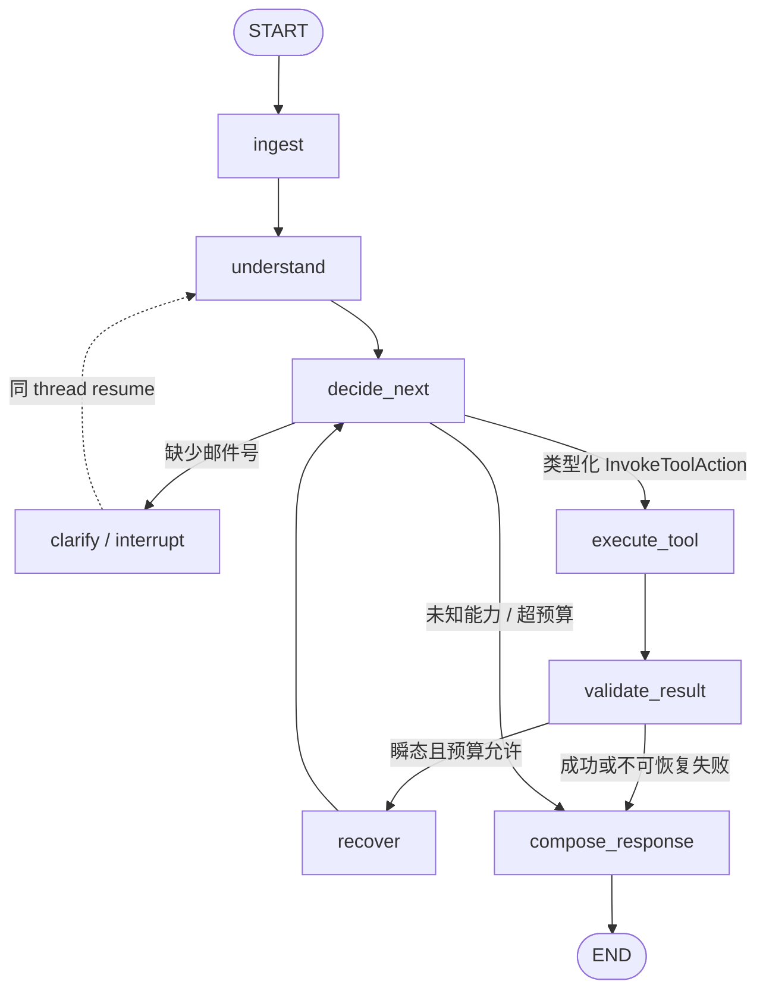

# Phase 1：LangGraph Agent Kernel 与 Fake Tracking 垂直切片

> 状态：`Implemented / Engineering verified`。
>
> 日期：2026-09-03。
>
> 边界：这是不依赖网络的内部 Agent Kernel，不是已发布的 `/v2` API。轨迹、时限和
> 资费真实接口仍未接入；邮件号提取规则仍为 provisional。

## 1. 阶段结果

阶段 1 已把阶段 0 的三节点技术 Spike 演进为一个可注入依赖、可中断恢复、可安全重放
的轨迹查询状态图。当前垂直切片能够：

- 用离线规则识别轨迹意图并抽取 13 位国内邮件号或国际邮件号样式；
- 缺少邮件号时通过 LangGraph `interrupt()` 暂停，并在同一 thread 上恢复；
- 从已验证 Slot 生成 `TrackingCommand`，再由确定性 Registry 路由 Fake Tracking Tool；
- 区分成功、无业务结果、瞬态失败、契约失败和 Loop 预算耗尽；
- 对允许的瞬态失败重试一次，对契约失败不重试；
- 从历史 checkpoint 重放 `execute_tool` 时复用执行收据，不重复调用 Gateway；
- 输出结构化内部审计事件，同时不记录邮件号和自由文本到事件 details。

## 2. 运行拓扑



图定义位于
[`workflow/graph.py`](../apps/assistant-api/src/spb_assistant_api/workflow/graph.py)，组合入口位于
[`workflow/composition.py`](../apps/assistant-api/src/spb_assistant_api/workflow/composition.py)。
Node 不创建 Gateway、Repository 或 Checkpointer；这些依赖只在编译图时注入。

## 3. 模块边界

| 模块 | 当前职责 | 明确不负责 |
| --- | --- | --- |
| `domain/` | Intent、Slot、Understanding、Command、Result、Failure、Event、Descriptor、Receipt 契约 | LangGraph、HTTP、数据库 |
| `services/query_understanding.py` | Phase-1 离线规则识别与邮件号抽取 | LLM fallback、行政区划和重量 |
| `workflow/policy.py` | 纯函数式下一动作、fingerprint、工具与循环预算、恢复许可 | I/O、checkpoint 写入 |
| `services/agent_tools.py` | Registry、Command Dispatcher、Receipt-aware Executor | 选择业务意图、编排图 |
| `tools/tracking.py` | `TrackingCommand -> AgentResult` 的领域工具适配 | HTTP 字段解码 |
| `adapters/fake_tracking.py` | 确定性离线 Gateway 和故障注入 | 生产数据 |
| `workflow/nodes/` | Pydantic 边界校验与 partial state update | 自行构造运行时依赖 |
| `workflow/runtime.py` | thread 配置、输入校验、interrupt resume、Graph 调用与事件流 | V2 鉴权、会话归属、持久化选择 |

现有 V1 `QueryDispatcher` 和 `ToolRegistry` 未修改。Phase-1 Agent 使用独立命名的
`AgentCommandDispatcher` 与 `AgentToolRegistry`，避免把新状态机耦合进当前单轮接口。

## 4. State 与 Reducer

正式 `AgentState` 使用 `TypedDict`，checkpoint 中只保存 JSON-native 值。Pydantic 模型
只在 Node、Policy、Dispatcher、Executor 和 Validator 边界构造或恢复。主要字段包括：

```text
schema_version / conversation_id / turn_id
phase / turn_count / active_intent
slots / missing_slots / ambiguities / pending_action
tool_calls[] / audit_events[]
last_result / last_error
tool_call_count / retry_count / step_count
max_tool_calls / max_retries / max_steps / deadline_at
reply / required_inputs / result / failure / finish_reason
```

`audit_events` 与 `tool_calls` 使用独立 append reducer；Reducer 创建新列表，不修改输入。
其他字段使用覆盖语义，由一个明确节点拥有。`latest_message` 在理解完成后清空，邮件号只
在执行所必需的 Slot / Command 中保留。

## 5. 确定性执行边界

执行路径固定为：

```text
QueryUnderstandingResult
  -> WorkflowPolicy
  -> InvokeToolAction<TrackingCommand>
  -> AgentToolRegistry(Intent.TRACKING)
  -> TrackingTool
  -> TrackingGateway
  -> AgentResultValidator
```

客户端或模型不能提交可直接执行的工具名。Dispatcher 会检查：

1. Command 的 Intent 必须存在于 Registry；
2. Action 中的工具名必须等于 Descriptor 的服务端映射；
3. Command 的运行时类型必须匹配 Descriptor；
4. Tool 返回的工具名和 Intent 必须匹配；
5. Tracking Validator 再检查邮件号一致、事件时间正序且时间包含时区。

任何一项失败都归一为 `contract_violation`，阻止结果展示且不重试。

## 6. Bounded Agent Loop

当前默认预算：

| 预算 | 默认值 | 计数语义 |
| --- | ---: | --- |
| Policy 决策步数 | 8 | 每次进入 `decide_next` 加 1；补槽新用户轮次重置 |
| 逻辑工具调用 | 1 | 相同 argument fingerprint 的重试仍算同一个逻辑调用 |
| 工具重试 | 1 | 首次尝试之外最多重试一次 |
| Descriptor 最大尝试 | 2 | 工具自身的硬上限 |
| Action deadline | 30 秒 | 调用 Gateway 前检查；真实接口接入后重新校准 |
| LangGraph recursion limit | 24 | 运行时最后保险，不作为正常分支控制 |

恢复策略同时检查 `retryable`、Failure allowlist 和 retry budget。即使某个契约失败被错误
标记为 `retryable=true`，Policy 也不会重试。

## 7. Replay-safe 执行收据

`WorkflowPolicy` 对规范化 Command 进行 canonical JSON 编码并生成 SHA-256 fingerprint；
`tool_call_id` 由会话 ID 与 fingerprint 确定性生成。`ToolExecutor` 的顺序是：

```text
查找 (conversation_id, argument_fingerprint)
  -> 已有收据：校验 tool_call_id / tool_name 后复用
  -> 无收据：调用 Gateway，保存结果收据，再返回 Node update
```

因此，如果上游已返回成功但 Graph Node 的 checkpoint 尚未完成，恢复或 time-travel
重放会复用收据。阶段测试真实选择 `execute_tool` 之前的历史 LangGraph checkpoint 建立
分支，确认 Fake Gateway 不发生第二次调用。

阶段 2 需要把内存收据替换成具备唯一约束和事务语义的持久化 Repository，并加入同一
thread 串行推进；当前内存实现不宣称解决多进程竞态。

## 8. Failure 路径

| Failure | Phase-1 行为 |
| --- | --- |
| 缺少邮件号 | `waiting_user` + interrupt，属于正常暂停 |
| `no_match` | `completed`，返回无匹配结果，不重试 |
| timeout / rate limit / unavailable | 在预算内进入 `recover`，最多重试一次 |
| contract violation | `failed`，阻止数据展示，不重试 |
| unknown / 未注册能力 | `handoff`，不调用其他工具 |
| tool / step budget exceeded | `failed`，返回稳定 `loop_budget_exceeded` |

内部事件只保留 node、phase、intent、action、attempt、Failure Category 和 finish reason
等低敏字段。它们用于测试与后续 Trace 投影，不是另一套 Event Sourcing Runtime。

## 9. 验证命令与覆盖范围

```bash
LANGGRAPH_STRICT_MSGPACK=true uv run pytest \
  apps/assistant-api/tests/test_agent_kernel_units.py \
  apps/assistant-api/tests/test_tracking_agent_workflow.py
```

阶段测试覆盖 Reducer 不变性、规则理解、完整类型路由、Registry 白名单、Command 构造、
Result Validator、直接查询、interrupt/resume、no-match、重试成功、重试耗尽、契约失败、
业务 Step 预算、Graph 拓扑、thread 隔离、运行时事件流、严格 checkpoint 序列化和历史
checkpoint 重放。

Phase 1 里程碑提交前的验证结果：该阶段两个测试文件共 36 项通过；当时完整 Python
工作区 203 项通过。后续阶段的当前总数见对应实现说明。
这些是工程回归数量，不替代阶段 5 的代表性 Agent 质量指标。

## 10. 尚未实现

- `/v2/agent` FastAPI 路由、SSE 投影、身份归属和 HTTP 幂等键；
- SQLite/Redis/PostgreSQL checkpointer、持久化收据、TTL 和并发控制；
- 五意图完整规则、Slot Merger、Region Resolver 和 Structured LLM fallback；
- 轨迹、时限、资费真实接口及其认证、限流、超时和 schema fixture；
- 政策与设备价格 V2 兼容 Adapter；
- Agent Web、黑盒 Eval、生产 Trace/Metrics 和质量指标。

以上内容在 Phase 1 里程碑时分别属于阶段 2～6，不能用该 Fake 垂直切片替代；其中阶段
2 的后续实现与仍未完成范围见[Phase 2 说明](agent-kernel-phase2.md)。
