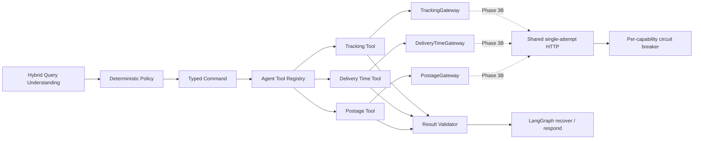

# Phase 3A：接口契约前置的 Gateway 与可靠性基础

- 状态：Implemented / contract-independent foundation verified
- 日期：2026-09-04
- 前置提交：`186208f`（Phase 2）
- 当阶段 API 边界：尚未挂载 FastAPI；后续 Phase 4A 已增加显式装配的 V2 JSON

> 后续状态：本文保留 Phase 3A 里程碑事实；Policy/Device V1 Tool 到 V2 Registry 的
> 兼容桥已在 [Phase 4D](agent-kernel-phase4d.md) 完成。

## 1. 阶段结果

外部轨迹、时限和资费接口尚未提供，无法诚实实现真实请求字段、认证和响应映射。
因此原“阶段 3”拆成两段：Phase 3A 先冻结与供应商无关的执行和可靠性边界，Phase 3B
在接口评审后补三个真实 Adapter、脱敏契约 fixture 与测试环境烟测。

Phase 3A 已完成：

- 新增独立的 `DeliveryTimeGateway`、`PostageGateway` Port，以及对应类型化 Tool；
- 扩展确定性 Policy，使完整的时限和资费槽位生成各自 Command；
- 通过可选依赖把时限、资费能力注册进同一 LangGraph Agent Runtime；
- 对可执行地区、重量、路线、查询时间和报价输入建立 fail-closed 不变量；
- 建立单次网络尝试的共享 JSON HTTP Client，把重试预算留给 Graph；
- 实现有界指数退避、确定性 jitter、受限 `Retry-After` 和按能力隔离的熔断器；
- 使用 Fake Gateway 与 `httpx.MockTransport` 验证正常路由、空业务结果、故障分类、
  有限重试、熔断隔离和半开恢复。

这证明的是“真实接口到达前可以验证的架构”。当前没有真实物流数据、供应商 URL、
凭据、业务错误码或线上烟测，不能把 Phase 3A 表述为“已接入三个真实接口”。

## 2. 运行边界



Graph 仍是唯一工作流运行时。Tool 和 Domain 只认识领域 Port；未来具体 Adapter 才认识
URL、Header、上游字段与业务错误码。共享 HTTP 层只处理协议共性，不接收“任意能力 +
任意字典后直接返回 UI”的通用业务接口。

## 3. 模块职责

| 模块 | Phase 3A 职责 | 不承担 |
| --- | --- | --- |
| `domain/ports.py` | 三个独立查询 Gateway Protocol | HTTP、认证、重试 |
| `domain/commands.py` | 可执行 Command；地区必须 resolved，资费重量必须有值 | 上游 wire schema |
| `tools/delivery_time.py` | `DeliveryTimeCommand -> AgentResult` | 估算缺失时限 |
| `tools/postage.py` | `PostageCommand -> AgentResult` | 自行计算或补写价格 |
| `services/result_validator.py` | 命令与结果的路线、重量、时区不变量 | 信任未验证响应 |
| `adapters/agent_http.py` | 单次 HTTP、连接池、TLS、Request ID、大小限制和错误归一 | Graph 重试、业务 DTO 映射 |
| `services/retry_schedule.py` | Graph 恢复节点的退避计划 | 发起网络请求 |
| `services/circuit_breaker.py` | 单进程、按能力隔离的熔断状态 | 分布式共享状态、readiness 聚合 |
| `adapters/fake_shipping.py` | 离线确定性结果和故障注入 | 模拟真实 wire contract |

Phase 3A 同时提供新的能力中性组合名 `create_agent_runtime()`、`build_agent_graph()`、
`StatefulAgentRuntime`。Phase 1/2 的 Tracking 前缀名称保留为兼容入口，避免让旧测试和
本地 checkpoint 调用方在同一次演进中被强制迁移。新组合入口的三个 Gateway 都是
可选依赖，未装配的 Intent 会安全 Handoff；旧 Tracking 入口仍要求 Tracking Gateway。

架构测试继续约束 Domain 不依赖外层、Application Service 不依赖 Workflow/Adapter、
LangGraph 只出现在 Workflow/checkpointer 边界，并新增 Tool 不依赖 Adapter/Workflow、
HTTP API 不装配 Fake Gateway 的约束。

## 4. 类型化路由与结果可信度

时限与资费沿用 Phase 1 的受约束执行链：

```text
validated Slots
  -> DeliveryTimeCommand / PostageCommand
  -> server-side ToolDescriptor
  -> allowlisted Tool
  -> capability-specific Gateway
  -> typed AgentResult
  -> Result Validator
```

关键不变量：

- Command 中的寄件地和寄达地必须已经解析为规范地区；
- 资费 Command 必须有正数 `Decimal` 重量；
- 时限必须是正数，单位不能为空；
- 时限和资费结果的路线必须与命令一致；双方都提供地区代码时，代码也必须一致；
- 报价返回的输入重量必须与命令完全一致，金额继续使用 `Decimal`；
- 成功或部分成功结果的 `queried_at` 必须包含有效时区；
- Gateway 返回 `None` 映射为正常 `no_match`，不伪装成技术失败；
- Tool 不计算上游没有返回的价格或时限事实。

当前地区代码比较是接口前的保守策略：规范名称必须一致，双方同时存在的代码必须
一致。Phase 3B 需要根据接口采用的行政区划版本决定代码是否改为强制字段。

## 5. HTTP、重试与熔断

### 5.1 单次 HTTP 边界

`AgentJsonHttpClient` 每次调用只发起一次网络请求：

- Base URL 只允许无内嵌凭据、query 和 fragment 的 HTTP(S) URL；
- 请求 path 必须是相对路径，query 参数只能通过独立参数传入；
- 只开放只读查询当前需要的 GET/POST，禁用自动重定向；
- 支持连接池、TLS 校验、总超时、默认 Header 和上下文 `X-Request-ID`；
- 以流式读取方式在累计内容超过默认 1 MiB 时立即拒绝；
- 只返回 `status_code + JSON payload`，具体 Adapter 仍需用 Pydantic 映射成领域结果。

协议失败映射如下：

| 条件 | FailureCategory | 是否允许 Graph 重试 |
| --- | --- | ---: |
| HTTPX timeout、408、504 | `upstream_timeout` | 是 |
| transport error、5xx | `upstream_unavailable` | 是 |
| 429 | `upstream_rate_limited` | 是 |
| 非契约状态、非法 JSON、响应过大 | `contract_violation` | 否 |
| 401 / 403 | `upstream_unavailable` | 否 |

当前只解析 `Retry-After` 的 delta-seconds 形式；HTTP-date 是否需要支持，等真实接口契约
确认。响应 Content-Type、空 200、业务码和字段 schema 也必须由 Phase 3B 的具体 Adapter
进一步验证。

### 5.2 唯一重试所有者

HTTP Client 不内置重试，LangGraph `recover` 节点是唯一重试决策点，避免出现“HTTP
重试次数 × Graph 重试次数”的乘法放大。默认计划为 50ms 指数退避、最大 2s、20%
确定性 jitter；jitter 由 conversation/turn 和尝试次数生成，测试可复现。

`Retry-After` 小于等于本地 2s 上限时遵循；超过上限时本轮直接安全失败，不让一个
请求长期占用 Graph Run 或并发槽。Runtime 写入的 Action deadline 会在每次 Tool 调用前
检查，单次网络调用由 HTTP timeout 约束；后续 Phase 4A 已在 V2 JSON API 补充覆盖整个
Graph Run 的外层 timeout。

### 5.3 能力级熔断

熔断状态按 `tracking`、`delivery_time`、`postage` 等稳定 capability key 隔离。默认连续
失败 3 次打开，30s 后只允许一个 half-open probe；成功关闭，失败重新打开。被取消的
半开探测会释放 probe，不会让能力永久卡住。

当前实现是进程内基础组件，不宣称多副本共享熔断状态。Phase 4C 已接入 V2 运行级
readiness 与指标，但尚未把真实上游健康和熔断状态聚合为能力探针。是否按供应商、host
或 capability 切分 key，需要在 Phase 3B 根据部署拓扑确认。

## 6. 自动化证据

Phase 3A 相对 Phase 2 新增 22 个 pytest case；该里程碑完整 Python workspace 为
`262 passed`。新增覆盖包括：

- 时限与资费在同一 StateGraph 中路由到不同类型化 Tool；
- 空结果与技术失败分离，错误路线/错误重量被 Validator 阻止；
- 未解析地区和空重量不能构造可执行 Command；
- Request ID、认证 Header、路径和 JSON body 转发；
- timeout、transport、429、5xx、504、非法 JSON、未知状态和超大响应映射；
- 熔断按能力隔离、冷却后半开恢复、取消探测后再次恢复；
- jitter 可复现且有界，过长 `Retry-After` 不重复调用 Gateway；
- Tool、Domain、Service、Workflow、Adapter 与 HTTP API 的依赖方向。

复现命令：

```bash
LANGGRAPH_STRICT_MSGPACK=true .venv/bin/pytest -o addopts='' -q
```

## 7. Phase 3B 接口接入清单

收到接口资料后，每个能力分别完成以下内容：

1. 确认环境、Base URL、方法、路径、版本与 Content-Type；
2. 确认认证、凭据轮换、TLS、Request/Trace ID 和日志脱敏要求；
3. 冻结请求字段、行政区标识、邮件号格式、重量单位与精度；
4. 冻结成功、空结果、参数错误、限流和服务错误的 HTTP/业务码；
5. 用脱敏真实样例建立严格的请求/响应 Pydantic wire schema 与 fixture；
6. 分别实现 Tracking、Delivery Time、Postage Adapter，不把三种领域结果合为字典；
7. 映射 wire schema 到稳定 Domain，并保留供应商版本与 provenance；
8. 校准 timeout、retry、breaker、连接池和响应大小，不直接沿用 Demo 默认值；
9. 增加 MockTransport 合同测试、错误矩阵和测试环境 smoke test；
10. 记录接口映射表与烟测证据，再把 Phase 3 标记为完成。

## 8. 尚未完成

- 三个真实 Gateway Adapter、供应商认证和 wire schema；
- 脱敏真实 fixture、测试环境 smoke test 和真实延迟数据；
- 真实邮件号规则、完整行政区目录、产品类型与计费字段；
- Policy/Device Price V1 Tool 到 V2 Registry 的兼容桥；
- HTTP Client/Breaker 的生产配置注入和分布式状态；V2 运行级 readiness/metrics 已在
  Phase 4C 完成，但能力级熔断的外部依赖探针仍待真实 Adapter；
- V2 SSE、Agent Web、黑盒 Agent Eval 与完整 Trace；V2 JSON 已在 Phase 4A 以显式装配
  方式完成。

以上内容分别属于 Phase 3B～6，不能由 Fake Gateway 或 MockTransport 测试替代。
