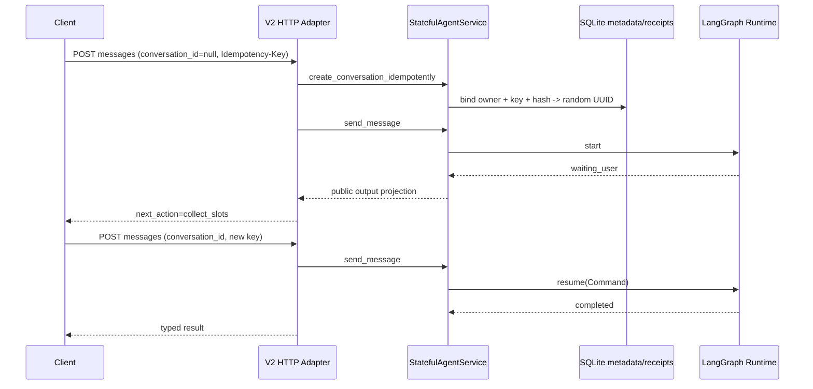

# Phase 4A：Stateful Agent V2 JSON API

> 后续状态：本文保留 Phase 4A 里程碑事实；当时尚未实现的 SSE 与 Agent Web 已在
> [Phase 4B](agent-kernel-phase4b.md) 的显式装配路径完成。

- 状态：Implemented / opt-in transport verified
- 日期：2026-09-04
- 前置基线：Phase 3A 工作树
- 当前发布边界：V2 路由仅在显式注入 Agent 依赖时挂载；默认 `main.app` 仍为 V1

## 1. 阶段结果

Phase 4A 已把隔离的 LangGraph Runtime 接到稳定 HTTP 边界，同时不提前装配尚未提供的
真实物流接口。当前完成：

- `GET /v2/agent/capabilities`：返回五类公开能力及非敏感输入描述，并区分已注册/未注册；
- `POST /v2/agent/messages`：统一处理新会话、interrupt 恢复和已完成会话的新一轮查询；
- `DELETE /v2/agent/conversations/{id}`：校验 owner 后清理 checkpoint、消息幂等收据和
  Tool 执行收据，并保留 deleted tombstone；
- 将内部 Graph Output 投影为固定的 `phase / next_action / required_inputs / result /
  failure`，不暴露 Node 名、Graph State、Prompt 或内部错误消息；
- 复用 V1 的 API Key、Request ID、请求体限制、限流和并发容量中间件；
- 为整个 Graph Run 增加 HTTP 外层 timeout，并将已分类 Failure 映射为稳定状态码；
- 用独立会话创建收据覆盖 `conversation_id=null` 时的跨重启幂等，避免重试创建多个
  Workflow；
- 保留默认 V1 应用行为：没有明确注入 `AgentApiDependencies` 就不会出现 V2 路由。

这一阶段使用 Fake Gateway 验证 HTTP 到 LangGraph 的完整本地路径，不需要外部 API Key。
真实 Tracking / Delivery Time / Postage URL、认证和 wire schema 仍属于 Phase 3B。

## 2. 调用与状态边界



HTTP 层只知道一个小型 `AgentConversationService` Protocol 和 `ToolDescriptor` 映射；它
不导入 Fake Gateway，不构造 Tool，也不包含 Query Understanding 或 Workflow 分支。
LangGraph 仍只存在于 Workflow/checkpointer 边界。

## 3. JSON 契约

### 3.1 能力发现

能力接口始终声明 `policy`、`device_price`、`tracking`、`delivery_time` 和 `postage`，
但 `available` 只由服务端实际注入的 Descriptor 决定。客户端不能因为意图名称存在就
假定工具可执行，也不会看到供应商 URL、认证方式或内部工具参数。

### 3.2 创建或推进会话

请求示例：

```json
{
  "conversation_id": null,
  "message": "帮我查一下邮件",
  "explicit_intent": null,
  "confirm_overwrite": false,
  "stream": false
}
```

规则：

- `Idempotency-Key` 必填，长度 1～128，只接受可见 ASCII；
- 新建会话必须有 `message`；恢复意图澄清时可只提交 `explicit_intent`；
- `explicit_intent=unknown` 被拒绝，客户端不能强制未知路由；
- `confirm_overwrite` 只表示用户明确确认覆盖冲突槽位；
- `stream=true` 在 Phase 4A 返回 `501 agent_streaming_not_implemented`，不会伪装成 JSON
  流；
- `conversation_id` 已处于 `waiting_user` 时调用 LangGraph resume；否则有消息时开始新的
  turn，从而避免 HTTP 调用方理解 checkpoint/interrupt 细节。

响应只允许四种外部停止态：

| `phase` | `next_action` | 含义 |
| --- | --- | --- |
| `waiting_user` | `collect_slots` / `clarify_intent` | Graph 已 interrupt，可用同一会话恢复 |
| `completed` | `complete` | 成功、部分结果或正常 `no_match` |
| `handoff` | `handoff` | 能力未注册或需要安全退出自动流程 |
| `failed` | `failed` | Workflow 已分类失败，事实结果为空 |

瞬态的 `understanding / executing / recovering` 等内部阶段不会作为一次 JSON 请求的最终
响应。`AgentResult` 仅投影公开 `type / status / data / reason_code`；失败投影不含内部
message，只包含 category、稳定 code、retryable 和受限 Retry-After。

### 3.3 删除

删除先验证调用方 owner，再在同一会话锁内依次清理 LangGraph checkpoint、消息幂等
收据和 Tool 收据，最后把元数据标为 `deleted`。删除本身幂等：同一 owner 重试得到
204；其他 owner 与不存在/已删除会话在后续消息接口中统一表现为 404，避免会话枚举。

创建收据与 deleted tombstone 暂时保留，用于防止网络重放把已删除会话重新创建。生产
数据保留期限和异步清理队列仍需隐私评审后确定。

## 4. 三层幂等

| 层 | 唯一键 | 防止的问题 |
| --- | --- | --- |
| 会话创建收据 | `(owner_id, Idempotency-Key)` + request hash | 首次响应丢失后产生多个随机会话 |
| 消息收据 | `(conversation_id, Idempotency-Key)` + request hash | 重复 start/resume 和不同请求误用同 Key |
| Tool 执行收据 | `(conversation_id, argument_fingerprint)` | checkpoint 重放导致重复调用只读上游 |

会话创建收据和随机 UUID 在一个 SQLite `BEGIN IMMEDIATE` 事务内写入；重启后相同请求
返回原会话，不同 payload 使用相同 Key 返回 409。API 响应中的 `request_id` 不进入业务
结果收据，因此每次 HTTP 重放仍返回本次 Request ID，便于链路排查。

## 5. 鉴权、owner 与失败映射

现有中间件在鉴权开启时以 API Key 的 SHA-256 短摘要作为不透明 `owner_id`，Graph State
和元数据不保存原始 Key。会话 UUID 仍是服务端随机生成，知道 UUID 不能绕过 owner
校验。当前共享服务 Key 只能隔离不同 Key，不能替代正式终端用户/tenant 身份；Agent
Web 发布前必须明确身份绑定策略。

主要操作级映射：

| 条件 | HTTP | 稳定语义 |
| --- | ---: | --- |
| 会话不存在、owner 不符或已删除 | 404 | `conversation_not_available` |
| 并发推进、过期、幂等 hash 冲突、Loop 超预算 | 409 | 客户端重新加载或新建会话 |
| 输入与当前状态不兼容 | 422 | 修正消息、意图或确认字段 |
| Result contract violation | 502 | 不展示未验证事实 |
| 持久化、State schema 或上游暂不可用 | 503 | 根据 retryable/Retry-After 重试 |
| Graph Run 超过 API 外层预算 | 504 | `agent_request_timeout` |
| 未分类异常 | 500 | fail closed，仅返回 Request ID |

业务 `no_match` 是 HTTP 200 的完成结果；可预期的上游失败由 Graph recover/response 形成
HTTP 200 的 `phase=failed`。只有无法开始/推进本次 Workflow 的操作级错误才使用 4xx/5xx。

## 6. 自动化证据

Phase 4A 新增 9 个 API 集成测试和 1 个架构合同测试，完整 Python workspace 为
`272 passed`。覆盖：

- V2 路由的鉴权与五能力发现，未注册能力不会被误报为 available；
- 新建 -> 补槽 -> resume -> 类型化结果，以及完成后的新 turn；
- 首轮与恢复消息重放不重复 Tool Call；
- 创建收据跨 SQLite/Graph 重启返回同一随机 conversation/turn；
- 同 Key 不同请求返回 409；
- 多意图 interrupt 可只提交显式选择，不必重复原始自然语言；
- 不同 API Key 的 owner 隔离、幂等删除和删除后不可恢复；
- 必填头、额外字段、unknown 显式意图、空输入和暂不支持 SSE 的失败契约；
- TTL 过期稳定映射；默认 `main.app` 继续不挂载 V2。
- Graph Run 外层 timeout 会取消慢调用并释放消息 claim，相同请求可安全重试。

复现：

```bash
uv run pytest apps/assistant-api/tests/test_phase4a_agent_json_api.py
uv run pytest
```

## 7. 下一切片

以下不依赖真实接口的条目已由 Phase 4B 完成：

- 版本化 SSE 事件投影和断流语义，不直接转发 `astream_events` 原始事件；
- OpenAPI 生成前端类型、V2 client 与运行时 payload 校验；
- Agent Web 五入口、补槽控件、typed renderer、刷新恢复和会话清理；
- 为显式装配增加正式 lifespan/config composition root。

Phase 4A 当时尚未实现 V2 Agent readiness、指标与脱敏 Trace；这些运维基础后来在
[Phase 4C](agent-kernel-phase4c.md) 完成。SSE/Web 实现和验收证据见
[Phase 4B 说明](agent-kernel-phase4b.md)。

Phase 3B 必须等待外部接口资料。开始实现真实 Adapter 或测试环境 smoke test 时，需要
用户提供对应 Base URL、认证方式、测试凭据/API Key 和脱敏请求/响应样例；任何真实
凭据只进入本地 `.env` 或 Secret 管理，不写入 Git、测试 fixture、日志或文档。
