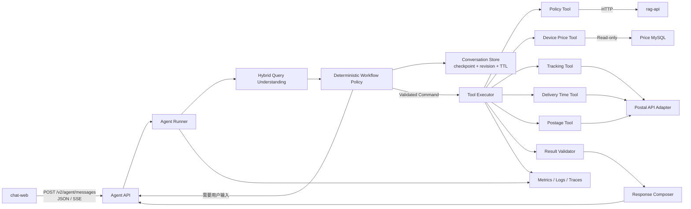

# Stateful Agent Workflow 下一阶段实施方案

> 文档状态：`Proposed`，用于下一阶段设计评审、任务拆分和验收，不描述当前已上线能力。
>
> 代码基线：提交 `1898261`；`assistant-api 0.3.2`、`chat-web 0.2.0`、
> `eval 0.3.0`。
>
> 更新日期：2026-09-03。
>
> 外部接口状态：轨迹、时限和资费接口尚未提供。本文中的字段、错误和时效策略为
> 领域侧预留，最终以接口契约评审结果为准。

## 1. 建设目标

当前 Assistant 是客户端显式选择 `policy` / `device_price` 后执行一次只读工具的
单轮 Dispatcher。下一阶段将其演进为一个受约束、可观测、可恢复的 Stateful Tool
Agent，在保留现有 RAG、结构化查询和安全边界的基础上增加：

- Query Understanding：识别意图、抽取实体、发现歧义和缺失字段；
- Routing：把已验证的结构化命令映射到白名单工具；
- Stateful Workflow：跨轮补充字段、checkpoint、恢复、超时和主动重置；
- Bounded Agent Loop：在明确的步数、工具调用和时间预算内执行；
- Failure Handling：区分用户输入、无业务结果、上游失败、契约失败和内部失败；
- 新增只读能力：邮件轨迹、寄递时限和资费查询；
- 多轮黑盒评测、失败注入、Agent Trace 和质量门禁。

最终系统应能支持以下交互：

```text
欢迎与能力提示
  -> 用户自由输入或显式选择能力
  -> 识别 policy / device_price / tracking / delivery_time / postage
  -> 收集并规范化当前意图所需字段
  -> 字段完整后执行且只执行一个只读工具
  -> 校验工具输出并显示类型化结果
  -> 完成本轮或开始新的查询
```

本阶段的 Agent 定位不是自由自治系统。LLM 可以参与自然语言理解和最终措辞，但
不能绕过状态机、参数 schema、工具白名单或结果校验器。

### 1.1 阶段总览

| 阶段 | 核心目标 | 主要退出条件 | 关键依赖 |
| --- | --- | --- | --- |
| 0 | 冻结领域契约与架构决策 | V2 草案、ADR、接口清单通过评审 | 无外部接口依赖 |
| 1 | 建立 Agent Kernel 和 Fake 轨迹垂直切片 | 补槽、单工具执行、终止与幂等测试通过 | 阶段 0 |
| 2 | Hybrid Understanding 与持久状态 | 五类意图、多轮、重启恢复和隐私门禁通过 | 阶段 1、模型配置可选 |
| 3 | 接入三类真实查询接口 | Adapter 合同、失败注入和测试环境烟测通过 | 外部接口与测试凭据 |
| 4 | 发布 V2 API 和 Agent Web | 五类 Renderer、JSON/SSE、取消与恢复通过 | 阶段 1～3 |
| 5 | 建立 Agent Eval、Trace 和质量门禁 | 基线报告、错误分析和可定位 Trace 完成 | 阶段 2～4 |
| 6 | 部署硬化并固化求职材料 | 回滚演练、全量验证、真实指标回填完成 | 阶段 5 |

## 2. 范围与非目标

### 2.1 本阶段范围

| 能力 | 初步输入 | 初步输出 | 状态 |
| --- | --- | --- | --- |
| 政策查询 | 自然语言问题 | 回答、公开引用、拒答原因 | 复用现有工具 |
| 设备价格 | 品牌、型号、规格相关描述 | 类型化价格候选 | 复用现有工具 |
| 邮件轨迹 | 邮件号 | 当前状态、轨迹节点 | 新增 |
| 寄递时限 | 收寄地、寄达地 | 时限结果与口径 | 新增 |
| 资费查询 | 收寄地、寄达地、重量 | 报价与计费信息 | 新增 |

图示中的“13 位数字邮件号”暂作为交互假设，不在接口确认前写死为唯一业务规则。
行政区划暂按省、市、县三级建模，工具最终使用名称、编码、邮编或其他标识，取决于
上游接口要求。资费工具预留产品类型、体积、保价和附加服务字段，但 MVP 不主动
要求尚未被接口证明为必要的输入。

### 2.2 明确非目标

- 不执行理赔审批、赔付计算、下单、改单或数据库写入；
- 不允许模型生成任意工具名、URL、SQL 或未经 schema 校验的工具参数；
- 不在一个工具步骤中隐式融合多个业务意图；
- 不建设长期用户画像或未经授权的跨会话记忆；
- 不记录或展示模型内部思维链；
- 不为展示概念而引入多 Agent 协作；当前任务适合单 Agent 状态图；
- 不在接口提供前伪造真实字段、错误码、限流规则或业务结果。

### 2.3 兼容性原则

- 保持现有 `POST /v1/chat` 行为不变；
- 新能力使用独立的 `/v2/agent` 契约；
- 现有政策和设备价格工具通过适配层接入 V2，不复制业务实现；
- V1 与 V2 可以并行评测和灰度；
- `packages/contracts` 继续只承载离线写入与 RAG 读取的数据契约，不成为通用 DTO
  存放目录；
- V2 HTTP 契约通过版本化 OpenAPI artifact 管理，并由其生成 Web 类型或客户端。

## 3. 当前基线与差距

| 当前实现 | 可复用内容 | 进入下一阶段前的差距 |
| --- | --- | --- |
| `QueryMode` 只有两个显式值 | 已有稳定模式标识 | 缺少候选意图、置信信号、歧义和多意图表示 |
| `AssistantTool.execute(question: str)` | 生命周期和测试替身接口 | 新工具需要结构化 Command，不能反复解析自由文本 |
| `ToolRegistry` 固定映射模式到工具 | 白名单路由和单工具约束 | 缺少 Tool Descriptor、输入/输出 schema 和失败策略 |
| `ToolResult` 提供公共状态与 Evidence | 公共响应、警告、缺失字段 | 轨迹时间线、时限和报价不适合强行建模为 Evidence |
| Web 保存页面内消息 | SSE、取消请求、现有证据展示 | 服务端无 workflow state，组件缺少类型化 renderer |
| Eval 黑盒调用单轮 API | HTTP 客户端、报告与基础指标 | 缺少多轮脚本、状态转换、错误恢复和 Agent Trace 指标 |
| Assistant 已有鉴权、限流和指标 | 可直接保护 V2 路由 | 需要会话级并发、幂等、TTL 和隐私策略 |

因此，下一阶段不是简单地给 `QueryMode` 添加三个值，而是在现有 Dispatcher 前增加
一个负责理解、补槽和状态迁移的 Agent Workflow；Dispatcher 继续只负责执行已经
验证完成的命令。

## 4. 目标架构



### 4.1 分层职责

| 层 | 允许职责 | 禁止职责 |
| --- | --- | --- |
| API | 鉴权、HTTP schema、SSE、错误映射 | 意图规则、工具业务逻辑、直接访问外部 API |
| Workflow | 状态迁移、下一动作、预算和 checkpoint | 拼接 SQL、解析上游私有字段 |
| Query Understanding | 文本规范化、意图候选、槽位抽取 | 执行工具或决定业务事实 |
| Domain | Intent、Command、State、Result、Failure 类型 | FastAPI、HTTP、Redis、数据库实现 |
| Tool | 一个领域命令到一个领域结果 | 接收任意未验证参数、选择其他工具 |
| Adapter | 外部认证、请求、响应映射 | 把上游错误伪装成无结果 |
| Store | 状态持久化、版本和 TTL | 推导下一业务动作 |
| Eval | 通过 HTTP 观察系统行为 | 导入 Assistant 实现或直连数据源 |

## 5. Query Understanding 契约

### 5.1 意图枚举

```python
class Intent(StrEnum):
    POLICY = "policy"
    DEVICE_PRICE = "device_price"
    TRACKING = "tracking"
    DELIVERY_TIME = "delivery_time"
    POSTAGE = "postage"
    UNKNOWN = "unknown"
```

对外的 `Intent` 是版本化契约；内部工具名不由客户端或模型直接提交。

### 5.2 公共值对象

```python
class RegionCandidate(BaseModel):
    province_code: str | None = None
    city_code: str | None = None
    county_code: str | None = None
    canonical_name: str


class RegionRef(BaseModel):
    raw_text: str
    province_code: str | None = None
    city_code: str | None = None
    county_code: str | None = None
    canonical_name: str | None = None
    resolution: Literal["resolved", "ambiguous", "unresolved"]
    candidates: list[RegionCandidate] = Field(default_factory=list)


class WeightValue(BaseModel):
    value: Decimal | None = None
    unit: Literal["g", "kg"] = "kg"


class SlotProvenance(BaseModel):
    slot: str
    source: Literal[
        "explicit_ui",
        "current_turn",
        "workflow_state",
        "rule_extractor",
        "model_extractor",
    ]
    raw_text: str = ""
```

金额和重量使用十进制定点值，不使用二进制浮点表示事实。行政区划同时保留原始文本
和规范化标识，避免把“朝阳区”等歧义名称直接交给外部接口。

### 5.3 按意图区分的槽位

```python
class TrackingSlots(BaseModel):
    intent: Literal["tracking"]
    mail_no: str | None = None


class DeliveryTimeSlots(BaseModel):
    intent: Literal["delivery_time"]
    origin: RegionRef | None = None
    destination: RegionRef | None = None


class PostageSlots(BaseModel):
    intent: Literal["postage"]
    origin: RegionRef | None = None
    destination: RegionRef | None = None
    weight: WeightValue | None = None
    product_code: str | None = None


class PolicySlots(BaseModel):
    intent: Literal["policy"]
    question: str


class DevicePriceSlots(BaseModel):
    intent: Literal["device_price"]
    question: str


SlotPayload = Annotated[
    TrackingSlots
    | DeliveryTimeSlots
    | PostageSlots
    | PolicySlots
    | DevicePriceSlots,
    Field(discriminator="intent"),
]
```

政策和设备价格继续允许自然语言问题，但在 V2 中也包装为类型化 Command，保证
Tool Executor 只处理统一命令联合。

### 5.4 理解结果

```python
class IntentCandidate(BaseModel):
    intent: Intent
    score: float = Field(ge=0, le=1)
    signals: list[str] = Field(default_factory=list)


class QueryUnderstandingResult(BaseModel):
    schema_version: Literal["1"] = "1"
    original_query: str
    normalized_query: str
    selected_intent: Intent
    candidates: list[IntentCandidate]
    slots: SlotPayload | None
    slot_provenance: list[SlotProvenance]
    missing_slots: list[str]
    ambiguities: list[str]
    multi_intent: bool
    source: Literal[
        "explicit_ui",
        "active_workflow",
        "rules",
        "model",
    ]
    parser_version: str
```

`score` 是路由启发式信号，不在文档或 UI 中称为“真实概率”。`signals` 只记录
可公开的判断依据，例如 `mail_no_pattern`、`weight_entity` 或 `keyword_tracking`，
不得保存模型内部思维链。

## 6. Query Understanding 实现策略

采用 Hybrid Pipeline，按以下优先级执行：

1. 显式 UI 意图：用户点击能力入口时优先，但仍校验服务端白名单；
2. 活跃 Workflow：处于等待重量状态时，“2.5 公斤”优先补当前槽位；
3. 确定性实体提取：邮件号、重量、行政区划候选和明显领域关键词；
4. 规则路由：根据实体和关键词产生候选意图及 signals；
5. Structured LLM fallback：只有规则无法可靠决策时调用；
6. Pydantic 校验：模型输出不满足 schema 时不得进入 Tool Executor；
7. Deterministic Policy：根据候选、缺失字段和歧义决定下一动作。

建议接口：

```python
class QueryUnderstander(Protocol):
    async def understand(
        self,
        *,
        message: str,
        state: AgentState,
        explicit_intent: Intent | None,
    ) -> QueryUnderstandingResult: ...
```

实现分为：

- `RuleBasedQueryUnderstander`：可离线、可解释的默认实现；
- `StructuredLlmQueryUnderstander`：只输出受约束 JSON；
- `HybridQueryUnderstander`：负责优先级、fallback 和结果合并；
- `RegionResolver`：把行政区划原文映射为候选标准值；
- `SlotMerger`：依据来源优先级和冲突策略更新状态。

### 6.1 槽位合并规则

- 当前轮显式字段优先于模型推断；
- 新输入没有提及某槽位时保留当前 Workflow 已确认值；
- 用户给出与已确认值冲突的新值时先请求确认，不静默覆盖；
- 检测到高置信新意图时，先确认是否放弃当前未完成流程；
- 不同意图之间默认不复用槽位；安全且明显的字段也要经过重新校验；
- `取消`、`重新开始`、`清空` 作为确定性控制命令处理；
- 结果完成后进入 `COMPLETED`，下一条业务问题创建新 Workflow 或显式复用。

### 6.2 初始路由门槛

以下数值仅作为首版实验参数，必须通过评测集校准：

| 条件 | 下一动作 |
| --- | --- |
| 显式意图且无冲突 | 使用显式意图 |
| Top-1 `>= 0.80` 且与 Top-2 差值 `>= 0.20` | 接受意图 |
| Top-1 `>= 0.55` 但差值不足 | `clarify_intent` |
| Top-1 `< 0.55` | 返回能力菜单 |
| `multi_intent=true` | 请求拆分或选择优先能力 |
| 意图明确但字段不足 | `collect_slots` |
| 意图、字段和规范化全部完成 | `invoke_tool` |

规则或模型分数不能覆盖硬冲突。例如输入含明确邮件号时，低置信 LLM 不能把它改为
设备价格查询；输入同时要求轨迹和资费时也不能擅自调用两个工具。

## 7. Routing 与 Tool Registry

### 7.1 Tool Descriptor

```python
class ToolDescriptor(BaseModel):
    intent: Intent
    tool_name: str
    input_schema_name: str
    output_schema_name: str
    required_slots: tuple[str, ...]
    read_only: bool = True
    timeout_seconds: float
    max_attempts: int
    capability_version: str
```

首版映射：

```text
policy        -> policy_knowledge
device_price  -> device_price
tracking      -> tracking
delivery_time -> delivery_time
postage       -> postage
```

Registry 负责：

- 验证每个可执行 Intent（不包括 `unknown`）有且只有一个默认工具；
- 验证工具名称、输入类型和输出类型；
- 暴露 readiness 和非敏感 capability metadata；
- 为 Tool Executor 提供固定映射；
- 拒绝客户端或模型提交的任意工具名。

### 7.2 下一动作联合

```python
NextAction = Annotated[
    UnderstandAction
    | ClarifyIntentAction
    | CollectSlotsAction
    | InvokeToolAction
    | ValidateResultAction
    | RespondAction
    | HandoffAction,
    Field(discriminator="type"),
]
```

`InvokeToolAction` 至少包含：

```text
tool_name
validated_arguments
tool_call_id
argument_fingerprint
attempt
deadline_at
```

一个 Agent Step 最多执行一个工具。相同参数指纹已有成功结果时，Workflow 应复用
结果或要求显式刷新，避免网络重试、页面重复提交造成重复调用。

## 8. Stateful Workflow

### 8.1 Agent State

```python
class AgentPhase(StrEnum):
    NEW = "new"
    UNDERSTANDING = "understanding"
    CLARIFYING = "clarifying"
    COLLECTING = "collecting"
    READY = "ready"
    EXECUTING = "executing"
    VALIDATING = "validating"
    RECOVERING = "recovering"
    RESPONDING = "responding"
    WAITING_USER = "waiting_user"
    COMPLETED = "completed"
    HANDOFF = "handoff"
    FAILED = "failed"


class AgentState(BaseModel):
    conversation_id: UUID
    revision: int
    phase: AgentPhase
    turn_count: int
    active_intent: Intent | None
    slots: SlotPayload | None
    missing_slots: list[str]
    ambiguities: list[str]
    pending_action: NextAction | None
    tool_calls: list[ToolCallRecord]
    last_result: AgentResult | None
    last_error: AgentFailure | None
    step_count: int
    retry_budget: int
    deadline_at: datetime
    created_at: datetime
    updated_at: datetime
    expires_at: datetime
```

### 8.2 状态事件与 Reducer

状态修改集中通过事件和纯 Reducer 完成：

```text
ConversationStarted
UserMessageReceived
QueryUnderstood
IntentClarificationRequested
IntentConfirmed
SlotCollected
SlotConflictDetected
ToolCallStarted
ToolCallSucceeded
ToolCallFailed
ResultValidated
ResponsePrepared
ConversationReset
ConversationExpired
```

纯 Reducer 使状态转换可以不启动 FastAPI、模型或外部接口进行单测，也便于在 Trace
中解释“系统做了什么”，而不记录 Chain of Thought。

### 8.3 Conversation Store

```python
class ConversationStore(Protocol):
    async def load(self, conversation_id: UUID) -> AgentState | None: ...

    async def save(
        self,
        state: AgentState,
        *,
        expected_revision: int,
    ) -> None: ...

    async def delete(self, conversation_id: UUID) -> None: ...
```

实施顺序：

1. `InMemoryConversationStore` 用于单测；
2. `SQLiteConversationStore` 用于本地单进程 Demo 和重启恢复演示；
3. 需要多副本部署时实现 `RedisConversationStore`，不让 Workflow 依赖 Redis API。

持久化要求：

- 使用 `revision` 做 compare-and-set，冲突返回稳定错误并允许客户端重取状态；
- 每次关键事件后 checkpoint，而不是只在最终响应后保存；
- 默认 TTL 30 分钟，实际值通过数据保留评审确认；
- 邮件号在普通日志中脱敏，状态存储按最小必要原则保存；
- 不保存 API Key、模型思维链或完整上游响应；
- 完成、取消和过期流程具备明确清理行为。

### 8.4 幂等与并发

- V2 写入型消息接口要求 `Idempotency-Key`；
- `(conversation_id, idempotency_key)` 对应唯一处理结果；
- 同一会话通过 revision 或轻量锁串行推进；
- 重复消息不能重复扣减 retry budget 或重复调用已成功工具；
- Tool Call 使用独立 `tool_call_id`，可跨重试关联；
- 用户主动要求刷新时生成新 argument fingerprint 版本或显式 refresh 标志。

## 9. Bounded Agent Loop

Agent Runner 每次收到消息后加载状态，循环执行内部步骤，直到需要用户输入或产生
终态响应：

```python
async def handle_message(command: AgentMessageCommand) -> AgentResponse:
    state = await store.load_or_create(command.conversation_id)
    state = reducer.apply(state, UserMessageReceived(...))

    for _ in range(settings.max_steps_per_turn):
        await checkpoint(state)
        action = workflow_policy.next_action(state)

        match action:
            case UnderstandAction():
                observation = await understander.understand(...)
                state = reducer.apply(state, QueryUnderstood(observation))

            case ClarifyIntentAction() | CollectSlotsAction():
                return await pause_for_user(state, action)

            case InvokeToolAction():
                observation = await executor.execute(action)
                state = reducer.apply(state, observation)

            case ValidateResultAction():
                observation = validator.validate(state.last_result)
                state = reducer.apply(state, observation)

            case RespondAction() | HandoffAction():
                return await finish_turn(state, action)

    return await fail_with_loop_budget_exceeded(state)
```

初始预算：

| 预算 | 初始值 |
| --- | ---: |
| 单轮最大内部 Step | 8 |
| 单轮正常工具调用 | 1 |
| 同一只读工具最大尝试 | 2 |
| Query Understanding 模型调用 | 最多 1 |
| 总请求 deadline | 由接口延迟基线确定，暂不写死 |

`WAITING_USER` 是一次 HTTP 请求的正常终点，不是失败。下一条用户消息恢复 Workflow。
达到预算后必须停止，返回稳定 `loop_budget_exceeded`，不能递归继续调用模型。

## 10. 新工具与外部接口适配层

### 10.1 领域 Gateway

```python
class TrackingGateway(Protocol):
    async def query(self, command: TrackingCommand) -> TrackingResult: ...


class DeliveryTimeGateway(Protocol):
    async def query(
        self,
        command: DeliveryTimeCommand,
    ) -> DeliveryTimeResult: ...


class PostageGateway(Protocol):
    async def quote(self, command: PostageCommand) -> PostageResult: ...
```

三个 Gateway 分别表达领域边界。若它们来自同一套外部服务，可在 Adapter 层共享
连接池、认证、Request ID、超时和响应解码，但不能合并成一个接收任意字典的接口。

### 10.2 预留输出

```text
TrackingResult
  mail_no
  current_status
  events[event_code, description, occurred_at, location]
  queried_at

DeliveryTimeResult
  origin
  destination
  estimated_duration
  duration_unit
  service_level
  estimate_basis
  queried_at

PostageResult
  origin
  destination
  product_code
  input_weight
  billable_weight
  amount
  currency
  fee_items
  valid_until
  queried_at
```

字段在接口确认后增删。Domain 不直接暴露上游字段名；Adapter 负责从上游版本映射到
稳定领域模型。

V2 使用统一外壳和判别联合，不把轨迹、时限或报价强行转换成现有 Evidence：

```python
class SourceReference(BaseModel):
    source_type: str
    source_name: str
    record_id: str = ""
    source_url: str = ""
    queried_at: datetime | None = None


AgentData = Annotated[
    PolicyData
    | DevicePriceData
    | TrackingData
    | DeliveryTimeData
    | PostageData,
    Field(discriminator="type"),
]


class AgentResult(BaseModel):
    tool: str
    intent: Intent
    status: Literal[
        "success",
        "partial",
        "need_more_info",
        "no_match",
        "failed",
    ]
    answer: str
    data: AgentData | None = None
    warnings: list[str] = Field(default_factory=list)
    missing_slots: list[str] = Field(default_factory=list)
    reason_code: str = ""
    provenance: list[SourceReference] = Field(default_factory=list)
```

政策和设备价格通过兼容适配器把现有 `ToolResult` 转成 V2 `AgentResult`，不复制检索、
引用校验或价格匹配代码。

### 10.3 结果语义校验

- 轨迹结果的邮件号必须与请求一致；时间节点必须可解析，排序策略明确；
- 时限结果的起止区域必须与已规范化命令相符；
- 资费金额、币种、重量和单位必须可验证，禁止使用浮点推断金额；
- 所有结果带查询时间和来源类别；
- 上游 HTTP 200 但缺失必要字段时记为 `contract_violation`；
- 空业务结果记为 `no_match`，不得和网络异常混用；
- 未经可信数据支持的字段不得由 Response Composer 补写。

## 11. V2 HTTP 契约草案

### 11.1 接口集合

| 方法 | 路径 | 用途 |
| --- | --- | --- |
| `GET` | `/v2/agent/capabilities` | 返回公开意图、展示名称和非敏感输入描述 |
| `POST` | `/v2/agent/messages` | 创建或继续一次 Workflow，支持 JSON/SSE |
| `DELETE` | `/v2/agent/conversations/{id}` | 用户主动清除当前 Workflow |
| `GET` | `/v2/agent/conversations/{id}` | 非 MVP；具备会话归属校验后才开放状态摘要 |

现有鉴权、Request ID、请求体限制和限流中间件继续生效。会话 ID 不能替代身份验证。
当前 Web 使用共享服务 Key，尚不能据此区分终端用户，因此 MVP 默认不开放查询任意
会话状态。`conversation_id` 必须使用不可预测随机值并在存储中最小化暴露；正式接入
用户身份后再绑定 owner / tenant。删除、继续和读取会话都必须执行相同的归属策略。

### 11.2 消息请求

```json
{
  "conversation_id": null,
  "message": "帮我查一下这个邮件",
  "explicit_intent": null,
  "stream": false
}
```

请求使用 `Idempotency-Key` 和 `X-Request-ID` 头。`conversation_id=null` 时创建新
Workflow；继续流程时必须传服务端返回的 ID。

### 11.3 等待补充输入响应

```json
{
  "request_id": "request-id",
  "conversation_id": "conversation-id",
  "turn_id": "turn-id",
  "phase": "waiting_user",
  "intent": "tracking",
  "reply": "请提供邮件号。",
  "next_action": "collect_slots",
  "required_inputs": [
    {
      "name": "mail_no",
      "label": "邮件号",
      "type": "string",
      "validation_hint": "格式以查询接口最终要求为准"
    }
  ],
  "result": null,
  "warnings": []
}
```

### 11.4 完成响应

```json
{
  "request_id": "request-id",
  "conversation_id": "conversation-id",
  "turn_id": "turn-id",
  "phase": "completed",
  "intent": "tracking",
  "reply": "已查询到该邮件的最新轨迹。",
  "next_action": "complete",
  "required_inputs": [],
  "result": {
    "type": "tracking",
    "status": "success",
    "data": {}
  },
  "warnings": []
}
```

### 11.5 SSE 事件

建议顺序：

```text
status
state
[input_required | result]
[delta]
done
```

流建立后的技术错误只发送 `error` 终止事件。`state` 只包含阶段、意图和缺失字段，
不发送思维链、内部 Prompt 或敏感工具参数。

## 12. Failure Handling

### 12.1 统一错误分类

```python
class FailureCategory(StrEnum):
    MISSING_INPUT = "missing_input"
    AMBIGUOUS_INTENT = "ambiguous_intent"
    INVALID_INPUT = "invalid_input"
    NO_MATCH = "no_match"
    UPSTREAM_TIMEOUT = "upstream_timeout"
    UPSTREAM_RATE_LIMITED = "upstream_rate_limited"
    UPSTREAM_UNAVAILABLE = "upstream_unavailable"
    CONTRACT_VIOLATION = "contract_violation"
    STATE_CONFLICT = "state_conflict"
    LOOP_BUDGET_EXCEEDED = "loop_budget_exceeded"
    INTERNAL_ERROR = "internal_error"
```

| 类别 | 重试 | Workflow 行为 | 用户可见语义 |
| --- | --- | --- | --- |
| 缺少输入 | 否 | `WAITING_USER` | 明确询问缺少字段 |
| 意图歧义 | 否 | `CLARIFYING` | 给出有限候选项 |
| 输入非法 | 否 | 保留有效槽位 | 指出字段及格式问题 |
| 无业务结果 | 否 | `COMPLETED` | 明确无匹配，不推测 |
| 上游超时 | 有限 | 退避后重试 | 重试失败后提示暂不可用 |
| 上游限流 | 有限 | 遵循 `Retry-After` | 告知稍后重试 |
| 上游不可用 | 有限 | 熔断或降级 | 不伪装为无结果 |
| 响应契约错误 | 否 | 阻止展示、记录契约指标 | 返回服务异常和 Request ID |
| 状态并发冲突 | 否 | 重新加载或让客户端重试 | 当前会话已被更新 |
| Loop 超预算 | 否 | 强制终止 | 无法安全完成本轮 |
| 内部错误 | 否 | Fail closed | 通用错误和 Request ID |

### 12.2 重试与熔断

- 只对幂等、只读且明确可恢复的错误重试；
- 默认最多 2 次尝试，指数退避并加入 jitter；
- 参数错误、无匹配和契约错误不重试；
- 读取并约束上游 `Retry-After`，避免无限等待；
- Circuit Breaker 按上游能力分别统计，避免一个接口故障拖垮全部工具；
- 熔断打开时 readiness 标记对应工具不可用，但不必让不相关工具全部下线；
- 降级数据必须来自另一个明确注册的可信工具，不允许模型生成近似轨迹或价格。

### 12.3 Human in the Loop

以下情况进入 `handoff` 或提供正式渠道提示：

- 连续无法消除行政区划歧义；
- 用户要求审批、赔付结论或其他超出只读查询的动作；
- 上游返回互相冲突且无法验证的事实；
- Workflow 超过轮次或执行预算；
- 安全策略判定请求需要人工确认。

MVP 可以只返回类型化 Handoff 响应，不必立即对接真实工单系统。

## 13. Web 改造

### 13.1 交互

- 欢迎页展示五类能力入口，同时允许自由输入；
- 显式入口通过 `explicit_intent` 提交，不直接提交工具名；
- 保存 `conversation_id`、当前 phase 和 required inputs；
- 补槽时同时支持自然语言输入和结构化控件；
- 用户可以取消、清空或重新开始；
- 完成结果后默认不把旧槽位隐式带入新意图。

### 13.2 Renderer Registry

```text
policy        -> PolicyEvidenceRenderer
device_price  -> DevicePriceRenderer
tracking      -> TrackingTimelineRenderer
delivery_time -> DeliveryEstimateRenderer
postage       -> PostageQuoteRenderer
```

通用 `ChatMessage` 只负责消息外壳、状态、错误、Request ID 和 renderer 分发。每个
业务结果由独立组件处理，避免继续扩大单一 Vue 文件。

### 13.3 前端可靠性

- TypeScript 类型从 V2 OpenAPI 生成或由同一 artifact 校验；
- 对 SSE payload 做运行时校验，未知 Intent 不得默认为某个已知模式；
- `done` / `error` 是唯一终态事件；
- 网络中断后显示可恢复状态，不把半个结果标为成功；
- 页面不持有上游 API Key；
- 邮件号默认脱敏展示，是否允许完整展示由产品要求决定。

## 14. 可观测性

### 14.1 Trace

每次 Agent 请求使用同一 Trace 关联：

```text
agent.request
  query_understanding
    deterministic_extractors
    structured_model (optional)
  workflow.transition
  state.checkpoint
  tool.execute
    upstream.http
  result.validate
  response.compose
```

Span 属性仅保留低基数、非敏感信息：

```text
intent
understander_source
workflow_phase
next_action
tool_name
attempt
failure_category
finish_reason
parser_version
prompt_version
```

不将完整问题、邮件号、API Key、上游原始响应或模型思维链写入指标标签。

### 14.2 指标

- 请求量、活跃 Workflow、完成和过期数量；
- Intent 分布、澄清率、未知意图率、多意图率；
- 缺槽类型、平均补槽轮数、任务完成率；
- Tool 调用量、成功率、延迟、重试和熔断状态；
- 契约失败、Loop 超预算、State Conflict 和 Handoff；
- Query Understanding 模型调用率、Token 和延迟；
- 按阶段统计 P50 / P95 / P99，但不使用邮件号等高基数字段。

## 15. 评测设计

### 15.1 数据集类型

| 数据集 | 目标 |
| --- | --- |
| 单轮 Intent | 评测五类意图、未知意图和多意图 |
| Slot Extraction | 评测邮件号、行政区划、重量和规格 |
| Multi-turn Scenario | 评测补槽、冲突、更正、取消和恢复 |
| Routing | 评测 Tool 名称、参数和错误路由 |
| Failure Injection | 评测超时、限流、5xx、非法 JSON 和契约漂移 |
| Safety | 评测 Prompt Injection、越权工具和敏感信息日志 |

### 15.2 黑盒多轮样本草案

```json
{
  "id": "tracking_missing_number",
  "turns": [
    {
      "user": "帮我查一下邮件",
      "expect_action": "collect_slots",
      "expect_missing_slots": ["mail_no"]
    },
    {
      "user": "1234567890123",
      "expect_tool": "tracking",
      "expect_finish_reason": "stop"
    }
  ]
}
```

Eval 只调用 V2 HTTP，不读取 Store 或导入 Agent 实现。内部 Reducer 单测和黑盒流程
评测分别验证“状态机实现”和“用户实际行为”。

### 15.3 初始质量门禁

这些门禁用于首个代表性评测集，完成数据标注后允许通过 ADR 调整：

| 指标 | 初始门禁 |
| --- | ---: |
| Intent Macro-F1 | `>= 0.90` |
| 关键实体 Slot F1 | `>= 0.90` |
| 已明确意图的 Wrong Tool Rate | `0` |
| 正常场景 Task Completion Rate | `>= 0.85` |
| 不必要澄清率 | `<= 0.10` |
| Golden Failure Recovery | 全部符合预期状态 |
| 非回答结果事实泄漏 | `0` |
| 未授权工具调用 | `0` |
| Golden Case Loop 超预算 | `0` |

样本量、分布和置信区间必须随报告一起保存，不能只展示百分比。

## 16. 建议代码布局

```text
apps/assistant-api/src/spb_assistant_api/
  domain/
    intents.py
    slots.py
    commands.py
    results.py
    failures.py
    agent_state.py
    agent_events.py
    agent_actions.py
    ports.py
  services/
    query_understanding.py
    slot_merger.py
    workflow_policy.py
    state_reducer.py
    agent_runner.py
    tool_executor.py
    result_validator.py
    response_composer.py
  tools/
    policy.py
    device_price.py
    tracking.py
    delivery_time.py
    postage.py
  adapters/
    postal_client.py
    conversation_memory.py
    conversation_sqlite.py
    conversation_redis.py
  api/
    schemas_v2.py
    routes/agent.py

apps/chat-web/src/
  agent/
    api.ts
    state.ts
    generated-types.ts
  components/results/
    PolicyEvidenceRenderer.vue
    DevicePriceRenderer.vue
    TrackingTimelineRenderer.vue
    DeliveryEstimateRenderer.vue
    PostageQuoteRenderer.vue

eval/src/spb_eval/
  agent/
    schemas.py
    dataset.py
    client.py
    metrics.py
    runner.py
    reporting.py
```

首版先在 `assistant-api` 内稳定 Agent Domain，不立即提取通用 `agent-core` 包。只有
出现第二个真实消费者且抽象边界经过验证后再提取，避免为了复用而制造框架。

## 17. 分阶段实施

### 阶段 0：契约与决策基线

目标：在不写外部接口实现的情况下冻结不会因接口细节轻易返工的核心边界。

工作内容：

- 评审 Intent、Slot、Command、AgentState、NextAction、Result 和 Failure 模型；
- 确认 V1 兼容策略与 V2 路径；
- 建立 ADR：受约束 Agent、Hybrid Understanding、State Store、Failure Taxonomy；
- 建立 OpenAPI snapshot 和 breaking-change 检查方案；
- 整理外部接口待确认清单；
- 为敏感字段制定日志和状态保留规则。

交付物：

- 本实施方案评审通过；
- 四篇 ADR；
- V2 OpenAPI 草案；
- Domain schema 初稿；
- 外部接口问题清单。

验收标准：

- 每个公开字段有定义、来源和版本策略；
- V1 无行为变化；
- 未确认接口字段明确标为 provisional；
- 架构评审确认没有模型到任意工具的直通路径。

### 阶段 1：Agent Kernel 与 Fake Tool 垂直切片

目标：不用 LLM、Redis或真实外部接口，跑通一个可恢复的轨迹查询 Workflow。

工作内容：

- 实现 AgentState、Event、Reducer、WorkflowPolicy 和 AgentRunner；
- 实现 Tool Descriptor、Command Dispatcher 和 Result Validator；
- 实现 `InMemoryConversationStore`；
- 实现 Rule-based Query Understanding 最小版本；
- 实现 Fake Tracking Gateway；
- 跑通“识别轨迹 -> 缺邮件号 -> 补充 -> 调用工具 -> 完成”；
- 加入最大 Step、工具调用和 retry budget。

交付物：

- Agent Kernel 源码；
- Reducer、Policy、Runner 和并发单测；
- Fake Tracking Tool；
- 内部状态转换 Trace；
- 不依赖外部网络的完整测试。

验收标准：

- Reducer 为纯逻辑，可独立测试；
- 同一幂等键不会重复调用工具；
- Agent Loop 能在等待用户、成功、失败和超预算处确定终止；
- Wrong Tool、未经校验参数和任意工具名均被拒绝；
- V1 全部回归测试继续通过。

### 阶段 2：Hybrid Query Understanding 与持久状态

目标：覆盖五类意图、跨轮补槽、歧义和服务重启恢复。

工作内容：

- 完成邮件号、重量和行政区划提取器；
- 实现 Region Resolver 与 Slot Merger；
- 加入 Structured LLM fallback 和 Prompt 版本；
- 实现意图澄清、多意图拆分、更正、取消和切换意图；
- 实现 SQLite Store 和 revision 乐观锁；
- 增加 Workflow TTL、重启恢复和状态清理；
- 建立首版 Intent/Slot/多轮评测集。

交付物：

- Hybrid Query Understanding；
- SQLite checkpoint；
- Query Understanding 报告；
- 多轮状态测试与并发冲突测试。

验收标准：

- 五类意图、未知意图和多意图都有测试；
- 规则可解决的输入不调用模型；
- 模型输出必须通过 schema 校验；
- 服务重启后可恢复未过期 Workflow；
- 明确意图 Wrong Tool Rate 为 0；
- 日志和指标不出现完整邮件号。

### 阶段 3：真实轨迹、时限和资费 Adapter

前置条件：取得并评审三类外部接口契约、凭据管理方式和测试环境。

工作内容：

- 为每个接口建立请求/响应契约 fixture；
- 实现共享 HTTP Client 和三个领域 Gateway；
- 映射认证、Request ID、超时、限流和错误码；
- 增加响应 schema 与领域语义校验；
- 加入有限重试、jitter 和按能力熔断；
- 建立 MockTransport 合同测试和测试环境烟测；
- 根据真实接口修订 provisional slots 和结果字段。

交付物：

- 三个真实 Adapter；
- 经过脱敏的契约 fixtures；
- 接口映射表；
- 失败注入测试；
- 测试环境烟测报告。

验收标准：

- HTTP 200 非法响应会被拒绝；
- `no_match` 与技术失败严格分离；
- 重试只发生在允许的只读错误上；
- 一个能力熔断不会阻塞其他健康工具；
- 工具结果不包含未被上游支持的推测事实。

### 阶段 4：V2 API 与 Web 交互

目标：提供用户可操作的完整 Agent 对话体验。

工作内容：

- 实现 `/v2/agent/capabilities`、`messages` 和 reset；
- 实现 JSON 与 SSE 协议、幂等头和状态错误映射；
- Web 增加五类入口、自由输入和补槽交互；
- 拆分类型化 Result Renderer；
- 加入取消、重新开始、网络恢复和会话过期提示；
- 从 OpenAPI 生成前端类型并进行运行时事件校验；
- 保持 V1 页面或回退能力直到 V2 验收完成。

交付物：

- V2 API；
- Agent Web；
- 组件和 SSE 测试；
- API 使用文档与兼容说明。

验收标准：

- 五类能力均能通过 Web 到达正确工具；
- 补槽流程刷新页面或服务重启后按设计恢复；
- 未知 SSE 事件安全忽略，非法已知事件显式失败；
- 浏览器不持有 Assistant 或上游密钥；
- 前端测试、类型检查和生产构建通过。

### 阶段 5：Agent Eval、可观测性与可靠性门禁

目标：用可复现证据说明 Agent 不只是“能演示”，还可度量、可定位和可恢复。

工作内容：

- 扩展 Eval 的 Agent 多轮 dataset、client、runner、metrics 和 reporting；
- 加入 Intent、Slot、Routing、Task Completion、Recovery 和 Loop 指标；
- 接入 Agent Step Trace 和 Prometheus 指标；
- 建立超时、限流、5xx、非法 JSON、状态冲突和中断恢复测试；
- 对规则门槛和 Structured LLM fallback 做 baseline/experiment 对比；
- 生成 review queue，人工检查误路由和不必要澄清。

交付物：

- Agent 黑盒评测工具；
- 版本化评测集模板；
- 基线报告与失败样本；
- 可靠性测试报告；
- Trace 示例和 Dashboard 指标定义。

验收标准：

- 初始质量门禁全部通过，或每项未通过指标有明确风险接受记录；
- 报告包含样本量、数据划分、版本、延迟和失败分布；
- 可通过 Request ID / Trace ID 定位一次完整 Workflow；
- 不记录 PII、高基数工具参数或模型思维链。

### 阶段 6：部署硬化与求职材料固化

目标：形成可部署、可复盘、可在面试中现场解释的完整项目版本。

工作内容：

- 根据部署规模决定继续使用 SQLite 或接入 Redis Store；
- 更新 Compose、readiness、资源限制、凭据和网络边界；
- 执行升级、回滚、过期状态清理和依赖故障演练；
- 更新架构、API、部署、评测和复盘文档；
- 录制或整理六条标准 Demo 路径；
- 将真实量化结果回填简历素材，删除未验证占位值。

交付物：

- 可复现部署包；
- 灰度与回滚说明；
- 最终架构图、测试和评测报告；
- 面试故事、简历 bullet 和演示脚本。

验收标准：

- 全量 Python、Web、架构和 Compose 校验通过；
- V1 回归与 V2 Agent 门禁同时通过；
- 依赖不可用、重启和重复请求演练符合预期；
- 简历只使用最终报告能够证明的数据。

## 18. 测试矩阵

| 层级 | 重点用例 |
| --- | --- |
| Domain 单测 | Schema、不变量、Decimal、行政区划和错误分类 |
| Reducer 单测 | 每个 Event × Phase 的合法/非法转换 |
| Policy 单测 | 澄清、补槽、执行、完成、Handoff 和预算 |
| Query Understanding | Intent、实体、冲突、多意图和 Prompt Injection |
| Store 合同测试 | revision、幂等、TTL、重启和删除 |
| Tool 合同测试 | 参数映射、输出验证、超时、限流和 5xx |
| API 集成测试 | JSON/SSE、鉴权、错误码、取消和重复消息 |
| Web 组件测试 | required inputs、五类 renderer、终态和中断 |
| 黑盒场景 | 从多轮输入到最终工具及结果 |
| 故障注入 | 重试、熔断、契约漂移、状态冲突和 Loop 预算 |
| 架构测试 | App 之间无实现导入，Eval 仅走 HTTP |

## 19. 外部接口到达后的确认清单

### 通用

- Base URL、环境划分、认证、凭据轮换和 TLS 要求；
- 请求方法、路径、版本、Content-Type 和字符编码；
- QPS、突发限制、并发限制和 `Retry-After`；
- 连接/读取超时建议、幂等语义和缓存限制；
- Request ID / Trace ID 透传方式；
- HTTP 状态、业务错误码和是否存在 HTTP 200 错误体；
- Schema 版本、兼容策略和脱敏响应样例；
- 数据新鲜度、合法使用范围和日志保留要求。

### 轨迹

- 邮件号的真实格式、长度、字母支持和校验规则；
- 查无记录、暂未产生轨迹和邮件号非法的区别；
- 轨迹节点代码、状态含义、时间格式、时区和排序保证；
- 是否返回当前位置、签收人等敏感字段及展示权限。

### 时限

- 地区使用行政区划代码、邮编、网点代码还是名称；
- 必需粒度是省、市、县还是详细地址；
- 产品类型是否必填；
- 返回自然日、工作日、承诺时限还是模型预测；
- 节假日、截单时间、偏远地区和不可达线路如何表示。

### 资费

- 重量单位、精度、上下限和进位规则；
- 体积重量、包装、保价、附加服务和产品类型是否必填；
- 返回基础费、附加费、优惠、税费还是最终应付金额；
- 币种、金额精度、报价有效期和渠道差异；
- 无可用产品与参数不完整如何区分。

## 20. 风险与缓解

| 风险 | 影响 | 缓解方式 |
| --- | --- | --- |
| 外部接口字段变化 | Domain 和 UI 返工 | Adapter 隔离、fixture 合同测试、OpenAPI 版本化 |
| LLM 误识别意图 | 调错工具 | 显式入口优先、门槛、澄清和 Wrong Tool 门禁 |
| 行政区划歧义 | 错误时限或报价 | 标准编码、候选确认、拒绝静默猜测 |
| 状态并发覆盖 | 重复调用或槽位丢失 | revision、幂等键和会话串行化 |
| 上游不稳定 | 长延迟和雪崩 | deadline、有限重试、隔离熔断和 readiness |
| PII 泄漏 | 安全与合规问题 | 脱敏、最小持久化、TTL、低基数 Trace |
| 框架过度绑定 | 难测试和迁移 | Domain/Policy 与 LangGraph、Redis、FastAPI 解耦 |
| 为面试过度设计 | 主链路复杂化 | 单 Agent、单工具 Step、分阶段验收和明确非目标 |

## 21. Definition of Done

下一阶段整体完成必须同时满足：

- V1 行为和现有测试无回归；
- V2 支持五类意图、补槽、澄清、取消、恢复和类型化结果；
- Agent Loop 有步数、调用次数、重试和 deadline 预算；
- 所有工具只接收已验证 Command，并由固定 Registry 映射；
- 三类新工具通过真实 Adapter 合同测试；
- 无结果、用户错误、上游错误、契约错误和内部错误语义分离；
- Store 支持幂等、revision、TTL 和 checkpoint；
- Web 使用独立 Renderer，SSE 有运行时校验；
- Eval 能生成 Intent、Slot、Routing、Completion、Recovery 和延迟报告；
- Trace 可定位每个 Agent Step，且无凭据、完整邮件号或思维链泄漏；
- API、架构、部署、评测和复盘文档与实现一致；
- 所有简历数字来自可复现报告，不把 Proposed 能力描述为已实现。

## 22. 推荐 ADR

| ADR | 核心问题 |
| --- | --- |
| ADR-001 Constrained Agent | 为什么不用自由 ReAct 或多 Agent |
| ADR-002 Hybrid Query Understanding | 为什么规则、状态上下文和 Structured LLM 组合使用 |
| ADR-003 Typed Tool Routing | 为什么模型不直接选择任意工具和参数 |
| ADR-004 Checkpointed Workflow | 为什么使用显式 State、Event、revision 和 TTL |
| ADR-005 Failure Taxonomy | 为什么 `no_match`、技术失败和契约失败必须分开 |
| ADR-006 V1/V2 Compatibility | 为什么保留单轮接口并新增 Agent 契约 |
| ADR-007 Evaluation Gates | 如何证明路由、恢复和状态机行为可靠 |

这些 ADR 与最终评测报告共同构成下一阶段最重要的工程和面试证据。
