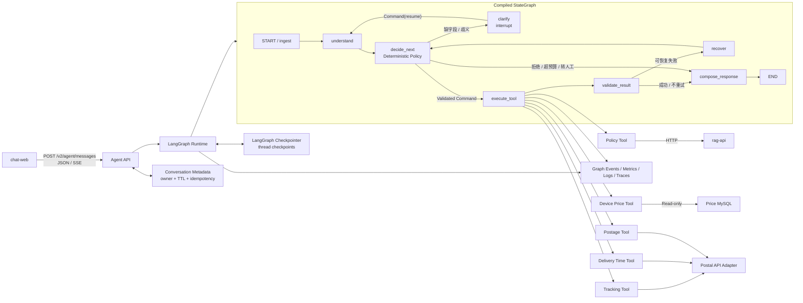

# LangGraph Stateful Agent Workflow 下一阶段实施方案

> 文档状态：`Proposed`，用于下一阶段设计评审、任务拆分和验收，不描述当前已上线能力。
>
> 起始代码基线：提交 `093e29d`；`assistant-api 0.3.2`、`chat-web 0.2.0`、
> `eval 0.3.0`。
>
> 更新日期：2026-09-03。
>
> 实施进度：阶段 0、1 工程验证已完成，等待架构评审。当前包含锁定的
> `langgraph 1.2.11`、正式 Agent StateGraph、Fake Tracking Tool、规则理解、类型化
> Registry/Command/Result、interrupt/resume、执行收据重放、预算与 Failure 路径、六篇
> ADR 和 Proposed V2 OpenAPI；尚未挂载 V2 路由。当前阶段 1 定向测试 36 项、完整
> Python 工作区测试 203 项通过。
>
> 外部接口状态：轨迹、时限和资费接口尚未提供。本文中的字段、错误和时效策略为
> 领域侧预留，最终以接口契约评审结果为准。

## 1. 建设目标

当前 Assistant 是客户端显式选择 `policy` / `device_price` 后执行一次只读工具的
单轮 Dispatcher。下一阶段将其演进为一个受约束、可观测、可恢复的 Stateful Tool
Agent，并把 **LangGraph 作为核心 Workflow Runtime**。在保留现有 RAG、结构化查询和
安全边界的基础上增加：

- Query Understanding：识别意图、抽取实体、发现歧义和缺失字段；
- Routing：把已验证的结构化命令映射到白名单工具；
- Stateful Workflow：由 LangGraph `StateGraph`、checkpointer 和 interrupt 承担跨轮
  补槽、checkpoint、暂停与恢复；
- Bounded Agent Loop：通过条件边、显式终止节点和多重预算限制执行；
- Failure Handling：区分用户输入、无业务结果、上游失败、契约失败和内部失败；
- 新增只读能力：邮件轨迹、寄递时限和资费查询；
- 多轮黑盒评测、失败注入、Agent Trace 和质量门禁。

最终系统应能支持以下交互：

```text
欢迎与能力提示
  -> 用户自由输入或显式选择能力
  -> 识别 policy / device_price / tracking / delivery_time / postage
  -> 收集并规范化当前意图所需字段
  -> 字段完整后执行且只执行一个只读工具
  -> 校验工具输出并显示类型化结果
  -> 完成本轮或开始新的查询
```

本阶段的 Agent 定位不是自由自治系统。LangGraph 提供编排和运行时能力，不负责替代
业务决策；LLM 可以参与自然语言理解和最终措辞，但不能绕过状态图、参数 schema、
工具白名单或结果校验器。

### 1.1 阶段总览

| 阶段 | 核心目标 | 主要退出条件 | 关键依赖 |
| --- | --- | --- | --- |
| 0 | 冻结领域契约并完成 LangGraph 技术验证 | ADR、最小 Spike、V2 草案通过评审 | 无外部接口依赖 |
| 1 | 建立 LangGraph Agent Kernel 和 Fake 轨迹垂直切片 | 图编译、补槽中断/恢复、单工具执行和预算测试通过 | 阶段 0 |
| 2 | Hybrid Understanding 与持久化 Checkpointer | 五类意图、多轮、进程重启恢复和隐私门禁通过 | 阶段 1、模型配置可选 |
| 3 | 接入三类真实查询接口 | Adapter 合同、失败注入和测试环境烟测通过 | 外部接口与测试凭据 |
| 4 | 发布 V2 API 和 Agent Web | 五类 Renderer、JSON/SSE、取消与恢复通过 | 阶段 1～3 |
| 5 | 建立 Agent Eval、Trace 和质量门禁 | 基线报告、错误分析和可定位 Trace 完成 | 阶段 2～4 |
| 6 | 部署硬化并固化求职材料 | 回滚演练、全量验证、真实指标回填完成 | 阶段 5 |

### 1.2 核心技术栈与职责边界

| 技术 | 本项目承担的职责 | 不交给它的职责 |
| --- | --- | --- |
| FastAPI | V1/V2 HTTP 边界、鉴权、限流、JSON/SSE 适配 | Workflow 分支和领域规则 |
| LangGraph `StateGraph` | 节点编排、条件边、受限循环、checkpoint、interrupt/resume、运行时事件流 | 意图定义、工具授权、业务结果真伪判断 |
| Pydantic | API、Query Understanding、Command、Result、Failure 的运行时校验 | 图调度和持久化 |
| 领域 Policy / Tool Registry | 确定性下一动作、白名单工具映射和预算规则 | 保存会话或直接调用外部 HTTP |
| LangGraph Checkpointer | 单个 thread 的短期工作状态、历史 checkpoint 和故障恢复 | 跨会话用户画像、RAG 知识库 |
| HTTPX + Gateway Adapter | 外部接口访问、协议映射、超时和错误翻译 | 路由到哪个业务工具 |
| Eval + Trace/Metrics | 黑盒质量门禁、图节点和工具调用可观测性 | 参与线上业务决策 |

选择 LangGraph 的原因是本需求天然包含“显式状态 + 条件分支 + 跨请求暂停恢复 + 有限
循环”，与它的低层编排定位相符。项目不引入高层预制 ReAct Agent；图中的节点仍是
本项目可单测的普通函数，领域模型和 Tool Port 保持框架无关。阶段 0 已在
`pyproject.toml` 声明 `langgraph>=1.0,<2`，并由 `uv.lock` 固定实际验证版本
`1.2.11`；后续升级必须重新执行 Graph 与 Checkpointer 合同测试。

## 2. 范围与非目标

### 2.1 本阶段范围

| 能力 | 初步输入 | 初步输出 | 状态 |
| --- | --- | --- | --- |
| 政策查询 | 自然语言问题 | 回答、公开引用、拒答原因 | 复用现有工具 |
| 设备价格 | 品牌、型号、规格相关描述 | 类型化价格候选 | 复用现有工具 |
| 邮件轨迹 | 邮件号 | 当前状态、轨迹节点 | 新增 |
| 寄递时限 | 收寄地、寄达地 | 时限结果与口径 | 新增 |
| 资费查询 | 收寄地、寄达地、重量 | 报价与计费信息 | 新增 |

图示中的“13 位数字邮件号”暂作为交互假设，不在接口确认前写死为唯一业务规则。
行政区划暂按省、市、县三级建模，工具最终使用名称、编码、邮编或其他标识，取决于
上游接口要求。资费工具预留产品类型、体积、保价和附加服务字段，但 MVP 不主动
要求尚未被接口证明为必要的输入。

### 2.2 明确非目标

- 不执行理赔审批、赔付计算、下单、改单或数据库写入；
- 不允许模型生成任意工具名、URL、SQL 或未经 schema 校验的工具参数；
- 不在一个工具步骤中隐式融合多个业务意图；
- 不建设长期用户画像或未经授权的跨会话记忆；
- 不记录或展示模型内部思维链；
- 不为展示概念而引入多 Agent 协作；当前任务适合单 Agent 状态图；
- 不在接口提供前伪造真实字段、错误码、限流规则或业务结果。

### 2.3 兼容性原则

- 保持现有 `POST /v1/chat` 行为不变；
- 新能力使用独立的 `/v2/agent` 契约；
- 现有政策和设备价格工具通过适配层接入 V2，不复制业务实现；
- V1 与 V2 可以并行评测和灰度；
- `packages/contracts` 继续只承载离线写入与 RAG 读取的数据契约，不成为通用 DTO
  存放目录；
- V2 HTTP 契约通过版本化 OpenAPI artifact 管理，并由其生成 Web 类型或客户端。

## 3. 当前基线与差距

| 当前实现 | 可复用内容 | 进入下一阶段前的差距 |
| --- | --- | --- |
| `QueryMode` 只有两个显式值 | 已有稳定模式标识 | 缺少候选意图、置信信号、歧义和多意图表示 |
| `AssistantTool.execute(question: str)` | 生命周期和测试替身接口 | 新工具需要结构化 Command，不能反复解析自由文本 |
| `ToolRegistry` 固定映射模式到工具 | 白名单路由和单工具约束 | 缺少 Tool Descriptor、输入/输出 schema 和失败策略 |
| `ToolResult` 提供公共状态与 Evidence | 公共响应、警告、缺失字段 | 轨迹时间线、时限和报价不适合强行建模为 Evidence |
| Web 保存页面内消息 | SSE、取消请求、现有证据展示 | 服务端无 workflow state，组件缺少类型化 renderer |
| Eval 黑盒调用单轮 API | HTTP 客户端、报告与基础指标 | 缺少多轮脚本、状态转换、错误恢复和 Agent Trace 指标 |
| Assistant 已有鉴权、限流和指标 | 可直接保护 V2 路由 | 需要会话级并发、幂等、TTL 和隐私策略 |

因此，下一阶段不是简单地给 `QueryMode` 添加三个值，而是在现有 Dispatcher 前增加
一个负责理解、补槽和状态迁移的 Agent Workflow；Dispatcher 继续只负责执行已经
验证完成的命令。

## 4. 目标架构



`StateGraph` 是应用主流程的唯一编排入口。`decide_next` 返回类型化路由结果，条件边只
消费这个结果；节点不通过字符串拼接动态导入函数。`conversation_id` 在 API 层校验
归属后映射为 LangGraph `thread_id`，恢复时必须使用同一映射。

### 4.1 分层职责

| 层 | 允许职责 | 禁止职责 |
| --- | --- | --- |
| API | 鉴权、HTTP schema、SSE、错误映射 | 意图规则、工具业务逻辑、直接访问外部 API |
| LangGraph Runtime | 执行节点和边、checkpoint、interrupt/resume、图级步数限制、事件流 | 推导业务事实、绕过 Tool Registry |
| Workflow Policy | 根据已验证状态决定下一动作、业务预算和终止原因 | 持久化实现、拼接 SQL、解析上游私有字段 |
| Query Understanding | 文本规范化、意图候选、槽位抽取 | 执行工具或决定业务事实 |
| Domain | Intent、Command、Result、Failure 和 Policy 输入/输出类型 | FastAPI、LangGraph、HTTP、数据库实现 |
| Tool | 一个领域命令到一个领域结果 | 接收任意未验证参数、选择其他工具 |
| Adapter | 外部认证、请求、响应映射 | 把上游错误伪装成无结果 |
| Checkpointer | thread-scoped Graph State 和 checkpoint 历史 | 长期用户画像、推导下一业务动作 |
| Metadata Repository | 会话归属、TTL、幂等收据和生命周期 | 复制完整 Graph State |
| Eval | 通过 HTTP 观察系统行为 | 导入 Assistant 实现或直连数据源 |

### 4.2 LangGraph 与领域层的接口

每个 Graph Node 只做一类工作，并依赖领域 Protocol：

| Node | 输入/输出 | 依赖 | 是否允许副作用 |
| --- | --- | --- | --- |
| `ingest` | HTTP 输入 -> Graph State update | Pydantic schema、幂等收据 | 否 |
| `understand` | 当前消息与状态 -> `QueryUnderstandingResult` | `QueryUnderstander` | 仅可选模型调用 |
| `decide_next` | 已验证状态 -> `NextAction` | `WorkflowPolicy` | 否，必须可重复执行 |
| `clarify` | 缺失项/歧义 -> interrupt payload | LangGraph `interrupt` | 只暂停，不调用工具 |
| `execute_tool` | `InvokeToolAction` -> Tool observation | `ToolExecutor`、Gateway | 是，必须幂等 |
| `validate_result` | Tool observation -> 领域结果或失败 | `ResultValidator` | 否 |
| `recover` | Failure + budget -> retry / handoff / respond | Retry Policy、Circuit Breaker | 不直接执行工具 |
| `compose_response` | 状态 -> 类型化 API 输出 | 模板/可选 LLM | 仅可选模型调用 |

图定义只依赖节点工厂和路由函数；FastAPI 在启动时注入 Understander、Tool Registry、
Gateway、checkpointer 和 runtime settings，再编译一次图。单测可以给同一图注入 Fake
依赖，不需要启动 Web 或外部服务。

## 5. Query Understanding 契约

### 5.1 意图枚举

```python
class Intent(StrEnum):
    POLICY = "policy"
    DEVICE_PRICE = "device_price"
    TRACKING = "tracking"
    DELIVERY_TIME = "delivery_time"
    POSTAGE = "postage"
    UNKNOWN = "unknown"
```

对外的 `Intent` 是版本化契约；内部工具名不由客户端或模型直接提交。

### 5.2 公共值对象

```python
class RegionCandidate(BaseModel):
    province_code: str | None = None
    city_code: str | None = None
    county_code: str | None = None
    canonical_name: str


class RegionRef(BaseModel):
    raw_text: str
    province_code: str | None = None
    city_code: str | None = None
    county_code: str | None = None
    canonical_name: str | None = None
    resolution: Literal["resolved", "ambiguous", "unresolved"]
    candidates: list[RegionCandidate] = Field(default_factory=list)


class WeightValue(BaseModel):
    value: Decimal | None = None
    unit: Literal["g", "kg"] = "kg"


class SlotProvenance(BaseModel):
    slot: str
    source: Literal[
        "explicit_ui",
        "current_turn",
        "workflow_state",
        "rule_extractor",
        "model_extractor",
    ]
    raw_text: str = ""
```

金额和重量使用十进制定点值，不使用二进制浮点表示事实。行政区划同时保留原始文本
和规范化标识，避免把“朝阳区”等歧义名称直接交给外部接口。

### 5.3 按意图区分的槽位

```python
class TrackingSlots(BaseModel):
    intent: Literal["tracking"]
    mail_no: str | None = None


class DeliveryTimeSlots(BaseModel):
    intent: Literal["delivery_time"]
    origin: RegionRef | None = None
    destination: RegionRef | None = None


class PostageSlots(BaseModel):
    intent: Literal["postage"]
    origin: RegionRef | None = None
    destination: RegionRef | None = None
    weight: WeightValue | None = None
    product_code: str | None = None


class PolicySlots(BaseModel):
    intent: Literal["policy"]
    question: str


class DevicePriceSlots(BaseModel):
    intent: Literal["device_price"]
    question: str


SlotPayload = Annotated[
    TrackingSlots
    | DeliveryTimeSlots
    | PostageSlots
    | PolicySlots
    | DevicePriceSlots,
    Field(discriminator="intent"),
]
```

政策和设备价格继续允许自然语言问题，但在 V2 中也包装为类型化 Command，保证
Tool Executor 只处理统一命令联合。

### 5.4 理解结果

```python
class IntentCandidate(BaseModel):
    intent: Intent
    score: float = Field(ge=0, le=1)
    signals: list[str] = Field(default_factory=list)


class QueryUnderstandingResult(BaseModel):
    schema_version: Literal["1"] = "1"
    original_query: str
    normalized_query: str
    selected_intent: Intent
    candidates: list[IntentCandidate]
    slots: SlotPayload | None
    slot_provenance: list[SlotProvenance]
    missing_slots: list[str]
    ambiguities: list[str]
    multi_intent: bool
    source: Literal[
        "explicit_ui",
        "active_workflow",
        "rules",
        "model",
    ]
    parser_version: str
```

`score` 是路由启发式信号，不在文档或 UI 中称为“真实概率”。`signals` 只记录
可公开的判断依据，例如 `mail_no_pattern`、`weight_entity` 或 `keyword_tracking`，
不得保存模型内部思维链。

## 6. Query Understanding 实现策略

采用 Hybrid Pipeline，按以下优先级执行：

1. 显式 UI 意图：用户点击能力入口时优先，但仍校验服务端白名单；
2. 活跃 Workflow：处于等待重量状态时，“2.5 公斤”优先补当前槽位；
3. 确定性实体提取：邮件号、重量、行政区划候选和明显领域关键词；
4. 规则路由：根据实体和关键词产生候选意图及 signals；
5. Structured LLM fallback：只有规则无法可靠决策时调用；
6. Pydantic 校验：模型输出不满足 schema 时不得进入 Tool Executor；
7. Deterministic Policy：根据候选、缺失字段和歧义决定下一动作。

建议接口：

```python
class QueryUnderstander(Protocol):
    async def understand(
        self,
        *,
        message: str,
        state: AgentState,
        explicit_intent: Intent | None,
    ) -> QueryUnderstandingResult: ...
```

实现分为：

- `RuleBasedQueryUnderstander`：可离线、可解释的默认实现；
- `StructuredLlmQueryUnderstander`：只输出受约束 JSON；
- `HybridQueryUnderstander`：负责优先级、fallback 和结果合并；
- `RegionResolver`：把行政区划原文映射为候选标准值；
- `SlotMerger`：依据来源优先级和冲突策略更新状态。

### 6.1 槽位合并规则

- 当前轮显式字段优先于模型推断；
- 新输入没有提及某槽位时保留当前 Workflow 已确认值；
- 用户给出与已确认值冲突的新值时先请求确认，不静默覆盖；
- 检测到高置信新意图时，先确认是否放弃当前未完成流程；
- 不同意图之间默认不复用槽位；安全且明显的字段也要经过重新校验；
- `取消`、`重新开始`、`清空` 作为确定性控制命令处理；
- 结果完成后进入 `COMPLETED`，下一条业务问题创建新 Workflow 或显式复用。

### 6.2 初始路由门槛

以下数值仅作为首版实验参数，必须通过评测集校准：

| 条件 | 下一动作 |
| --- | --- |
| 显式意图且无冲突 | 使用显式意图 |
| Top-1 `>= 0.80` 且与 Top-2 差值 `>= 0.20` | 接受意图 |
| Top-1 `>= 0.55` 但差值不足 | `clarify_intent` |
| Top-1 `< 0.55` | 返回能力菜单 |
| `multi_intent=true` | 请求拆分或选择优先能力 |
| 意图明确但字段不足 | `collect_slots` |
| 意图、字段和规范化全部完成 | `invoke_tool` |

规则或模型分数不能覆盖硬冲突。例如输入含明确邮件号时，低置信 LLM 不能把它改为
设备价格查询；输入同时要求轨迹和资费时也不能擅自调用两个工具。

## 7. Routing 与 Tool Registry

### 7.1 Tool Descriptor

```python
class ToolDescriptor(BaseModel):
    intent: Intent
    tool_name: str
    input_schema_name: str
    output_schema_name: str
    required_slots: tuple[str, ...]
    read_only: bool = True
    timeout_seconds: float
    max_attempts: int
    capability_version: str
```

首版映射：

```text
policy        -> policy_knowledge
device_price  -> device_price
tracking      -> tracking
delivery_time -> delivery_time
postage       -> postage
```

Registry 负责：

- 验证每个可执行 Intent（不包括 `unknown`）有且只有一个默认工具；
- 验证工具名称、输入类型和输出类型；
- 暴露 readiness 和非敏感 capability metadata；
- 为 Tool Executor 提供固定映射；
- 拒绝客户端或模型提交的任意工具名。

### 7.2 下一动作联合

```python
NextAction = Annotated[
    UnderstandAction
    | ClarifyIntentAction
    | CollectSlotsAction
    | InvokeToolAction
    | ValidateResultAction
    | RespondAction
    | HandoffAction,
    Field(discriminator="type"),
]
```

`InvokeToolAction` 至少包含：

```text
tool_name
validated_arguments
tool_call_id
argument_fingerprint
attempt
deadline_at
```

一个 Agent Step 最多执行一个工具。相同参数指纹已有成功结果时，Workflow 应复用
结果或要求显式刷新，避免网络重试、页面重复提交造成重复调用。

## 8. Stateful Workflow

### 8.1 LangGraph State Schema

Graph State 是运行时工作内存，不等同于 API DTO 或长期用户记忆。为了让部分更新和
Reducer 语义清晰，首版使用 `TypedDict` 表达图状态；Intent、Slot、Command、Result
和 Failure 等领域值仍使用 Pydantic 在节点边界执行运行时校验。

```python
from typing import Annotated
from typing_extensions import TypedDict


class AgentPhase(StrEnum):
    NEW = "new"
    UNDERSTANDING = "understanding"
    CLARIFYING = "clarifying"
    COLLECTING = "collecting"
    READY = "ready"
    EXECUTING = "executing"
    VALIDATING = "validating"
    RECOVERING = "recovering"
    RESPONDING = "responding"
    WAITING_USER = "waiting_user"
    COMPLETED = "completed"
    HANDOFF = "handoff"
    FAILED = "failed"


# 与上面枚举值对应的 Literal 联合；checkpoint 只保存字符串值。
AgentPhaseValue = Literal[
    "new", "understanding", "clarifying", "collecting", "ready",
    "executing", "validating", "recovering", "responding",
    "waiting_user", "completed", "handoff", "failed",
]


class AgentState(TypedDict, total=False):
    schema_version: str
    conversation_id: str
    turn_id: str
    latest_message: str
    phase: AgentPhaseValue  # JSON-native Literal，不持久化 Enum 对象
    turn_count: int
    active_intent: str | None
    slots: dict[str, Any] | None
    missing_slots: list[str]
    ambiguities: list[str]
    pending_action: dict[str, Any] | None
    tool_calls: Annotated[list[dict[str, Any]], append_tool_calls]
    audit_events: Annotated[list[dict[str, Any]], append_events]
    last_result: dict[str, Any] | None
    last_error: dict[str, Any] | None
    tool_call_count: int
    retry_count: int
    step_count: int
    max_tool_calls: int
    max_retries: int
    max_steps: int
    deadline_at: str
    reply: str
    required_inputs: list[dict[str, Any]]
    result: dict[str, Any] | None
    failure: dict[str, Any] | None
    finish_reason: str
```

另外定义窄化的 `AgentInputState` 与 `AgentOutputState`：外部输入只允许当前消息、显式
意图和请求元数据；输出只允许 phase、reply、required inputs、result、warnings 和
公开错误。即使内部 State 被事件流观察，API/SSE 也必须经投影层输出，不能把 Graph
State 直接序列化给浏览器。

### 8.2 Node Update、Reducer 与审计事件

每个节点返回 **partial state update**。默认覆盖的字段不声明 Reducer；`tool_calls`、
`audit_events` 等需要累积的字段使用显式、纯函数 Reducer。初始化默认值集中在
`ingest` 节点，避免其他节点假设缺失 key。Pydantic 领域模型进入 State 前使用
`model_dump(mode="json")`，从 State 读取后重新校验。

领域审计事件保留以下类型：

```text
ConversationStarted
UserMessageReceived
QueryUnderstood
IntentClarificationRequested
IntentConfirmed
SlotCollected
SlotConflictDetected
ToolCallStarted
ToolCallSucceeded
ToolCallFailed
ResultValidated
ResponsePrepared
ConversationReset
ConversationExpired
```

这些 Event 用于审计投影、测试断言和 Trace，不再额外实现一套与 LangGraph 平行的
Event-Sourcing Runtime。业务状态转换放在 `WorkflowPolicy` 和纯 transition helper
中，LangGraph Reducer 只负责合并字段更新。这样既能独立单测规则，又避免“双状态机”
造成 checkpoint 与自定义 Store 不一致。

状态演进遵循以下约束：

- Node 只返回自己拥有的字段；不同并行节点不得无 Reducer 地写同一字段；
- `decide_next`、路由函数和 Reducer 必须确定性、无 I/O；
- `latest_message` 在完成理解后按数据保留策略清理或脱敏；
- State schema 升级必须带 `schema_version`、迁移测试和回滚策略；
- checkpoint 中只放可序列化数据，不放 HTTP Client、数据库连接或运行时 Secret。

### 8.3 Checkpointer、Thread 与元数据

LangGraph Checkpointer 是单会话工作状态的唯一事实源：图编译时注入 checkpointer，
每次调用通过配置传入 `thread_id`。API 层维护不可预测的 `conversation_id`，校验会话
归属后将其稳定映射到 `thread_id`；客户端不能自行选择其他用户的 thread。

不要再实现复制完整 Agent State 的 `ConversationStore`。应用只保留一个窄化的元数据
仓储：

```python
class ConversationMetadataRepository(Protocol):
    async def authorize(self, conversation_id: UUID, principal: Principal) -> bool: ...

    async def claim_idempotency(
        self, conversation_id: UUID, key: str, request_hash: str
    ) -> IdempotencyReceipt: ...

    async def touch_expiry(self, conversation_id: UUID, expires_at: datetime) -> None: ...

    async def mark_deleted(self, conversation_id: UUID) -> None: ...
```

Tool 调用的执行收据由独立 `ToolExecutionRepository` 管理，避免把工具副作用记录塞入
会话元数据接口；两者可以共享同一个数据库连接，但拥有不同的领域契约。

实施顺序：

1. LangGraph `InMemorySaver` 用于单测和最小 Spike；它不承担重启恢复验收；
2. `AsyncSqliteSaver` 用于本地单进程 Demo 和进程重启恢复演示；
3. 多副本部署前通过 ADR 在官方/社区支持的异步持久化实现中选择 Redis 或 PostgreSQL
   checkpointer，并完成并发、清理和故障测试；
4. 不建设 LangGraph long-term Store，除非未来出现经过授权的跨 thread 记忆需求。

持久化要求：

- checkpointer 随图的执行 super-step 保存 checkpoint，不由业务节点手写 `save()`；
- 同一 thread 的推进由应用层会话锁或后端原子机制串行化，冲突返回稳定错误；
- 默认 TTL 30 分钟，实际值通过数据保留评审确认；
- checkpoint 清理与 Metadata 过期必须可重试并允许最终一致，不能只删索引不删状态；
- 邮件号在普通日志中脱敏，状态存储按最小必要原则保存；
- 不保存 API Key、模型思维链或完整上游响应；
- 完成、取消、过期和 schema 升级具备明确清理/迁移行为；
- 对 checkpoint 大小、单 thread checkpoint 数量和保留时间建立指标与上限。

### 8.4 幂等与并发

- V2 写入型消息接口要求 `Idempotency-Key`；
- `(conversation_id, idempotency_key)` 对应唯一处理结果；
- 相同 key 但不同 request hash 返回冲突，不复用旧结果；
- 同一会话只允许一个活跃 Graph Run，避免两个请求同时从同一 checkpoint 分叉；
- 重复消息不能重复扣减 retry budget 或重复调用已成功工具；
- Tool Call 使用独立 `tool_call_id`，可跨重试关联；
- `execute_tool` 以 `(conversation_id, argument_fingerprint)` 查询执行收据；恢复或重放
  节点时先复用成功结果，再决定是否发起外部调用；
- 用户主动要求刷新时生成新 argument fingerprint 版本或显式 refresh 标志。

### 8.5 Interrupt 与恢复协议

`clarify` 节点调用 LangGraph `interrupt()`，payload 只能包含可序列化且允许对外展示的
字段，例如原因、候选意图和 `required_inputs`。Graph Run 暂停后，API 将 interrupt
投影为 `WAITING_USER` 响应；下一条补充消息在完成 API 校验后，以相同 `thread_id` 和
`Command(resume=...)` 恢复。

恢复会从包含 `interrupt()` 的节点开头重新执行，因此该调用之前不得放置非幂等副作用。
对本项目而言，`clarify` 节点只组装 payload；网络工具调用位于后续独立节点。没有待处理
interrupt 的新一轮业务输入使用普通 state input，不滥用 `Command(resume=...)`。

### 8.6 Working Memory、Long-term Memory 与 RAG

| 数据类型 | 位置 | 生命周期 | 本阶段策略 |
| --- | --- | --- | --- |
| 当前意图、槽位、工具结果摘要 | Graph State + Checkpointer | 单 thread、短期 | 实现 |
| 会话归属、幂等收据、过期时间 | Metadata Repository | 会话生命周期 | 实现 |
| 政策文档及向量 | 现有 RAG / Milvus | 独立知识生命周期 | 复用，不复制进 State |
| 用户偏好或长期事实 | LangGraph Store 候选 | 跨 thread | 非目标，未获授权不建设 |

## 9. Bounded Agent Loop

Agent Loop 由编译后的 `StateGraph` 执行，不再由自定义 `while` / `for` Runner 手写
调度。条件边消费 `WorkflowPolicy` 生成的类型化 `NextAction`：

```python
builder = StateGraph(
    AgentState,
    input_schema=AgentInputState,
    output_schema=AgentOutputState,
)
builder.add_edge(START, "ingest")
builder.add_edge("ingest", "understand")
builder.add_edge("understand", "decide_next")
builder.add_conditional_edges("decide_next", route_next_action, ROUTE_MAP)
builder.add_edge("execute_tool", "validate_result")
builder.add_conditional_edges("validate_result", route_validation, VALIDATION_MAP)
builder.add_edge("recover", "decide_next")
builder.add_edge("compose_response", END)
graph = builder.compile(checkpointer=checkpointer)
```

`route_next_action` 只能返回预定义 Literal，`ROUTE_MAP` 在启动测试中验证完整性。每个
节点使用静态边或动态边之一，避免同一节点同时沿两种路由重复执行。

初始预算：

| 预算 | 初始值 |
| --- | ---: |
| 单轮最大内部 Step | 8 |
| 单轮正常工具调用 | 1 |
| 同一只读工具最大尝试 | 2 |
| Query Understanding 模型调用 | 最多 1 |
| Phase-1 内部 action deadline | 30 秒；真实接口接入后重新校准 |

Phase 1 中一个业务 `Step` 定义为一次 `decide_next` Policy 决策，不等同于一个
LangGraph Node；因此重试循环会消耗新的 Step，普通的 ingest/validate/response Node
由独立 `recursion_limit` 兜底。

预算使用四层防线：

1. `WorkflowPolicy` 在调用前检查工具、模型、重试和 deadline 预算；
2. State 中记录本业务轮的 `tool_call_count` 与 `retry_count`；
3. Graph 调用显式配置 `recursion_limit`，不依赖框架默认值；
4. API 外层捕获图步数耗尽并映射为稳定 `loop_budget_exceeded`，保留 Request ID。

`WAITING_USER` 是一次 Graph Run 被 interrupt 的正常暂停，不是失败。达到预算时路由到
`compose_response` 产生安全终态；`recursion_limit` 是最后保险，不是正常控制流。任何
恢复、节点重放或 HTTP 重试都不得重置业务预算。

## 10. 新工具与外部接口适配层

### 10.1 领域 Gateway

```python
class TrackingGateway(Protocol):
    async def query(self, command: TrackingCommand) -> TrackingResult: ...


class DeliveryTimeGateway(Protocol):
    async def query(
        self,
        command: DeliveryTimeCommand,
    ) -> DeliveryTimeResult: ...


class PostageGateway(Protocol):
    async def quote(self, command: PostageCommand) -> PostageResult: ...
```

三个 Gateway 分别表达领域边界。若它们来自同一套外部服务，可在 Adapter 层共享
连接池、认证、Request ID、超时和响应解码，但不能合并成一个接收任意字典的接口。

### 10.2 预留输出

```text
TrackingResult
  mail_no
  current_status
  events[event_code, description, occurred_at, location]
  queried_at

DeliveryTimeResult
  origin
  destination
  estimated_duration
  duration_unit
  service_level
  estimate_basis
  queried_at

PostageResult
  origin
  destination
  product_code
  input_weight
  billable_weight
  amount
  currency
  fee_items
  valid_until
  queried_at
```

字段在接口确认后增删。Domain 不直接暴露上游字段名；Adapter 负责从上游版本映射到
稳定领域模型。

V2 使用统一外壳和判别联合，不把轨迹、时限或报价强行转换成现有 Evidence：

```python
class SourceReference(BaseModel):
    source_type: str
    source_name: str
    record_id: str = ""
    source_url: str = ""
    queried_at: datetime | None = None


AgentData = Annotated[
    PolicyData
    | DevicePriceData
    | TrackingData
    | DeliveryTimeData
    | PostageData,
    Field(discriminator="type"),
]


class AgentResult(BaseModel):
    tool: str
    intent: Intent
    status: Literal[
        "success",
        "partial",
        "need_more_info",
        "no_match",
        "failed",
    ]
    answer: str
    data: AgentData | None = None
    warnings: list[str] = Field(default_factory=list)
    missing_slots: list[str] = Field(default_factory=list)
    reason_code: str = ""
    provenance: list[SourceReference] = Field(default_factory=list)
```

政策和设备价格通过兼容适配器把现有 `ToolResult` 转成 V2 `AgentResult`，不复制检索、
引用校验或价格匹配代码。

### 10.3 结果语义校验

- 轨迹结果的邮件号必须与请求一致；时间节点必须可解析，排序策略明确；
- 时限结果的起止区域必须与已规范化命令相符；
- 资费金额、币种、重量和单位必须可验证，禁止使用浮点推断金额；
- 所有结果带查询时间和来源类别；
- 上游 HTTP 200 但缺失必要字段时记为 `contract_violation`；
- 空业务结果记为 `no_match`，不得和网络异常混用；
- 未经可信数据支持的字段不得由 Response Composer 补写。

## 11. V2 HTTP 契约草案

### 11.1 接口集合

| 方法 | 路径 | 用途 |
| --- | --- | --- |
| `GET` | `/v2/agent/capabilities` | 返回公开意图、展示名称和非敏感输入描述 |
| `POST` | `/v2/agent/messages` | 创建或继续一次 Workflow，支持 JSON/SSE |
| `DELETE` | `/v2/agent/conversations/{id}` | 用户主动清除当前 Workflow |
| `GET` | `/v2/agent/conversations/{id}` | 非 MVP；具备会话归属校验后才开放状态摘要 |

现有鉴权、Request ID、请求体限制和限流中间件继续生效。会话 ID 不能替代身份验证。
当前 Web 使用共享服务 Key，尚不能据此区分终端用户，因此 MVP 默认不开放查询任意
会话状态。`conversation_id` 必须使用不可预测随机值并在存储中最小化暴露；正式接入
用户身份后再绑定 owner / tenant。删除、继续和读取会话都必须执行相同的归属策略。
删除操作同时撤销元数据、幂等/执行收据并清理对应 thread checkpoint；任一步失败都
进入可重试清理队列，避免只删除页面索引而遗留工作状态。

### 11.2 消息请求

```json
{
  "conversation_id": null,
  "message": "帮我查一下这个邮件",
  "explicit_intent": null,
  "stream": false
}
```

请求使用 `Idempotency-Key` 和 `X-Request-ID` 头。`conversation_id=null` 时创建新
Workflow；继续流程时必须传服务端返回的 ID。

### 11.3 等待补充输入响应

```json
{
  "request_id": "request-id",
  "conversation_id": "conversation-id",
  "turn_id": "turn-id",
  "phase": "waiting_user",
  "intent": "tracking",
  "reply": "请提供邮件号。",
  "next_action": "collect_slots",
  "required_inputs": [
    {
      "name": "mail_no",
      "label": "邮件号",
      "type": "string",
      "validation_hint": "格式以查询接口最终要求为准"
    }
  ],
  "result": null,
  "warnings": []
}
```

### 11.4 完成响应

```json
{
  "request_id": "request-id",
  "conversation_id": "conversation-id",
  "turn_id": "turn-id",
  "phase": "completed",
  "intent": "tracking",
  "reply": "已查询到该邮件的最新轨迹。",
  "next_action": "complete",
  "required_inputs": [],
  "result": {
    "type": "tracking",
    "status": "success",
    "data": {}
  },
  "warnings": []
}
```

### 11.5 SSE 事件

建议顺序：

```text
status
state
[input_required | result]
[delta]
done
```

流建立后的技术错误只发送 `error` 终止事件。`state` 只包含阶段、意图和缺失字段，
不发送思维链、内部 Prompt 或敏感工具参数。

## 12. Failure Handling

### 12.1 统一错误分类

```python
class FailureCategory(StrEnum):
    MISSING_INPUT = "missing_input"
    AMBIGUOUS_INTENT = "ambiguous_intent"
    INVALID_INPUT = "invalid_input"
    NO_MATCH = "no_match"
    UPSTREAM_TIMEOUT = "upstream_timeout"
    UPSTREAM_RATE_LIMITED = "upstream_rate_limited"
    UPSTREAM_UNAVAILABLE = "upstream_unavailable"
    CONTRACT_VIOLATION = "contract_violation"
    STATE_CONFLICT = "state_conflict"
    PERSISTENCE_UNAVAILABLE = "persistence_unavailable"
    STATE_SCHEMA_INCOMPATIBLE = "state_schema_incompatible"
    LOOP_BUDGET_EXCEEDED = "loop_budget_exceeded"
    INTERNAL_ERROR = "internal_error"
```

| 类别 | 重试 | Workflow 行为 | 用户可见语义 |
| --- | --- | --- | --- |
| 缺少输入 | 否 | `WAITING_USER` | 明确询问缺少字段 |
| 意图歧义 | 否 | `CLARIFYING` | 给出有限候选项 |
| 输入非法 | 否 | 保留有效槽位 | 指出字段及格式问题 |
| 无业务结果 | 否 | `COMPLETED` | 明确无匹配，不推测 |
| 上游超时 | 有限 | 退避后重试 | 重试失败后提示暂不可用 |
| 上游限流 | 有限 | 遵循 `Retry-After` | 告知稍后重试 |
| 上游不可用 | 有限 | 熔断或降级 | 不伪装为无结果 |
| 响应契约错误 | 否 | 阻止展示、记录契约指标 | 返回服务异常和 Request ID |
| 状态并发冲突 | 否 | 重新加载或让客户端重试 | 当前会话已被更新 |
| Checkpointer 不可用 | 有限 | 不创建新 Run；恢复保持原 thread | 状态服务暂不可用 |
| State schema 不兼容 | 否 | 阻止执行并进入迁移/回滚流程 | 会话暂不可恢复 |
| Loop 超预算 | 否 | 强制终止 | 无法安全完成本轮 |
| 内部错误 | 否 | Fail closed | 通用错误和 Request ID |

### 12.2 重试与熔断

- 只对幂等、只读且明确可恢复的错误重试；
- 默认最多 2 次尝试，指数退避并加入 jitter；
- LangGraph 运行时重放用于从最近 checkpoint 恢复图执行；领域 `recover` 节点负责根据
  `FailureCategory` 决定是否再次调用工具，两者不能各自无条件重试；
- 若为节点配置框架级 Retry Policy，只允许覆盖模型/网络瞬态错误，且必须共享同一
  `tool_call_id` 与执行收据；
- 参数错误、无匹配和契约错误不重试；
- 读取并约束上游 `Retry-After`，避免无限等待；
- Circuit Breaker 按上游能力分别统计，避免一个接口故障拖垮全部工具；
- 熔断打开时 readiness 标记对应工具不可用，但不必让不相关工具全部下线；
- 降级数据必须来自另一个明确注册的可信工具，不允许模型生成近似轨迹或价格。

异常在三层收口：Node 内把可预期领域/上游错误转换为 `AgentFailure`；Runtime Adapter
把图步数耗尽、interrupt 协议错误和 checkpointer 异常转换为稳定 API 错误；最外层只
处理未分类异常并 fail closed。若 Tool 已成功但随后 checkpoint 失败，执行收据保留
结果指纹，恢复后复用结果而不是重新请求上游。

### 12.3 Human in the Loop

缺少字段、意图歧义和需要用户确认的意图切换，通过 `interrupt()` 暂停，并把类型化
问题返回当前用户；这属于 Human in the Loop，但不等于人工客服 Handoff。

以下情况进入 `handoff` 或提供正式人工渠道提示：

- 连续无法消除行政区划歧义；
- 用户要求审批、赔付结论或其他超出只读查询的动作；
- 上游返回互相冲突且无法验证的事实；
- Workflow 超过轮次或执行预算；
- 安全策略判定请求需要人工确认。

MVP 可以只返回类型化 Handoff 响应，不必立即对接真实工单系统。所有 interrupt
payload 和 resume value 都要先通过 API schema 校验，不能把任意对象写回 Graph State。

## 13. Web 改造

### 13.1 交互

- 欢迎页展示五类能力入口，同时允许自由输入；
- 显式入口通过 `explicit_intent` 提交，不直接提交工具名；
- 保存 `conversation_id`、当前 phase 和 required inputs；
- 补槽时同时支持自然语言输入和结构化控件；
- 用户可以取消、清空或重新开始；
- 完成结果后默认不把旧槽位隐式带入新意图。

### 13.2 Renderer Registry

```text
policy        -> PolicyEvidenceRenderer
device_price  -> DevicePriceRenderer
tracking      -> TrackingTimelineRenderer
delivery_time -> DeliveryEstimateRenderer
postage       -> PostageQuoteRenderer
```

通用 `ChatMessage` 只负责消息外壳、状态、错误、Request ID 和 renderer 分发。每个
业务结果由独立组件处理，避免继续扩大单一 Vue 文件。

### 13.3 前端可靠性

- TypeScript 类型从 V2 OpenAPI 生成或由同一 artifact 校验；
- 对 SSE payload 做运行时校验，未知 Intent 不得默认为某个已知模式；
- `done` / `error` 是唯一终态事件；
- 网络中断后显示可恢复状态，不把半个结果标为成功；
- 页面不持有上游 API Key；
- 邮件号默认脱敏展示，是否允许完整展示由产品要求决定。

## 14. 可观测性

### 14.1 Trace

每次 Agent 请求使用同一 Trace 关联：

```text
agent.request
  langgraph.run
    node.ingest
    node.query_understanding
      deterministic_extractors
      structured_model (optional)
    edge.decision
    checkpoint.write
    interrupt / resume (optional)
    node.tool_execute
      upstream.http
    node.result_validate
    node.response_compose
```

Span 属性仅保留低基数、非敏感信息：

```text
intent
understander_source
workflow_phase
next_action
graph_node
graph_step
checkpoint_backend
resume_reason
tool_name
attempt
failure_category
finish_reason
parser_version
prompt_version
```

不将完整问题、邮件号、API Key、上游原始响应或模型思维链写入指标标签。

### 14.2 指标

- 请求量、活跃 Workflow、完成和过期数量；
- Graph Run、Node、Edge、interrupt/resume、checkpoint 写入量、大小和延迟；
- Intent 分布、澄清率、未知意图率、多意图率；
- 缺槽类型、平均补槽轮数、任务完成率；
- Tool 调用量、成功率、延迟、重试和熔断状态；
- 契约失败、Loop 超预算、State Conflict 和 Handoff；
- Query Understanding 模型调用率、Token 和延迟；
- 按阶段统计 P50 / P95 / P99，但不使用邮件号等高基数字段。

## 15. 评测设计

### 15.1 数据集类型

| 数据集 | 目标 |
| --- | --- |
| 单轮 Intent | 评测五类意图、未知意图和多意图 |
| Slot Extraction | 评测邮件号、行政区划、重量和规格 |
| Multi-turn Scenario | 评测补槽、冲突、更正、取消和恢复 |
| Routing | 评测 Tool 名称、参数和错误路由 |
| Failure Injection | 评测超时、限流、5xx、非法 JSON、契约漂移、checkpoint 故障和节点重放 |
| Safety | 评测 Prompt Injection、越权工具和敏感信息日志 |

### 15.2 黑盒多轮样本草案

```json
{
  "id": "tracking_missing_number",
  "turns": [
    {
      "user": "帮我查一下邮件",
      "expect_action": "collect_slots",
      "expect_missing_slots": ["mail_no"]
    },
    {
      "user": "1234567890123",
      "expect_tool": "tracking",
      "expect_finish_reason": "stop"
    }
  ]
}
```

Eval 只调用 V2 HTTP，不读取 checkpointer / Metadata Repository，也不导入 Agent 实现。
内部 Node、Reducer、Policy 与 Graph 拓扑测试验证“状态图实现”，黑盒流程评测验证
“用户实际行为”。

### 15.3 初始质量门禁

这些门禁用于首个代表性评测集，完成数据标注后允许通过 ADR 调整：

| 指标 | 初始门禁 |
| --- | ---: |
| Intent Macro-F1 | `>= 0.90` |
| 关键实体 Slot F1 | `>= 0.90` |
| 已明确意图的 Wrong Tool Rate | `0` |
| 正常场景 Task Completion Rate | `>= 0.85` |
| 不必要澄清率 | `<= 0.10` |
| Golden Failure Recovery | 全部符合预期状态 |
| Golden Interrupt / Resume | 全部恢复到预期状态 |
| 重放或重复请求导致的额外 Tool Call | `0` |
| 非回答结果事实泄漏 | `0` |
| 未授权工具调用 | `0` |
| Golden Case Loop 超预算 | `0` |

样本量、分布和置信区间必须随报告一起保存，不能只展示百分比。

## 16. 建议代码布局

```text
apps/assistant-api/src/spb_assistant_api/
  domain/
    agent_errors.py
    agent_events.py
    agent_actions.py
    primitives.py
    intents.py
    slots.py
    understanding.py
    commands.py
    results.py
    failures.py
    tooling.py
    ports.py
  workflow/
    composition.py
    state.py
    reducers.py
    policy.py
    routing.py
    graph.py
    node_utils.py
    runtime.py
    nodes/
      ingest.py
      understand.py
      decide_next.py
      clarify.py
      execute_tool.py
      validate_result.py
      recover.py
      compose_response.py
  services/
    agent_tools.py
    query_understanding.py
    slot_merger.py
    result_validator.py
    response_composer.py
  tools/
    policy.py
    device_price.py
    tracking.py
    delivery_time.py
    postage.py
  adapters/
    fake_tracking.py
    in_memory_receipts.py
    postal_client.py
    checkpointer_factory.py
    conversation_metadata.py
    idempotency_repository.py
    tool_execution_repository.py
  api/
    schemas_v2.py
    routes/agent.py

apps/chat-web/src/
  agent/
    api.ts
    state.ts
    generated-types.ts
  components/results/
    PolicyEvidenceRenderer.vue
    DevicePriceRenderer.vue
    TrackingTimelineRenderer.vue
    DeliveryEstimateRenderer.vue
    PostageQuoteRenderer.vue

eval/src/spb_eval/
  agent/
    schemas.py
    dataset.py
    client.py
    metrics.py
    runner.py
    reporting.py
```

首版先在 `assistant-api` 内稳定 Agent Domain，不立即提取通用 `agent-core` 包。只有
出现第二个真实消费者且抽象边界经过验证后再提取，避免为了复用而制造框架。
`domain/` 不导入 LangGraph；`workflow/` 是框架适配与编排层，`services/` 和 `tools/`
可以脱离图运行时单测。所有 checkpointer 的创建和生命周期统一收口在 factory，节点
不得自行实例化持久化后端。

## 17. 分阶段实施

### 阶段 0：契约基线与 LangGraph Spike

目标：在不写真实业务接口的情况下，冻结核心边界并用最小代码验证 LangGraph 选型。

工作内容：

- 评审 Intent、Slot、Command、AgentState、NextAction、Result 和 Failure 模型；
- 确认 V1 兼容策略与 V2 路径；
- 建立 ADR：受约束 Agent、LangGraph Runtime、Hybrid Understanding、Memory Boundary、
  Failure Taxonomy；
- 在 `assistant-api` 中加入经过验证的 `langgraph` 依赖并通过 `uv.lock` 固定；
- 完成最小 Spike：三节点 `StateGraph`、条件边、`InMemorySaver`、interrupt/resume、
  异步事件流、显式 `recursion_limit`；
- 验证 Graph State 序列化、节点重放语义以及当前 Python/async 技术栈兼容性；
- 建立 OpenAPI snapshot 和 breaking-change 检查方案；
- 整理外部接口待确认清单；
- 为敏感字段制定日志和状态保留规则。

交付物：

- 本实施方案评审通过；
- 五篇核心 ADR；
- 可运行的 LangGraph Spike、依赖锁和选型结论；
- [`docs/openapi/assistant-agent-v2.openapi.json`](openapi/assistant-agent-v2.openapi.json)
  V2 OpenAPI 草案；
- Domain schema 初稿；
- 外部接口问题清单。

验收标准：

- 每个公开字段有定义、来源和版本策略；
- V1 无行为变化；
- 未确认接口字段明确标为 provisional；
- Spike 能在同一 `thread_id` 上中断并恢复，且图步数上限可验证；
- Spike 证明 interrupt 节点重放不会重复执行副作用；
- 架构评审确认没有模型到任意工具的直通路径。

### 阶段 1：LangGraph Agent Kernel 与 Fake Tool 垂直切片

目标：不用 LLM、生产持久化或真实外部接口，跑通一个可恢复的轨迹查询 StateGraph。

> 实施状态（2026-09-03）：工程验证已完成。实现、拓扑、状态、边界、测试证据和限制见
> [Phase 1 Agent Kernel 与 Fake Tracking](agent-kernel-phase1.md)。

工作内容：

- 实现 Agent State、字段 Reducer、纯 `WorkflowPolicy`、Node 和 Graph Factory；
- 用类型化条件边连接 `understand -> decide -> clarify/execute -> validate -> respond`；
- 实现 Tool Descriptor、Command Dispatcher 和 Result Validator；
- 编译时注入 `InMemorySaver` 和 Fake 依赖；
- 实现 Rule-based Query Understanding 最小版本；
- 实现 Fake Tracking Gateway；
- 跑通“识别轨迹 -> 缺邮件号 -> interrupt -> `Command(resume)` -> 调用工具 -> 完成”；
- 增加执行收据，验证 checkpoint 重放不会重复 Tool Call；
- 加入最大 Step、工具调用和 retry budget。

交付物：

- LangGraph Agent Kernel、Graph 拓扑图和状态 schema；
- Node、Reducer、Policy、Routing 和 Runtime Adapter 单测；
- Fake Tracking Tool；
- 内部状态转换 Trace；
- 不依赖外部网络的完整测试。

验收标准：

- 图可编译且没有孤立节点或未覆盖的动态路由；
- Reducer、Policy 和路由函数为纯逻辑，可独立测试；
- 同一幂等键不会重复调用工具；
- interrupt/resume 在等待用户、成功、失败和超预算处有确定结果；
- Wrong Tool、未经校验参数和任意工具名均被拒绝；
- V1 全部回归测试继续通过。

### 阶段 2：Hybrid Query Understanding 与持久化 Checkpointer

目标：覆盖五类意图、跨轮补槽、歧义和服务重启恢复。

工作内容：

- 完成邮件号、重量和行政区划提取器；
- 实现 Region Resolver 与 Slot Merger；
- 加入 Structured LLM fallback 和 Prompt 版本；
- 实现意图澄清、多意图拆分、更正、取消和切换意图；
- 接入 `AsyncSqliteSaver`，实现 Metadata Repository、会话串行推进和幂等收据；
- 增加 Workflow TTL、checkpoint 清理、重启恢复和 State schema 迁移测试；
- 建立首版 Intent/Slot/多轮评测集。

交付物：

- Hybrid Query Understanding；
- SQLite-backed LangGraph Checkpointer 与会话元数据实现；
- Query Understanding 报告；
- 多轮状态测试与并发冲突测试。

验收标准：

- 五类意图、未知意图和多意图都有测试；
- 规则可解决的输入不调用模型；
- 模型输出必须通过 schema 校验；
- 服务重启后可从同一 thread checkpoint 恢复未过期 Workflow；
- 并发恢复、重复 resume 和过期 thread 不会重复执行工具；
- 明确意图 Wrong Tool Rate 为 0；
- 日志和指标不出现完整邮件号。

### 阶段 3：真实轨迹、时限和资费 Adapter

前置条件：取得并评审三类外部接口契约、凭据管理方式和测试环境。

工作内容：

- 为每个接口建立请求/响应契约 fixture；
- 实现共享 HTTP Client 和三个领域 Gateway；
- 映射认证、Request ID、超时、限流和错误码；
- 增加响应 schema 与领域语义校验；
- 加入有限重试、jitter 和按能力熔断；
- 建立 MockTransport 合同测试和测试环境烟测；
- 根据真实接口修订 provisional slots 和结果字段。

交付物：

- 三个真实 Adapter；
- 经过脱敏的契约 fixtures；
- 接口映射表；
- 失败注入测试；
- 测试环境烟测报告。

验收标准：

- HTTP 200 非法响应会被拒绝；
- `no_match` 与技术失败严格分离；
- 重试只发生在允许的只读错误上；
- 一个能力熔断不会阻塞其他健康工具；
- 工具结果不包含未被上游支持的推测事实。

### 阶段 4：V2 API 与 Web 交互

目标：提供用户可操作的完整 Agent 对话体验。

工作内容：

- 实现 `/v2/agent/capabilities`、`messages` 和 reset；
- 实现 JSON 与 SSE 协议、幂等头、interrupt 投影和状态错误映射；
- 由 Runtime Adapter 消费 LangGraph 事件流，转换为稳定的 V2 SSE 事件，不直接暴露
  内部 node 名或 Graph State；
- Web 增加五类入口、自由输入和补槽交互；
- 拆分类型化 Result Renderer；
- 加入取消、重新开始、网络恢复和会话过期提示；
- 从 OpenAPI 生成前端类型并进行运行时事件校验；
- 保持 V1 页面或回退能力直到 V2 验收完成。

交付物：

- V2 API；
- Agent Web；
- 组件和 SSE 测试；
- API 使用文档与兼容说明。

验收标准：

- 五类能力均能通过 Web 到达正确工具；
- 补槽流程刷新页面或服务重启后能用同一 conversation/thread 恢复；
- 未知 SSE 事件安全忽略，非法已知事件显式失败；
- 浏览器不持有 Assistant 或上游密钥；
- 前端测试、类型检查和生产构建通过。

### 阶段 5：Agent Eval、可观测性与可靠性门禁

目标：用可复现证据说明 Agent 不只是“能演示”，还可度量、可定位和可恢复。

工作内容：

- 扩展 Eval 的 Agent 多轮 dataset、client、runner、metrics 和 reporting；
- 加入 Intent、Slot、Routing、Task Completion、Recovery 和 Loop 指标；
- 接入 LangGraph node/edge/checkpoint 事件、Agent Step Trace 和 Prometheus 指标；
- 建立超时、限流、5xx、非法 JSON、状态冲突和中断恢复测试；
- 建立 checkpoint 恢复、interrupt 重放、图步数耗尽和 Tool 幂等故障注入；
- 对规则门槛和 Structured LLM fallback 做 baseline/experiment 对比；
- 生成 review queue，人工检查误路由和不必要澄清。

交付物：

- Agent 黑盒评测工具；
- 版本化评测集模板；
- 基线报告与失败样本；
- 可靠性测试报告；
- Trace 示例和 Dashboard 指标定义。

验收标准：

- 初始质量门禁全部通过，或每项未通过指标有明确风险接受记录；
- 报告包含样本量、数据划分、版本、延迟和失败分布；
- 可通过 Request ID / Trace ID 定位一次完整 Workflow；
- Trace 能区分 node 执行、条件路由、interrupt、resume、checkpoint 和 Tool Call；
- 不记录 PII、高基数工具参数或模型思维链。

### 阶段 6：部署硬化与求职材料固化

目标：形成可部署、可复盘、可在面试中现场解释的完整项目版本。

工作内容：

- 根据多副本规模和现有基础设施，通过 ADR 选择 Redis 或 PostgreSQL LangGraph
  checkpointer；SQLite 仅保留为本地开发后端；
- 对生产 checkpointer 执行并发恢复、连接中断、checkpoint 清理、schema 升级和回滚
  演练；
- 更新 Compose、readiness、资源限制、凭据和网络边界；
- 执行升级、回滚、过期状态清理和依赖故障演练；
- 更新架构、API、部署、评测和复盘文档；
- 录制或整理六条标准 Demo 路径；
- 将真实量化结果回填简历素材，删除未验证占位值。

交付物：

- 可复现部署包；
- 灰度与回滚说明；
- 最终架构图、测试和评测报告；
- 面试故事、简历 bullet 和演示脚本。

验收标准：

- 全量 Python、Web、架构和 Compose 校验通过；
- V1 回归与 V2 Agent 门禁同时通过；
- 依赖不可用、重启和重复请求演练符合预期；
- 多副本下同一 thread 不发生并行推进或重复 Tool Call；
- 简历只使用最终报告能够证明的数据。

## 18. 测试矩阵

| 层级 | 重点用例 |
| --- | --- |
| Domain 单测 | Schema、不变量、Decimal、行政区划和错误分类 |
| Node / Reducer 单测 | Partial update、字段合并、默认值、非法 Phase 转换和序列化 |
| Policy / Routing 单测 | 澄清、补槽、执行、完成、Handoff、预算和所有条件边分支 |
| Graph 拓扑测试 | 编译、入口/终点、孤立节点、路由覆盖和 graph snapshot |
| Query Understanding | Intent、实体、冲突、多意图和 Prompt Injection |
| Checkpointer 合同测试 | thread 隔离、checkpoint、interrupt/resume、重启、历史和清理 |
| Runtime 恢复测试 | 节点重放、重复 resume、并发 Graph Run、recursion limit 和迁移 |
| Metadata 合同测试 | owner、幂等 request hash、TTL、删除和并发 claim |
| Tool 合同测试 | 参数映射、输出验证、超时、限流和 5xx |
| API 集成测试 | JSON/SSE、鉴权、错误码、取消和重复消息 |
| Web 组件测试 | required inputs、五类 renderer、终态和中断 |
| 黑盒场景 | 从多轮输入到最终工具及结果 |
| 故障注入 | 重试、熔断、契约漂移、checkpointer 中断、状态冲突、节点重放和 Loop 预算 |
| 架构测试 | App 之间无实现导入，Eval 仅走 HTTP |

## 19. 外部接口到达后的确认清单

### 通用

- Base URL、环境划分、认证、凭据轮换和 TLS 要求；
- 请求方法、路径、版本、Content-Type 和字符编码；
- QPS、突发限制、并发限制和 `Retry-After`；
- 连接/读取超时建议、幂等语义和缓存限制；
- Request ID / Trace ID 透传方式；
- HTTP 状态、业务错误码和是否存在 HTTP 200 错误体；
- Schema 版本、兼容策略和脱敏响应样例；
- 数据新鲜度、合法使用范围和日志保留要求。

### 轨迹

- 邮件号的真实格式、长度、字母支持和校验规则；
- 查无记录、暂未产生轨迹和邮件号非法的区别；
- 轨迹节点代码、状态含义、时间格式、时区和排序保证；
- 是否返回当前位置、签收人等敏感字段及展示权限。

### 时限

- 地区使用行政区划代码、邮编、网点代码还是名称；
- 必需粒度是省、市、县还是详细地址；
- 产品类型是否必填；
- 返回自然日、工作日、承诺时限还是模型预测；
- 节假日、截单时间、偏远地区和不可达线路如何表示。

### 资费

- 重量单位、精度、上下限和进位规则；
- 体积重量、包装、保价、附加服务和产品类型是否必填；
- 返回基础费、附加费、优惠、税费还是最终应付金额；
- 币种、金额精度、报价有效期和渠道差异；
- 无可用产品与参数不完整如何区分。

## 20. 风险与缓解

| 风险 | 影响 | 缓解方式 |
| --- | --- | --- |
| 外部接口字段变化 | Domain 和 UI 返工 | Adapter 隔离、fixture 合同测试、OpenAPI 版本化 |
| LLM 误识别意图 | 调错工具 | 显式入口优先、门槛、澄清和 Wrong Tool 门禁 |
| 行政区划歧义 | 错误时限或报价 | 标准编码、候选确认、拒绝静默猜测 |
| 同一 thread 并发推进 | 重复调用或状态分叉 | 会话锁、幂等收据、后端并发测试 |
| interrupt/故障恢复触发节点重放 | 重复外部副作用 | 副作用独立节点、执行收据、幂等 Tool Adapter |
| 上游不稳定 | 长延迟和雪崩 | deadline、有限重试、隔离熔断和 readiness |
| PII 泄漏 | 安全与合规问题 | 脱敏、最小持久化、TTL、低基数 Trace |
| LangGraph 版本/API 漂移 | 升级后恢复或事件适配失效 | 锁版本、Graph/Checkpoint 合同测试、升级 ADR |
| 框架过度绑定 | 难测试和迁移 | LangGraph 只留在 `workflow/`；Domain/Policy/Tool Port 无框架导入 |
| checkpoint 无限增长 | 成本和恢复延迟上升 | 最小 State、TTL、数量/大小指标和定期清理 |
| 为面试过度设计 | 主链路复杂化 | 单 Agent、单工具 Step、分阶段验收和明确非目标 |

## 21. Definition of Done

下一阶段整体完成必须同时满足：

- V1 行为和现有测试无回归；
- V2 支持五类意图、补槽、澄清、取消、恢复和类型化结果；
- LangGraph 是唯一 Workflow Runtime，Graph 拓扑、Node/Edge 和状态 schema 有版本化测试；
- Agent Loop 有步数、调用次数、重试和 deadline 预算；
- 所有工具只接收已验证 Command，并由固定 Registry 映射；
- 三类新工具通过真实 Adapter 合同测试；
- 无结果、用户错误、上游错误、契约错误和内部错误语义分离；
- 持久化 checkpointer 支持 thread 隔离、interrupt/resume、进程重启和清理；
- Metadata Repository 支持归属、幂等、TTL，并且不复制完整 Graph State；
- checkpoint/interrupt 重放和并发恢复不会重复成功的 Tool Call；
- Web 使用独立 Renderer，SSE 有运行时校验；
- Eval 能生成 Intent、Slot、Routing、Completion、Recovery 和延迟报告；
- Trace 可定位每个 Agent Step，且无凭据、完整邮件号或思维链泄漏；
- API、架构、部署、评测和复盘文档与实现一致；
- 所有简历数字来自可复现报告，不把 Proposed 能力描述为已实现。

## 22. 推荐 ADR

| ADR | 核心问题 |
| --- | --- |
| ADR-001 Constrained Agent | 为什么不用自由 ReAct 或多 Agent |
| ADR-002 LangGraph as Workflow Runtime | 为什么选择 Graph API，以及框架负责和不负责什么 |
| ADR-003 Hybrid Query Understanding | 为什么规则、状态上下文和 Structured LLM 组合使用 |
| ADR-004 Checkpoint and Memory Boundary | 为什么 thread checkpoint、元数据、RAG 和长期记忆分开 |
| ADR-005 Failure Taxonomy | 为什么 `no_match`、技术失败和契约失败必须分开 |
| [ADR-006 Typed Tool Routing](adr/0006-typed-tool-routing.md) | 为什么模型不直接选择任意工具和参数 |
| ADR-007 V1/V2 Compatibility | 为什么保留单轮接口并新增 Agent 契约 |
| ADR-008 Evaluation Gates | 如何证明路由、恢复和状态机行为可靠 |

前六篇已写入 [`docs/adr/`](adr/README.md)；ADR-007～008 随对应阶段落地。ADR 与最终
评测报告共同构成下一阶段最重要的工程和面试证据。

## 23. LangGraph 实施参考

- [LangGraph Overview](https://docs.langchain.com/oss/python/langgraph/overview)：框架定位、
  durable execution、streaming、human-in-the-loop 与 persistence。
- [Graph API](https://docs.langchain.com/oss/python/langgraph/graph-api)：State、Node、Reducer、
  条件边、运行时配置与图步数限制。
- [Persistence](https://docs.langchain.com/oss/python/langgraph/persistence)：thread-scoped
  checkpointer 与 cross-thread Store 的边界。
- [Interrupts](https://docs.langchain.com/oss/python/langgraph/interrupts)：`interrupt()`、
  `Command(resume=...)` 与节点恢复语义。
- [Checkpointer integrations](https://docs.langchain.com/oss/python/integrations/checkpointers)：
  内存、SQLite、PostgreSQL、Redis 等后端选项。

实施时以锁定版本对应的官方文档和测试结果为准；若 API 与本文示意不同，先更新 ADR、
代码示例和验收项，再升级依赖。
