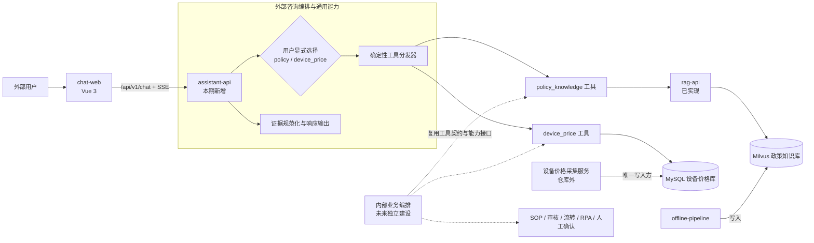

# 中国邮政理赔智能能力底座与外部咨询窗口 Demo 开发文档

> 文档状态：开发设计基线
>
> 版本：0.7
>
> 更新日期：2026-08-17
>
> 适用范围：当前仓库的后续 Demo 开发，不代表文中规划能力均已实现

## 1. 文档目的

本文档以当前国家邮政局政策知识库项目为基础，定义“中国邮政理赔助手”Demo
的产品边界、目标架构、模块职责、核心协议、开发阶段和验收标准。

本期重点是面向客户或外部人员的轻量 Web 咨询窗口。系统通过自然语言提供：

- 理赔相关公开政策查询；
- 设备参考价格查询；
- 有公开资料支持的材料清单和基础办理流程说明；
- 来源、时间和信息缺口清晰可见的回答。

第一版采用显式二选一入口：用户进入页面后先选择“政策查询”或“设备价格
查询”，再提交一个独立问题。服务端完全依据该选择调用对应能力，不使用 LLM
识别意图或生成多工具计划，也不保存、接收或使用对话记忆。

系统只提供信息辅助，不执行内部审批，不给出最终理赔结论，也不代表中国邮政
或监管机构作出正式决定。

## 2. 当前状态

### 2.1 已实现能力

| 模块 | 当前能力 | 状态 |
|---|---|---|
| `apps/offline-pipeline` | 政策网页和附件抓取、解析、OCR、切分、向量化及 Milvus 同步 | 已实现 |
| `apps/rag-api` | Hybrid Search、Reranker、DeepSeek 证据判定、带引用问答及拒答 | 已实现 |
| `apps/chat-web` | 显式二选一、单轮 SSE、政策引用、价格卡片和结果状态展示 | 阶段 4 已实现 |
| `apps/assistant-api` | 固定分发、政策 HTTP 工具、价格只读工具、统一证据和引用校验 | 阶段 3 已实现 |
| `eval` | RAG 专项与理赔助手路由、状态、证据、价格候选和效率黑盒评估 | 阶段 5 已实现 |
| `packages/contracts` | Milvus schema、embedding 和元数据共享契约 | 已实现 |
| `deploy` | `chat-web -> assistant-api -> rag-api/MySQL` 和监控的 Compose 配置 | 阶段 4 已实现 |
| 设备价格数据源 | 外部采集服务持续写入公司测试 MySQL | 外部前置已具备 |

现有 Web 已切换为调用 `assistant-api`，首屏由用户显式选择政策或设备价格模式，
服务端按单轮问题处理。统一能力入口、政策 HTTP 适配器和设备价格只读适配器已经
进入本仓库。
价格模式执行参数化候选查询、确定性字段规范化、RapidFuzz 排序、规格过滤和
多 SKU 返回；政策模式通过 HTTP 复用现有 RAG 双重门槛，并再次校验引用和证据
字段。两个工具均配置且就绪时，整体 readiness 可报告为可用。案件信息提取、
多工具路由、多源答案融合和会话记忆不属于第一版实施范围，保留为后续扩展项。

### 2.2 当前数据能力限制

当前政策库来自国家邮政局公开“政策法规标准”栏目。它可以支持有原文依据的
政策解释，但不应默认认为它完整覆盖中国邮政具体理赔所需材料、网点办理步骤
或内部 SOP。

因此，材料和流程类问题必须遵循以下规则：

1. 公开政策库能够支持时，按原文引用回答；
2. 资料只支持部分内容时，只回答被支持的部分并列出缺口；
3. 资料未覆盖时明确说明无法确认，不能使用通用常识补齐；
4. 后续如接入公开服务指南或授权 SOP，应为数据源标记可见范围；内部资料不能
   因为复用了同一底座而自动暴露给外部 Web。

设备价格库已具备产品、SKU、当前价和历史记录等结构。该库由独立采集项目负责
写入；本仓库只实现只读查询和匹配，不复制爬虫，不修改价格数据。

## 3. 产品定位与边界

### 3.1 外部窗口定位

外部 Web 的产品名称调整为“中国邮政理赔助手（Demo）”，定位是有证据约束的
咨询入口，而不是一个可以自主处理理赔案件的 Agent。

| 能力 | 本期行为 |
|---|---|
| 政策咨询 | 返回公开政策依据、原文链接和适用限制 |
| 设备价格 | 返回数据库中匹配到的一个或多个参考价格及采集时间 |
| 所需材料 | 仅按已接入的公开资料回答，资料不足则列出待确认项 |
| 基础流程 | 说明公开流程和建议的下一步，不代替正式受理 |
| 查询入口 | 用户先在“政策”和“设备价格”中二选一，系统不自动猜测 |
| 信息不足 | 询问必要的设备型号、规格或事项类型；仍不足时拒答 |
| 超出范围 | 说明当前不能完成，并指向人工或正式渠道 |

### 3.2 本期不做

- 不判断案件是否应赔、赔多少或责任归属；
- 不访问、创建或修改真实理赔案件；
- 不审核材料真实性、完整性或图片质量；
- 不接入内部审批、案件流转、SOP 执行和 RPA；
- 不代替人工确认或产生具有业务效力的操作；
- 不把设备参考价格表述为最终定损价或赔付价；
- 不自动识别政策/价格意图，不处理两类数据融合问题；
- 不使用 LLM 生成结构化工具计划；
- 不保存或向服务端传递对话历史，每次查询都是独立单轮；
- 不构建可无限循环、自主选择任意工具的通用 Agent。

### 3.3 未来内部系统边界

未来内部工作系统使用独立的业务编排服务，并可复用本项目定义的查询工具、案件
信息结构和证据结构。在内部编排中才考虑：

- 内部 SOP 查询；
- 材料审核和规则校验；
- 案件状态机与流转；
- RPA 表单操作；
- 关键步骤人工确认；
- 可恢复的长流程和审计记录。

外部编排只注册只读咨询工具；内部动作工具必须属于另一套工具白名单和运行权限，
不能仅依靠提示词区分。

## 4. 设计原则

1. **证据先于回答**：先得到结构化证据，再生成自然语言；没有证据就不输出事实。
2. **数据源各司其职**：政策使用 RAG，价格使用关系数据库；不强行把所有数据向量化。
3. **价格来自数据库**：大模型只能提取查询条件和组织语言，不能生成 SQL 或价格。
4. **显式选择优先**：第一版由用户选择查询类别，服务端只做确定性工具分发。
5. **读写边界固定**：设备价格采集项目是写入方，本项目是只读消费方。
6. **外部与内部隔离**：复用契约和能力，不复用同一条包含审批动作的流程。
7. **单轮单工具**：每个请求只调用用户所选类别对应的一个只读工具，不使用记忆。
8. **渐进式扩展**：保留工具接口；只有真实出现融合、长流程、恢复和人工节点后再
   引入图式 Agent 框架。
9. **不展示思维链**：只向用户展示查询状态、事实来源、匹配条件和信息缺口。

## 5. 目标架构



### 5.1 为什么新增 `apps/assistant-api`

`rag-api` 已经是边界清晰的政策专用服务。如果继续在其中加入 MySQL 查询、意图
识别和任意新工具，它会同时承担知识检索、业务编排和公共网关，后续难以复用和
独立评估。

本期新增 `apps/assistant-api`，其实际职责是：

- 接收外部咨询请求；
- 校验用户显式选择的 `policy` 或 `device_price` 查询模式；
- 将每个请求确定性分发给唯一对应的只读工具；
- 判断该工具返回的证据是否足够；
- 规范化政策引用或价格证据并提供 JSON/SSE 回答；
- 为未来工具保留同一注册方式。

当前不再新增空壳 `capability-platform`、`agent-runtime` 或每个工具一个微服务。
`assistant-api` 内部的工具接口就是 Demo 阶段的能力底座；等内部系统成为真实消费
方、需要独立扩缩容或权限边界时，再将能力接口抽成独立服务，工具契约保持不变。

### 5.2 运行时边界

| 进程 | 数据权限 | 对外暴露 | 主要职责 |
|---|---|---|---|
| `offline-pipeline` | Milvus 建表/写入 | 否 | 政策数据生产 |
| 设备价格采集服务 | MySQL 写入 | 否 | 价格数据生产 |
| `rag-api` | Milvus 只读 | 仅容器内 | 政策检索、重排、证据门槛 |
| `assistant-api` | MySQL 只读；调用 `rag-api` | 由 Web 反向代理 | 显式模式分发和咨询响应 |
| `chat-web` | 不直连数据库或模型 | 是 | 交互和证据展示 |
| `eval` | 仅 HTTP 调用 | 否 | 黑盒量化评估 |

浏览器继续访问同源 `/api/v1/chat`。部署时只需把 Nginx 的上游从 `rag-api`
切换到 `assistant-api`；Milvus、MySQL 和 DeepSeek 凭证均不进入浏览器构建产物。

## 6. 仓库规划

本期在当前 monorepo 中增加一个独立可部署应用：

```text
apps/
  assistant-api/                 # 新增：外部咨询编排和通用只读工具
    pyproject.toml
    src/spb_assistant_api/
      api/                       # FastAPI 路由和请求/响应 schema
      domain/                    # QueryMode、ToolResult、Evidence 等模型
      services/                  # 确定性分发、证据校验和响应输出
      tools/                     # policy_knowledge、device_price、registry
      adapters/                  # rag-api HTTP、MySQL 实现
      settings.py
      main.py
    tests/
  chat-web/                      # 改造为理赔咨询 UI
  rag-api/                       # 保持政策专用服务
  offline-pipeline/              # 保持政策离线数据生产
packages/
  contracts/                    # 仅存放真正跨 Python 应用的稳定契约
eval/                            # 保留 RAG 评估并增加 assistant 模式
deploy/                          # 增加 assistant-api 容器和代理关系
```

不创建没有运行职责的层级。`ToolResult` 在只有 `assistant-api` 使用时先保留在该
应用；当未来内部编排也实际使用它时，再上移到 `packages/contracts`。

## 7. 核心领域对象

### 7.1 `QueryMode` 与请求上下文

第一版使用显式枚举而不是意图识别：

```text
policy        -> policy_knowledge（含有公开依据的材料和流程问题）
device_price -> device_price
```

`QueryMode` 来自用户在 Web 上的二选一操作，并随本次请求发送。分发映射由服务端
固定定义，客户端不能提交任意工具名。一个请求只有一个 `mode`、一个 `question`
和一个工具结果。

当前不定义 `ClaimContext` 或 `ToolPlan`，也不接收消息历史。设备品牌、型号和
规格只在 `device_price` 工具内部从本次问题中做最小必要的规则提取和规范化。

### 7.2 `ToolResult` 与 `Evidence`

所有工具返回统一外壳，回答生成器不直接依赖各数据库响应：

```json
{
  "tool": "device_price",
  "status": "success",
  "facts": ["匹配到多个规格和参考价格"],
  "evidence": [],
  "warnings": ["型号存在多个 SKU，请结合规格确认"],
  "missing_fields": [],
  "observed_at": "数据观察时间"
}
```

`status` 只取：

- `success`：有足够证据；
- `partial`：当前单一工具只支持问题的一部分；
- `need_more_info`：缺少必要查询条件；
- `no_match`：数据源中没有匹配项；
- `error`：工具技术失败，不能伪装成无数据。

证据使用带 `type` 的联合结构：

| `type` | 必要字段 | 用途 |
|---|---|---|
| `policy` | 标题、文号、机构、发布日期、原文 URL、摘录 | 政策、材料和流程依据 |
| `device_price` | 品牌、型号、规格、价格、币种、来源、观察时间、状态 | 价格卡片和时效提示 |

每条证据分配稳定的请求内 `evidence_id`。模型只能引用这些 ID，服务端在输出前
校验引用是否存在。

### 7.3 后续扩展契约

为保持整体结构可扩展，工具继续采用统一输入输出接口，分发器内部也使用工具
注册表。但第一版注册表只接受固定 `QueryMode -> tool` 映射，不暴露给 LLM。

未来确定需要融合问题后，再增加 `ClaimContext`、`ToolCall` 或 `ToolPlan`。这些
对象必须基于真实需求加入，不能影响当前单轮单工具协议。

## 8. 工具设计

### 8.1 政策知识工具 `policy_knowledge`

第一版复用现有 `rag-api`，不重写 embedding、Milvus、Reranker 和 DeepSeek
相关性门槛。

最小接入方式：

1. `assistant-api` 通过内部 HTTP 调用现有 `rag-api /v1/chat`；
2. 当前使用非流式 JSON 获取完整回答，以便在对外发送前完成引用后校验；外层
   `assistant-api` 仍提供 SSE 状态、证据和回答事件；
3. 将政策回答和引用规范化为统一 `ToolResult` / `Evidence`；
4. `reranker_rejected`、`llm_rejected` 和 `no_context` 均映射为无可用政策证据。
5. 启动时分别检查公开 readiness 和受保护的 `/v1/auth/check`，避免错误的内部
   服务 Key 被误报为 ready。

当前选择“先完整校验、再通过 SSE 发出回答”，因此政策文本通常作为一个 `delta`
发送，而不是逐 Token 转发。这样可避免引用校验失败后，客户端已经看到不可追溯
文本。若后续确需逐 Token 体验，应先设计可验证的流式引用协议，不能简单绕过
最终校验。

未来其他内部编排只需要政策证据而不需要生成答案时，可以为 `rag-api` 增加“只
执行检索、重排和证据判定”的内部 evidence 接口。该扩展不是第一版前置条件。

材料清单和基础流程在第一版仍由政策工具处理，而不是创建两个名字不同但数据源
相同的空工具。只有未来接入独立服务指南或 SOP 数据源时才拆分。

### 8.2 设备价格工具 `device_price`

设备价格属于结构化且经常更新的数据，不采用当前政策 RAG 的处理方式。

查询流程：

1. 规范化品牌提示、产品系列、型号和容量；
2. 通过参数化 SQL 只在产品名、系列名和型号字段中粗召回；
3. 按官方产品 ID 聚合候选，先匹配产品，再处理该产品下的 SKU；
4. 对产品系列、型号数字、字母数字型号和明确版本词执行确定性硬约束；
5. 硬约束通过后使用产品名称模糊分数排序并只保留最高分产品分组，不让 SKU
   规格或不透明 ID 决定产品身份；
6. 使用容量和内存字段过滤 SKU，返回达到门槛的多个参考价格；
7. 默认使用当前价格；每个结果展示来源、观察时间和在售状态。

建议技术实现：

- SQLAlchemy 2.x Core：显式、参数化地读取既有表，不需要 ORM 业务实体；
- PyMySQL：纯 Python 驱动，便于在当前 Docker 环境构建；
- `asyncio.to_thread` + 信号量：有界执行同步 MySQL 调用，不阻塞事件循环；
- RapidFuzz：在型号硬约束通过后，对产品级候选名称做可解释的模糊排序；
- 只读连接池和查询超时；禁止任何 INSERT、UPDATE、DELETE 和 DDL。

第一版不对设备或价格建立 embedding，原因是：

- 型号、容量和 SKU 更依赖精确匹配；
- 向量相似不能保证产品标识正确；
- 价格会变化，事实必须实时来自关系数据库；
- 当前数据规模允许先用结构化过滤和模糊排序完成 Demo。

未来只有在别名、口语型号和错别字导致候选召回明显不足时，才考虑用 embedding
辅助“召回候选”；最终价格仍必须回查 MySQL。

### 8.3 第一版字段处理与未来案件提取

第一版不实现通用案件信息提取，也不调用 DeepSeek 生成字段 JSON。只有设备价格
工具对当前问题做必要的确定性处理：

- 规范化全半角、大小写、空白和常见容量写法；
- 从当前文本识别明显的品牌、型号和规格片段；
- 使用参数化查询取得候选，再进行模糊排序；
- 缺少决定性字段时提示用户在下一次独立请求中提交完整型号和规格。

后续确有材料审核、融合查询或内部案件编排需求时，再增加通用 `ClaimContext`
提取能力。该能力仍只整理用户明确提供的事实，不产生案件判断。

## 9. 外部咨询分发

### 9.1 执行流程

```text
请求校验
  -> 校验 QueryMode
  -> 按固定映射选择唯一工具
  -> 执行一个只读工具
  -> 统一 ToolResult 和 Evidence
  -> 证据充分性检查
  -> 复用政策回答或生成价格模板
  -> 引用与事实后校验
  -> JSON / SSE 返回
```

第一版不做自动路由。`policy` 固定映射到 `policy_knowledge`，`device_price`
固定映射到 `device_price`。如果一个问题同时包含两类需求，服务提示用户拆成两次
查询并分别选择类别，不自行拆解，也不合并两类结果。

### 9.2 回答策略

- 纯价格问题可直接使用模板组织数据库结果，避免不必要的 LLM 调用；
- 纯政策问题优先透传 `rag-api` 已生成的 grounded answer；
- 每个可核验事实必须关联证据 ID；
- 价格结果不计算未经定义的“合理价”或“应赔金额”；
- 多个候选全部列出，并说明需要哪些规格才能进一步筛选；
- 当前工具只支持问题的一部分时，返回支持内容和待补充信息；
- 工具异常返回技术错误，不能解释成“数据库中没有”；
- 跨类别问题提示拆分查询，不进行融合回答。

### 9.3 拒答与信息不足门槛

| 场景 | 行为 |
|---|---|
| Reranker 无相关政策 | 返回政策资料不足，不调用政策答案生成 |
| DeepSeek Judge 拒绝政策证据 | 返回政策资料不足 |
| 设备条件不足 | 提示用户在新请求中提供完整品牌/型号/规格，不返回泛化价格 |
| 无价格匹配 | 明确未找到匹配记录，不让模型估价 |
| 多个价格匹配 | 全部或按上限列出，标记歧义，不伪装为唯一价格 |
| 一个问题包含政策和价格 | 提示拆成两次请求并分别选择查询类别 |
| 最终引用校验失败 | 返回技术错误，不向客户端发送未经验证的政策事实 |
| 超出外部能力范围 | 指向正式渠道或人工，不调用内部动作工具 |

## 10. API 与 SSE 契约

### 10.1 公共入口

`assistant-api` 对 Web 提供：

| 方法 | 路径 | 用途 |
|---|---|---|
| `POST` | `/v1/chat` | 理赔咨询 JSON/SSE 问答 |
| `GET` | `/health/live` | 进程存活 |
| `GET` | `/health/ready` | 已注册工具、鉴权和运行依赖检查 |
| `GET` | `/metrics` | Demo 指标 |

请求第一版在现有字段上增加必填 `mode`，不接收历史消息：

```json
{
  "mode": "device_price",
  "question": "某品牌某型号 256GB 的参考价格是多少？",
  "stream": true
}
```

`mode` 只允许 `policy` 或 `device_price`。服务端不提供 session ID，不接收
`history` 或 `messages`，不持久化会话。即使页面保留已显示消息供用户阅读，每次
POST 也只包含当前类别和当前问题，类似“这个型号呢”的问题不会继承上一轮信息。

### 10.2 SSE 事件

在现有 `delta / usage / done / error` 基础上增加两类有实际 UI 职责的事件：

```text
event: status
data: {"stage":"retrieving","message":"正在查询设备参考价格"}

event: evidence
data: {"items":[{"evidence_id":"price-1","type":"device_price"}]}

event: delta
data: {"content":"根据当前可查询到的信息，"}

event: done
data: {
  "request_id":"...",
  "finish_reason":"stop",
  "reason_code":"stop",
  "used_tool":"device_price",
  "missing_fields":[]
}
```

事件含义：

- `status`：展示“识别问题、查询资料、组织回答”等阶段，不暴露模型推理；
- `evidence`：让 Web 按证据类型渲染政策引用或价格卡片；
- `delta`：回答文本增量；
- `usage`：模型用量，仅在发生模型调用时返回；
- `done`：包含 `stop`、`partial`、`insufficient_information`、`out_of_scope`
  等结束原因；
- `reason_code`：保留 `no_context`、`reranker_rejected`、`llm_rejected` 或
  `multiple_query_categories` 等具体原因；
- `error`：流建立后的技术错误。

价格、政策证据通过结构化事件返回，不能要求前端从 Markdown 表格中反向解析。

### 10.3 未来内部能力接口

内部系统尚未开发，因此当前不创建空路由。实现工具时应保持其输入输出与 HTTP
无关；未来可薄封装为内部接口，例如：

```text
POST /internal/v1/tools/policy/query
POST /internal/v1/tools/device-price/query
POST /internal/v1/extract/claim-context
```

内部工作流调用这些能力接口，而不是调用面向外部用户的 `/v1/chat` 文案接口。

## 11. Web 改造

`apps/chat-web` 保持独立 Vue 3 应用，不拆成新仓库。阶段 4 已完成以下改造：

1. 品牌文案调整为“中国邮政理赔助手（Demo）”；
2. 首屏先显示“您要查询哪方面的问题？”，提供“政策查询”和“设备价格”两个
   选择按钮；
3. 选择后再展示输入框、当前类别和对应示例，并提供“更换查询类别”入口；
4. 请求固定携带当前 `mode`，不发送此前消息；
5. 处理 `status` 和 `evidence` SSE 事件；
6. 政策证据沿用引用卡片；
7. 价格证据使用结构化卡片或表格，展示型号、规格、价格、来源和观察时间；
8. 对多个 SKU 明确显示“存在多个候选”；
9. 对 `partial` 和 `insufficient_information` 展示信息缺口和补充提示；
10. 每个回答固定展示“参考信息，不构成最终理赔结论”的轻量提示；
11. 页面可以保留已显示内容供阅读，但不把它作为上下文，不持久化案件，也不提供
    审批、上传审核或 RPA 按钮。

## 12. 技术选型

| 位置 | 选择 | 原因 |
|---|---|---|
| API | FastAPI + Pydantic | 与现有 `rag-api` 一致，结构化校验和 SSE 已验证 |
| 分发 | `QueryMode` 枚举 + 简单工具注册表 | 用户显式二选一，路径确定且便于未来增加工具 |
| 模型 | 仅沿用 `rag-api` 的 DeepSeek | 第一版不在 `assistant-api` 中做意图识别、规划或价格生成 |
| 政策检索 | 现有 Milvus Hybrid + BGE Reranker | 当前已具备检索和双重门槛 |
| 价格查询 | SQLAlchemy Core + PyMySQL + RapidFuzz | 结构化过滤、精确型号和模糊候选排序更合适 |
| 前端 | Vue 3 + TypeScript + Vite | 当前应用已实现且满足 Demo |
| 流式协议 | SSE | 单向文本生成简单，现有链路已验证 |
| 部署 | Docker Compose | 适合当前单机内网 Demo，模块仍可独立运行 |

### 12.1 暂不引入 LangGraph / OpenAI Agents SDK

当前流程是用户显式选择后的一次单工具调用，没有自动路由、融合、长期状态或人工
审批节点。引入 Agent 框架会增加状态、调试和部署复杂度，但不会提升价格事实
准确性。

满足以下任一条件时再重新评估 LangGraph：

- 内部案件流程出现多分支状态机；
- 任务需要跨请求暂停、恢复和持久化 checkpoint；
- 材料审核、RPA 和人工确认形成循环；
- 需要对每个节点做独立重试、补偿和审计。

只有未来模型供应商和运行环境明确采用 OpenAI Agent 生态，并完成 DeepSeek 等
模型兼容性验证后，才评估 OpenAI Agents SDK。工具契约应保持框架无关，以避免
提前绑定。

## 13. 配置与部署变更

### 13.1 配置原则

所有地址和凭证只通过环境变量或未提交的 `.env` 注入。仓库文档和示例不得包含：

- 公司内网地址；
- MySQL、Milvus 或模型真实凭证；
- 真实价格数据和私有评估问题；
- 用户或案件数据。

`assistant-api` 需要的配置类别：

```text
ASSISTANT_RAG_BASE_URL
ASSISTANT_RAG_API_KEY
ASSISTANT_RAG_TIMEOUT_SECONDS
ASSISTANT_MYSQL_DSN
ASSISTANT_MAX_CONCURRENCY
ASSISTANT_PRICE_MATCH_THRESHOLD
```

`.env.example` 只给出无敏感信息的占位值。

### 13.2 Compose 目标关系

```text
browser -> chat-web:80 -> assistant-api:8081
assistant-api -> rag-api:8080
assistant-api -> company MySQL (read only)
rag-api -> Milvus + DeepSeek
```

服务器只暴露 Web 端口。`assistant-api` 和 `rag-api` 使用容器内部网络；现有
CentOS 7 / 旧 Docker 环境的兼容处理继续限定在容器或 Compose 配置内，不要求
为了 Demo 大规模升级宿主机。

## 14. 评估方案

现有 `eval` 继续保留政策 RAG 专项评估，并增加调用 `assistant-api` 的黑盒模式。
第一版只关注直接影响 Demo 可信度的痛点。

### 14.1 最小数据集分类

| 分类 | 关键样本 |
|---|---|
| 模式入口 | 合法二选一、缺少模式、非法模式、更换类别 |
| 政策 | 可回答、相似但无依据、完全无关 |
| 价格 | 精确型号、别名/错别字、多 SKU、条件不足、无匹配 |
| 材料/流程 | 有公开依据、只覆盖部分、完全未覆盖 |
| 跨类别 | 同一问题同时询问政策和价格，应提示拆分查询 |
| 单轮隔离 | 连续请求、指代式问题，确认不会继承上一轮上下文 |
| 边界 | 要求估算赔付、要求审批、要求执行内部操作 |

测试数据、真实价格结果和运行报告继续保存在 Git 忽略目录。

### 14.2 核心指标

- `QueryMode` 校验通过率和固定分发正确率；
- 设备字段规则提取准确率、关键字段缺失识别率；
- 设备候选 Recall@K、无匹配误放率和歧义标记率；
- 现有政策 Recall/MRR、错误拒答率和错误回答率；
- 回答证据覆盖率、无效证据 ID 数和无来源事实数；
- 跨类别问题拆分提示率和单轮上下文隔离率；
- 首个 SSE 状态/文本延迟、完整响应 P50/P95；
- 5 并发下的成功率、流中断率和工具错误分布。

Demo 首轮验收目标：

- 固定评估集中，模型编造的设备价格为 0；
- 已生成的政策/价格事实均能映射到有效证据 ID；
- 无匹配价格问题不会返回推测价格；
- 固定模式分发正确率为 100%，设备候选 Recall@5 不低于 90%；
- 跨类别问题不触发多工具调用，对话请求不携带历史；
- 5 个并发流式请求无协议错误。延迟先建立基线，再通过实验设置门槛。

## 15. 测试策略

### 15.1 单元测试

- 品牌、型号、容量和全半角字符规范化；
- 精确、模糊、多 SKU 和无匹配排序；
- `QueryMode` 校验、固定映射和非法模式拒绝；
- 每个请求只执行一个工具；
- `ToolResult` 状态映射；
- 引用 ID 和无来源事实后校验；
- SSE 编码、解析、终止和中断处理。

### 15.2 集成测试

- 使用测试表或只读 fixture 验证 MySQL repository；
- 使用 stub `rag-api` 验证政策成功、拒答和错误；
- 验证政策和价格模式不会错误调用另一工具；
- 验证请求 schema 不接受历史消息字段；
- 验证 `assistant-api` readiness 能区分配置缺失和依赖不可用。

### 15.3 端到端测试

- `chat-web -> assistant-api -> rag-api` 的 SSE 链路；
- 政策模式的引用展示和价格模式的价格卡片分别展示；
- 首屏二选一、更换类别和两次请求上下文隔离；
- 停止生成、刷新、清空对话和流错误；
- Docker Compose 冷启动、健康检查和内网 MySQL 连通性；
- 真实数据只在获授权环境中只读验证，不写入测试记录或仓库。

## 16. 分阶段开发计划

当前实施状态：阶段 1—5 已完成。设备价格仓储通过公司测试库只读联通验证，
政策工具通过真实 `rag-api`、Milvus 和 DeepSeek 黑盒验证；Web 已切换至统一
`assistant-api`，三服务已在内网 Demo 服务器灰度部署并保留旧容器回滚点。

### 阶段 1：能力入口、契约和固定分发

交付：

- 创建 `apps/assistant-api` 并加入 uv workspace；
- 实现配置、健康检查、鉴权、限流和基础 SSE；
- 定义 `QueryMode`、`ToolResult`、`Evidence`；
- 实现 `policy -> policy_knowledge`、`device_price -> device_price` 固定映射；
- 使用 stub 工具验证单轮、单工具协议；
- 在 Compose 中加入服务，但不切换正式 Web 上游。

验收：服务可独立启动，测试不导入离线流水线；合法模式只调用一个对应工具，
非法或缺失模式被拒绝，SSE 协议稳定。

### 阶段 2：设备价格查询

交付：

- 只读 MySQL repository；
- 字段规范化、候选查询和 RapidFuzz 排序；
- 多 SKU 结果、观察时间和无匹配处理；
- 价格工具单元/集成测试；
- 定义价格专项样本类别和指标口径；黑盒执行器在阶段 5 接入。

实施结果：已完成。任何展示价格都带产品/SKU 标识、来源和观察时间；无匹配或
规格不一致时不估价；连接会话强制只读，代码没有价格写入接口。单元测试使用
假数据，真实公司测试库只执行只读联通与字段映射验证，具体数据未写入仓库。

### 阶段 3：政策工具与统一单工具响应

交付：

- `rag-api` HTTP 适配器和拒答状态映射；
- 政策回答、政策证据和价格证据的统一外壳；
- 单工具证据充分性和最终引用校验；
- 政策、价格、材料和流程问题端到端测试；
- 跨类别问题的拆分提示。

验收：两种模式分别返回结构化证据；一个请求只执行一个工具；信息不足和工具
错误不会被包装成确定答案。

实施结果：已完成。政策工具只通过 HTTP 使用 `rag-api`，成功回答必须包含连续、
有效且被正文引用的证据；三类 RAG 拒答原因映射为无可用政策证据。统一分发器
拒绝无证据成功结果和错误证据类型；政策与价格混合问题在数据源调用前提示拆分。
真实链路验证未将回答、引用正文或凭证写入仓库。

### 阶段 4：Web 理赔助手改造

交付：

- 新品牌文案和问题示例；
- 首屏政策/设备价格二选一和更换类别入口；
- `status`、`evidence` 和新增结束状态；
- 价格卡片、政策引用、歧义与信息缺口展示；
- 请求只包含当前模式和当前问题，不发送历史；
- Nginx 上游切换到 `assistant-api`。

验收：用户先选择类别，再完成一次独立的政策或价格查询，并能看出答案来源和
限制；切换类别不会携带上一轮上下文。

实施结果：已完成。页面品牌调整为“中国邮政理赔助手 Demo”，输入框只在选择
查询类别后出现；请求仅发送 `mode`、当前 `question` 和 `stream`。前端已适配
`status`、`evidence`、`delta`、`done` 和 `error` 事件，分别渲染政策原文引用与
设备价格候选卡片，并显示多候选、部分结果、待补字段、无匹配和固定免责声明。
Vite 与 Nginx 同源代理、Compose 依赖关系均已切换到 `assistant-api`；页面记录
只用于本地展示，不进入后续请求。

### 阶段 5：评估、部署与复盘

交付：

- 扩展黑盒评估模式和私有评估集模板；
- 5 并发、延迟和失败样本报告；
- 更新 API、架构和部署文档；
- 在现有内网服务器灰度部署 Demo；
- 记录模型调用成本、匹配失败类型和下一轮需求。

验收：通过第 14 节最小目标，原有政策 RAG 专项能力无回归。

实施结果：已完成。`eval` 新增独立的 `assistant-run` 黑盒路径，只通过 HTTP
校验显式模式分发、结束状态、拒答原因、缺失字段、证据类型/完整性、拒答证据
泄露、设备 Product/SKU Gold 候选和端到端效率。模板与真实评估集分离，私有问题、
标识、回答和报告均保持 Git 忽略。

2026-08-17 首轮服务器烟测使用 10 条混合样本和 5 并发：10/10 通过，固定分发、
结束状态和证据完整性均为 100%，2 条价格 Gold 候选全部命中，6 条非回答样本无
证据泄露，API 错误为 0。P50 约 82 ms，P95 约 26.7 s，墙钟约 26.7 s，吞吐约
0.375 请求/秒；延迟分布同时包含规则拒答、MySQL 查询和政策模型链路，不能把
P50 当作政策问答延迟。另行执行 5 个并发 SSE 请求，全部按协议完成且无流错误，
墙钟约 14.2 s。

灰度部署使用 `chat-web 0.2.0`、`assistant-api 0.3.1` 和 `rag-api 0.5.1` 的
`linux/amd64` 镜像。切换顺序为 RAG、Assistant、Web，后端端口未发布到宿主机，
旧 RAG/Web 容器以停止状态保留。候选验证发现“这个设备多少钱？”曾错误进入
数据库并返回无匹配；0.3.1 已把泛化指代识别为缺少品牌/型号，并加入回归样本。

首轮数据同时暴露两个下一轮重点：政策链路 P95 较高；两个价格正例共返回 61 条
完整候选，其中单个样本达到当前 50 条展示上限。下一轮应先标定价格候选排序与
展示上限，再拆分记录检索/Judge/生成阶段延迟，而不是立即引入 Agent 框架。

## 17. 完成定义

本期 Demo 完成需同时满足：

1. 外部用户可从 Web 以自然语言查询政策、参考价格、材料和基础流程；
2. 价格由本仓库只读查询，采集项目仍是唯一写入方；
3. 用户先选择政策或设备价格，每个请求只调用唯一对应工具；
4. 政策回答有公开原文引用，价格回答有来源和观察时间；
5. 信息不足、无匹配、工具错误和超出范围具有不同可见状态；
6. 系统不生成无数据库依据的价格，不给出最终赔付或审批结论；
7. Web、编排、政策 RAG、离线数据生产和评估保持独立运行边界；
8. 未来内部系统能够复用工具输入输出契约，不需要复用外部咨询流程；
9. 私有数据、真实凭证、内网地址和评估报告不进入 Git；
10. 服务端不接收或保存对话历史，不自动融合政策和价格；
11. README、API、部署和评估文档与实现保持一致。

## 18. 暂缓项与后续决策点

以下内容只保留设计位置，不进入当前外部窗口主开发：

- 公开服务指南或授权 SOP 的新知识库及其访问范围；
- 材料图片 OCR、真实性检查和规则审核；
- 真实案件存储、状态机、任务分派和人工工作台；
- RPA 表单填写、提交、失败补偿和操作审计；
- 内部工作流框架选型；
- 任意形式的服务端对话记忆、跨会话持久化和用户身份绑定；
- 案件信息提取和 `ClaimContext`；
- 融合问题的 LLM 结构化计划、自动工具选择和多工具结果合并；
- 设备别名规模增大后的向量候选召回；
- 价格时效、异常值和多来源冲突的正式业务规则；
- 最终理赔计算规则和审批权限模型。

在上述需求明确前，当前代码只预留稳定的领域对象和工具边界，不创建无消费者的
服务、数据库表或 Agent 节点。
