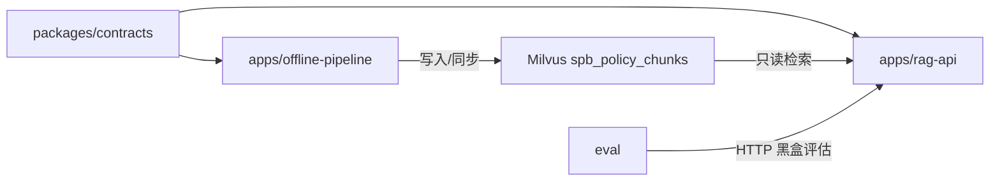
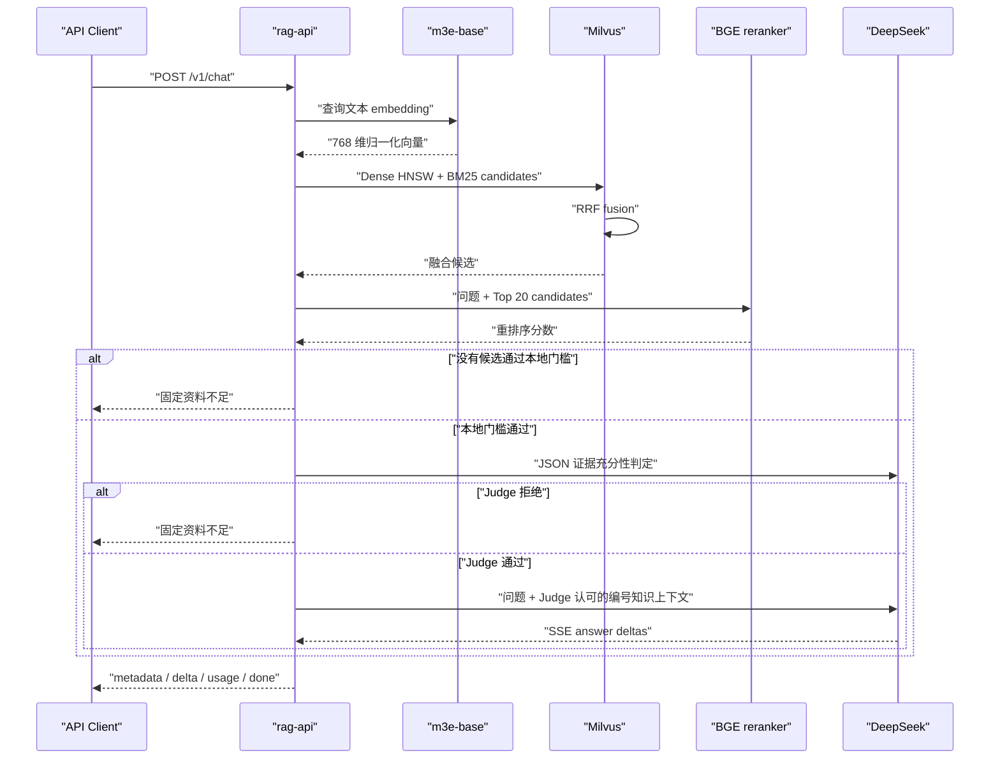

# Workspace 架构与模块边界

## 目标

仓库同时承载离线数据生产、在线检索问答和黑盒评估工具。离线与在线应用必须
在代码、依赖、进程、权限和发布层面保持隔离；评估工具只能通过 HTTP 使用
在线 API。



## Workspace 成员

### `apps/offline-pipeline`

职责：

- 抓取页面和附件；
- HTML、文档与 OCR 解析；
- 文本切分和文档 embedding；
- Milvus collection 创建、写入和增量同步；
- 数据质量报告。

它可以依赖 `spb-contracts`，但不得依赖 `spb-rag-api`。

### `apps/rag-api`

职责：

- 在线 HTTP API；
- 查询 embedding；
- Milvus Hybrid Retrieval；
- 轻量 Cross-Encoder 重排序与本地相关性门槛；
- RAG 上下文与引用；
- DeepSeek 证据充分性 Judge、答案生成和 SSE；
- 在线鉴权、限流、日志和监控。

它可以依赖 `spb-contracts`，但不得导入 `spb_pipeline`。当前包含查询
embedding、Milvus 只读 Hybrid Retrieval、RRF、结构化过滤、
`/v1/retrieve`，以及 DeepSeek grounded answer、引用和 SSE。

### `packages/contracts`

只包含：

- collection 名称、schema 版本和字段名；
- embedding 模型、维度、归一化和 metric；
- 跨边界元数据结构。

禁止包含 HTTP、Milvus、模型加载、文件读写或业务流程代码。

### `eval`

职责：

- 加载人工标注 JSONL 评估集；
- 以真实客户端方式调用 `/v1/retrieve` 和 `/v1/chat`；
- 计算召回、门槛、引用、事实覆盖与延迟指标；
- 离线扫描 reranker 阈值并对比 baseline/experiment；
- 生成失败样本人工复核队列；
- 生成本地 JSON、JSONL 和 Markdown 报告。

它不得导入 `spb_rag_api` 或 `spb_pipeline`，不得直连 Milvus，也不加入在线
Docker 镜像。私有评估集和运行报告默认不进入版本控制。

## 依赖方向

```text
spb-policy-pipeline ─┐
                     ├──> spb-contracts
spb-rag-api ─────────┘
```

以下依赖均被禁止：

```text
spb-rag-api -> spb-policy-pipeline
spb-policy-pipeline -> spb-rag-api
spb-contracts -> 任一应用
```

`apps/rag-api/tests/test_architecture.py` 会扫描三个包的 Python import，阻止
在线与离线应用相互依赖，也阻止 contracts 反向依赖任一应用。

## 运行和发布边界

| 项目 | 离线流水线 | 在线 RAG API |
|---|---|---|
| 进程 | 批处理 CLI | 常驻 API |
| Milvus 权限 | 建表/写入 | 只读 |
| 本地数据目录 | 需要 | 禁止依赖 |
| OCR/Poppler | 可选需要 | 不安装 |
| DeepSeek | 不需要 | Judge 与答案生成 |
| Docker 镜像 | 未提供专用镜像 | rag-api |
| 发布节奏 | 数据任务 | 在线服务 |

## 共享契约

当前契约：

```text
database        aisv
collection      spb_policy_chunks
schema_version  1
embedding       moka-ai/m3e-base
dimension       768
normalized      true
metric          COSINE
dense field     text_dense
sparse field    text_sparse
```

离线建表和在线启动检查都必须使用该契约。未来 schema 发生不兼容变更时，
应增加 schema version 或创建新 collection，不能让在线服务静默适配。

## 在线问答流程



客户端只能提交白名单结构化过滤字段。服务端负责构造 Milvus filter，
不接受原始表达式。Milvus 适配器仅暴露 schema 校验、collection load 和
hybrid search，没有任何数据写入方法。
