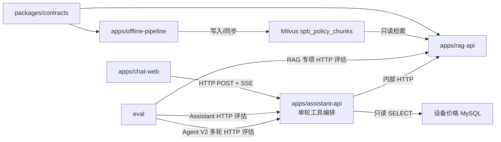
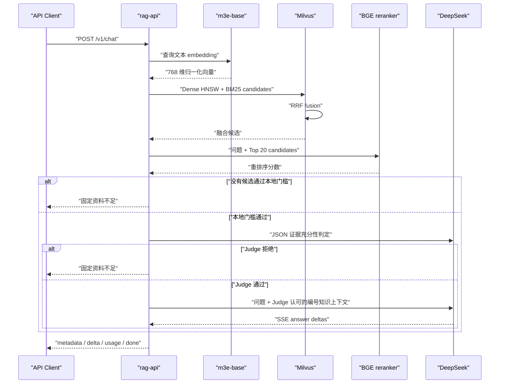

# Workspace 架构与模块边界

> 当前实现基线：`offline-pipeline 0.2.0`、`rag-api 0.5.1`、
> `assistant-api 0.3.3`、`chat-web 0.2.0`、`eval 0.5.0`。本文只描述已实现边界。

## 目标

仓库同时承载离线数据生产、在线检索问答、单轮工具编排和黑盒评估工具。各应用必须
在代码、依赖、进程、权限和发布层面保持隔离；评估工具只能通过 HTTP 使用
在线 API。



## Workspace 成员

### `apps/offline-pipeline`

职责：

- 抓取页面和附件；
- HTML、文档与 OCR 解析；
- 文本切分和文档 embedding；
- Milvus collection 创建、写入和增量同步；
- 数据质量报告。

它可以依赖 `spb-contracts`，但不得依赖 `spb-rag-api`。

### `apps/rag-api`

职责：

- 在线 HTTP API；
- 查询 embedding；
- Milvus Hybrid Retrieval；
- 轻量 Cross-Encoder 重排序与本地相关性门槛；
- RAG 上下文与引用；
- DeepSeek 证据充分性 Judge、答案生成和 SSE；
- 在线鉴权、限流、日志和监控。

它可以依赖 `spb-contracts`，但不得导入 `spb_pipeline`。当前包含查询
embedding、Milvus 只读 Hybrid Retrieval、RRF、结构化过滤、
`/v1/retrieve`，以及 DeepSeek grounded answer、引用和 SSE。

### `apps/assistant-api`

职责：

- 接收显式 `policy` / `device_price` 查询模式；
- 按固定映射执行且只执行一个只读工具；
- 提供统一 `ToolResult`、政策/价格 `Evidence`、JSON 和 SSE 契约；
- 提供独立鉴权、限流、健康检查和指标；
- 工具由代码静态注册，当前不允许 LLM 选择工具。

设置 `ASSISTANT_MYSQL_DSN` 时注册设备价格只读工具，使用 SQLAlchemy
Core + PyMySQL 参数化查询和 RapidFuzz 候选排序；连接会话强制只读，仓储接口
没有写方法。未配置或连接失败时，该工具 readiness 为 `not_ready`，不会用空结果
掩盖技术错误。

同时设置 `ASSISTANT_RAG_BASE_URL` 和 `ASSISTANT_RAG_API_KEY` 时注册政策工具，
通过 HTTP 调用 `rag-api` 的公开契约；它映射三类拒答原因，并校验政策回答的引用
编号和证据可追溯字段。两个能力都 ready 时整体 readiness 才为 200。

`assistant-api` 是当前 `chat-web` 的唯一 API 上游。跨应用只使用 HTTP 或数据库
适配器，不得导入其他应用实现。请求不接受对话历史，服务不保存会话。

代码库已在 `assistant-api` 隔离路径完成阶段 1–2、3A、4A～4D 与本地 5B，独立
`eval` 已完成 Phase 5A/5B：Domain 契约
和纯 Policy 不依赖框架，Application Service 提供 Hybrid Understanding、Region
Resolver、Slot Merger 和白名单工具执行，Workflow Runtime 负责编排、interrupt/resume、
会话串行化与生命周期，Adapter 提供 Fake Tool、`AsyncSqliteSaver`、元数据/API 幂等和
Tool 收据，以及接口无关的单次 HTTP Client 与能力级熔断。时限/资费已能通过 Fake
Gateway 执行，真实 wire Adapter 尚未实现。Phase 4A/4B 提供只依赖窄化 Service Protocol
和 Descriptor 的 V2 JSON/SSE HTTP Adapter；稳定事件投影不暴露 Graph 内部状态，
lifespan factory 负责 SQLite Agent 组件启停。Phase 4C 在该边界内增加只读 schema
readiness probe、固定标签指标、脱敏停止态 Run Trace 和共享 coordinator 的 janitor
调度。Phase 4D 再以兼容 Adapter 借用现有政策/价格 Tool；它对被包装工具只依赖
`AssistantTool` Port，共享 V1 结果合同并投影完整 Evidence。本地 Demo 因而可验证
五能力路由，同时不复制 RAG 或价格匹配逻辑。Phase 5B 从 checkpoint 审计事件构造
固定白名单的 node/edge/interrupt/resume/retry Trace；日志层只保留哈希会话引用。
只有 composition root 显式注入 Agent
依赖时才挂载。默认 `main.app` 不注入，因此当前运行拓扑、`/v1` 单轮语义和 `memory=disabled`
健康状态保持不变。LangGraph import 继续由架构测试限制在 Workflow
Runtime 与 checkpointer adapter 边界；SQLite 只代表本地单进程恢复能力。

### `apps/chat-web`

职责：

- 提供 Vue 3 单页问答界面；
- 默认保留 V1 政策/设备价格显式模式页面；构建时可显式启用 V2 Agent 页面；
- V2 页面从 OpenAPI 生成类型，通过运行时校验消费版本化 SSE；
- 提供五类能力入口、自由输入、意图澄清、结构化补槽和幂等断流重试；
- 由开发代理或 Nginx 同源代理调用 `assistant-api`；
- V1/V2 政策证据均显示原文引用，价格证据均显示结构化候选卡片；V2 使用领域 Renderer；
- `localStorage` 只保留公开 UI 快照、conversation ID 和未完成幂等键，服务端状态仍由
  LangGraph checkpoint 持有。

它不加入 Python `uv` workspace，不导入任何 Python 应用，也不直连 Milvus 或
DeepSeek。V1 连续消息仍按单轮请求处理；V2 会话只通过公开 HTTP 契约继续，Web 不读取
checkpoint 或导入 Python 实现。

### `packages/contracts`

只包含：

- collection 名称、schema 版本和字段名；
- embedding 模型、维度、归一化和 metric；
- 跨边界元数据结构。

禁止包含 HTTP、Milvus、模型加载、文件读写或业务流程代码。

### `eval`

职责：

- 加载人工标注 JSONL 评估集；
- 以真实客户端方式调用 RAG 或 Assistant 的 `/v1/chat`，以及 RAG
  `/v1/retrieve`；通过 `/v2/agent/messages` 顺序推进多轮 conversation；
- 计算 RAG 召回/门槛/引用/事实覆盖，以及 Assistant 路由、状态、证据、价格
  候选、延迟和吞吐指标；
- 离线扫描 reranker 阈值并对比 baseline/experiment；
- 生成失败样本人工复核队列；
- 计算 Agent Intent、Required Input、Wrong Tool、Task Completion、Recovery、API
  Error 与延迟，并输出机器可读质量门禁；
- 仅在 dataset hash、Gold 标签和门禁阈值一致时，对 Agent baseline/experiment 输出
  指标及逐 Turn 回归；
- 生成本地 JSON、JSONL 和 Markdown 报告。

它不得导入 `spb_rag_api`、`spb_assistant_api` 或 `spb_pipeline`，不得直连
Milvus/MySQL，也不加入在线 Docker 镜像。私有评估集和运行报告默认不进入版本
控制。

## 依赖方向

```text
spb-policy-pipeline ─┐
                     ├──> spb-contracts
spb-rag-api ─────────┘
spb-assistant-api     （独立应用；HTTP 调用 RAG，只读访问价格源）
```

以下依赖均被禁止：

```text
spb-rag-api -> spb-policy-pipeline
spb-policy-pipeline -> spb-rag-api
spb-assistant-api -> spb-rag-api / spb-policy-pipeline
spb-contracts -> 任一应用
```

`apps/rag-api/tests/test_architecture.py` 会扫描各 Python 包的 import，阻止在线、离线和
Assistant 应用相互导入，也阻止 contracts 反向依赖任一应用；Phase 5A Eval 测试额外
阻止 `eval` 导入 Assistant 实现。

## 运行和发布边界

| 项目 | 离线流水线 | 在线 RAG API | Assistant API |
|---|---|---|---|
| 进程 | 批处理 CLI | 常驻 API | 常驻 API |
| 数据权限 | Milvus 建表/写入 | Milvus 只读 | 设备价格 MySQL 只读 |
| 本地数据目录 | 需要 | 禁止依赖 | 禁止依赖 |
| 模型 | embedding | embedding、Reranker、DeepSeek | 无模型 |
| Docker 镜像 | 未提供专用镜像 | rag-api | assistant-api |
| 发布节奏 | 数据任务 | 政策在线服务 | 单轮工具 API |

## 共享契约

当前契约：

```text
database        aisv
collection      spb_policy_chunks
schema_version  1
embedding       moka-ai/m3e-base
dimension       768
normalized      true
metric          COSINE
dense field     text_dense
sparse field    text_sparse
```

离线建表和在线启动检查都必须使用该契约。未来 schema 发生不兼容变更时，
应增加 schema version 或创建新 collection，不能让在线服务静默适配。

## 在线问答流程



客户端只能提交白名单结构化过滤字段。服务端负责构造 Milvus filter，
不接受原始表达式。Milvus 适配器仅暴露 schema 校验、collection load 和
hybrid search，没有任何数据写入方法。
