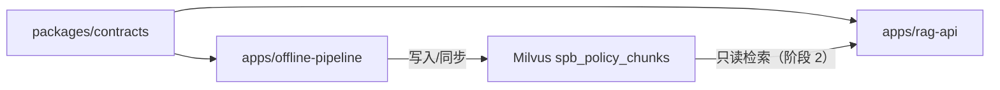
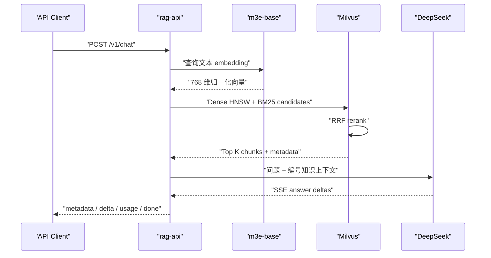

# Workspace 架构与模块边界

## 目标

仓库同时承载离线数据生产和在线检索问答，但两者必须在代码、依赖、进程、
权限和发布层面保持隔离。唯一允许共享的是 Milvus collection 与 embedding
的数据契约。



## Workspace 成员

### `apps/offline-pipeline`

职责：

- 抓取页面和附件；
- HTML、文档与 OCR 解析；
- 文本切分和文档 embedding；
- Milvus collection 创建、写入和增量同步；
- 数据质量报告。

它可以依赖 `spb-contracts`，但不得依赖 `spb-rag-api`。

### `apps/rag-api`

职责：

- 在线 HTTP API；
- 查询 embedding；
- Milvus Hybrid Retrieval；
- RAG 上下文与引用；
- DeepSeek 适配和 SSE；
- 在线鉴权、限流、日志和监控。

它可以依赖 `spb-contracts`，但不得导入 `spb_pipeline`。阶段 3 已包含查询
embedding、Milvus 只读 Hybrid Retrieval、RRF、结构化过滤、`/v1/retrieve`
以及 DeepSeek grounded answer、引用和 SSE。

### `packages/contracts`

只包含：

- collection 名称、schema 版本和字段名；
- embedding 模型、维度、归一化和 metric；
- 跨边界元数据结构。

禁止包含 HTTP、Milvus、模型加载、文件读写或业务流程代码。

## 依赖方向

```text
spb-policy-pipeline ─┐
                     ├──> spb-contracts
spb-rag-api ─────────┘
```

以下依赖均被禁止：

```text
spb-rag-api -> spb-policy-pipeline
spb-policy-pipeline -> spb-rag-api
spb-contracts -> 任一应用
```

`apps/rag-api/tests/test_architecture.py` 会扫描三个包的 Python import，阻止
在线与离线应用相互依赖，也阻止 contracts 反向依赖任一应用。

## 运行和发布边界

| 项目 | 离线流水线 | 在线 RAG API |
|---|---|---|
| 进程 | 批处理 CLI | 常驻 API |
| Milvus 权限 | 建表/写入 | 只读 |
| 本地数据目录 | 需要 | 禁止依赖 |
| OCR/Poppler | 可选需要 | 不安装 |
| DeepSeek | 不需要 | 阶段 3 接入 |
| Docker 镜像 | offline | rag-api |
| 发布节奏 | 数据任务 | 在线服务 |

## 共享契约

当前契约：

```text
database        aisv
collection      spb_policy_chunks
schema_version  1
embedding       moka-ai/m3e-base
dimension       768
normalized      true
metric          COSINE
dense field     text_dense
sparse field    text_sparse
```

离线建表和在线启动检查都必须使用该契约。未来 schema 发生不兼容变更时，
应增加 schema version 或创建新 collection，不能让在线服务静默适配。

## 阶段划分

1. Workspace 隔离：已完成；
2. 纯检索 API：已完成 m3e-base、Milvus、Dense/BM25、RRF；
3. DeepSeek 与 SSE：已完成 grounded answer、引用、流式响应；
4. Linux/Docker：只读凭据、鉴权、限流、日志、监控和压测。

## 阶段 2 在线检索流程



客户端只能提交白名单结构化过滤字段。服务端负责构造 Milvus filter，
不接受原始表达式。Milvus 适配器仅暴露 schema 校验、collection load 和
hybrid search，没有任何数据写入方法。
